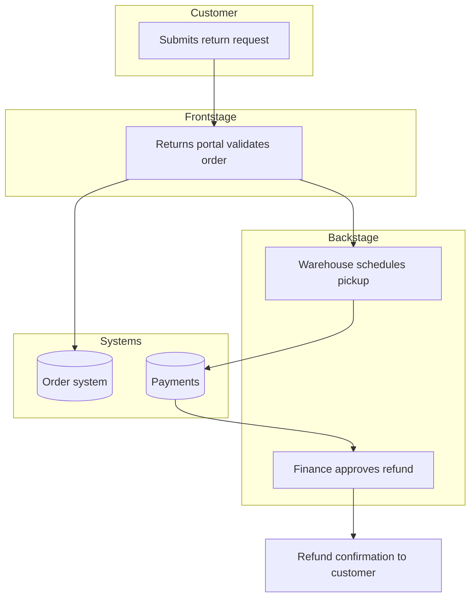

# Service Blueprints

A service blueprint extends a journey by connecting what the customer does to the organizational machinery that makes it happen: frontstage interactions, backstage work, support processes, the systems involved, and the physical/digital evidence the customer encounters. Where a journey answers "what is the experience," a blueprint answers "what has to happen behind the scenes — and where does it break."

Reach for a blueprint when the operating model matters: redesigning a process, exposing handoff gaps and redundancies, designing assisted + self-service paths, or planning a to-be operating model. If nobody needs the back-office layer, a journey is enough — don't over-build.

## Layered structure

A blueprint is read top-to-bottom as layers, left-to-right as time, with two key separators ("lines"):

1. **Physical / digital evidence** — what the customer sees or touches at each step.
2. **Customer actions** — the same spine as the journey.
   _— line of interaction —_
3. **Frontstage** — actions and people the customer interacts with directly (staff, UI, agents).
   _— line of visibility —_
4. **Backstage** — actions and people the customer does _not_ see (fulfilment, review queues, ops).
   _— line of internal interaction —_
5. **Support processes & systems** — internal systems, third parties, and infrastructure each step depends on.

Optional supporting rows: **time/SLA** per step, **owner/team**, **pain points & failure modes**, **metrics**.

## Workflow

1. Lay the customer-action spine from the (as-is or to-be) journey.
2. Add evidence above and frontstage below each action.
3. Trace each frontstage action down to its backstage work and the support systems it relies on.
4. Mark **fail points and handoffs** — the seams between backstage actors and systems are where service breaks.
5. Add SLA/time and owners where they expose bottlenecks.
6. For to-be blueprints, redesign the backstage and support layers, not just the frontstage — operating-model change lives below the line of visibility.

## Markdown table template

```markdown
# Service Blueprint: [Scenario]

- Actor / scenario / goal:
- As-is or To-be:

| Layer                              | Step 1 | Step 2 | Step 3 | Step 4 |
| ---------------------------------- | ------ | ------ | ------ | ------ |
| Evidence                           |        |        |        |        |
| **Customer action**                |        |        |        |        |
| _— line of interaction —_          |        |        |        |        |
| Frontstage                         |        |        |        |        |
| _— line of visibility —_           |        |        |        |        |
| Backstage                          |        |        |        |        |
| _— line of internal interaction —_ |        |        |        |        |
| Support processes / systems        |        |        |        |        |
| Time / SLA                         |        |        |        |        |
| Owner                              |        |        |        |        |
| Fail points / pain                 |        |        |        |        |
```

## Mermaid alternative for handoff-heavy blueprints

When the value is in the cross-functional handoffs and system calls, a `flowchart` with swimlane-style subgraphs (Customer / Frontstage / Backstage / Systems) often communicates better than a wide table:



A blueprint is ready when every customer action traces to the frontstage, backstage, and systems that serve it; fail points and handoffs are marked; and (for to-be) the operating-model changes below the line of visibility are explicit, not just cosmetic frontstage tweaks.
