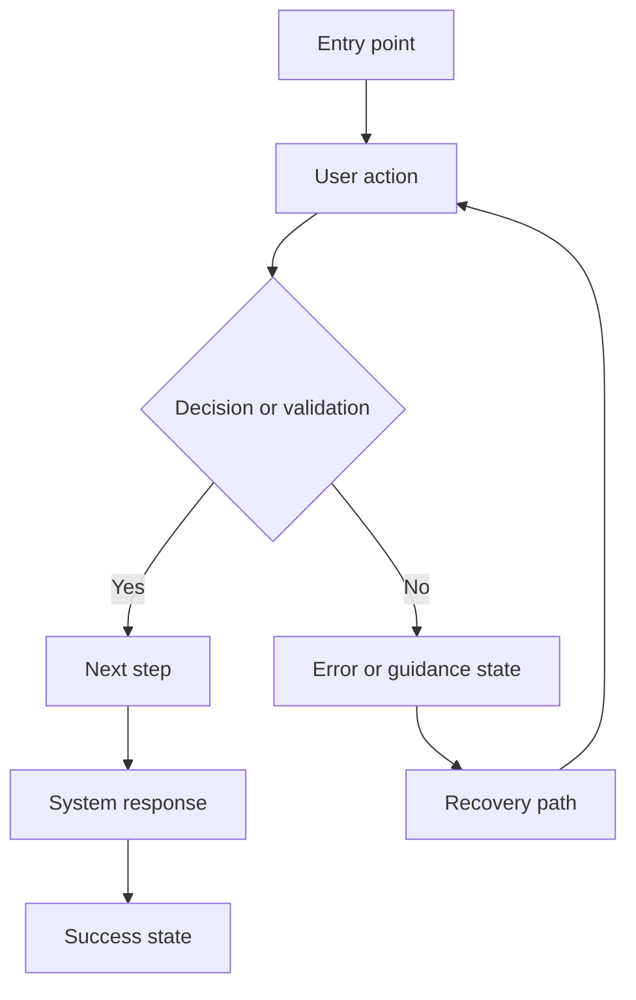
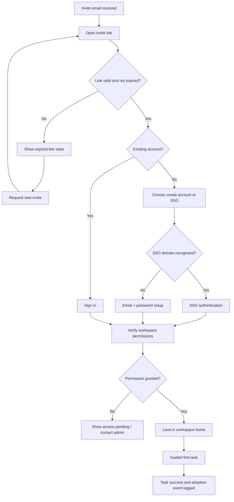

# User Flows

A user flow describes the typical or ideal set of steps needed to accomplish one specific task in one product. It focuses on key user steps and **system responses** — not emotions or cross-channel context. It is the default artefact for stream-level specification: the moment a team needs agreement on _how_ a user completes a task, including the unglamorous states that screen-first design tends to skip.

## Recommended workflow

1. **Start from one task statement** — taken from a journey opportunity or a prioritized product goal. One granular objective per flow.
2. **Define entry point, user intent, and success end state before drawing branches.** This prevents a "collection of screens" from masquerading as a flow. A flow with no named success state can't be validated.
3. **Map the happy path first**, then add alternate routes, validation, failure states, and exits.
4. **Separate user actions from system responses** so engineering can reason about both UI and backend behavior. (A useful convention: rectangles for user actions, diamonds for decisions/validation, a distinct style or label for system states.)
5. **Link each node to the relevant screen, component, or design-system pattern** — reuse before inventing.
6. **Validate** via usability testing or walkthrough before decomposing into stories.

## State coverage — the part teams forget

Under-detailing is as damaging as over-detailing. Before calling a flow done, deliberately check for: **error, empty, loading, permission-denied, expired, retry, offline, and success** states. Note accessibility considerations and platform conventions (keyboard path, focus order, screen-reader announcements, touch targets). The opposite failure — diagramming every micro-interaction — creates a maintenance burden; aim for the level where decisions and system responses are unambiguous, not pixel choreography.

## Readiness bar

A flow is ready when it identifies: entry and exit states; the happy path; alternate paths; required system responses; validation and error states; linked screens/components; unresolved questions; and (where possible) the task-success metric to monitor after release.

## Handoff package

Flow diagram + linked mockups/wireframes + dependencies + business rules + instrumentation events + accessibility notes + the stories derived from the flow.

## Diagram template



## Worked example — "accept workspace invite and finish setup"

Note how it separates user actions, decision points, and system states, and marks where permissions and instrumentation must be specified. That separation is the minimum clarity needed for independent stream work, and it turns the flow from a design-only diagram into a real handoff asset.



## Accompanying spec table (recommended alongside the diagram)

```markdown
| Step | User action | System response | State(s) handled                     | Linked screen/component | Instrumentation event | Accessibility note |
| ---- | ----------- | --------------- | ------------------------------------ | ----------------------- | --------------------- | ------------------ |
|      |             |                 | error / empty / loading / permission |                         |                       |                    |
```
