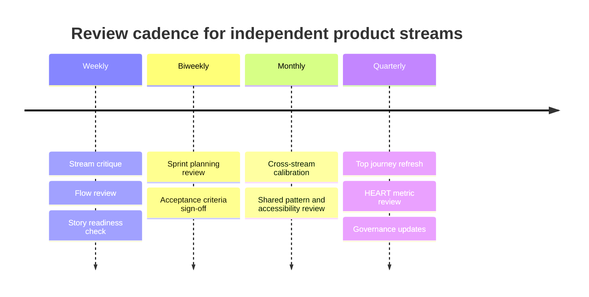

# Governance & Review Cadence

For teams running multiple semi-autonomous streams, artefacts need governance light enough to preserve autonomy but strong enough to keep them comparable, searchable, and reusable. Load this when the user is setting team standards, governing an artefact portfolio, or asking how to manage journeys/flows/stories across teams.

## The artefact-chain rule

One rule keeps the whole system coherent:

> **No story enters sprint planning without an attached flow (or a documented reason a flow is unnecessary). No major net-new flow is approved without linking to a journey, heuristic, or research source. No journey is complete until it names owners and next actions.**

This preserves stream independence while keeping the journey → flow → story chain intact.

## Branch-level controls

| Control       | Standard                                                                              |
| ------------- | ------------------------------------------------------------------------------------- |
| Naming        | `[Area] – [Persona] – [Goal] – [Artifact type]`                                       |
| Storage       | One source-of-truth location per stream; one portfolio index across all streams       |
| Versioning    | Date, owner, status, linked release or sprint                                         |
| Evidence      | Every artefact links to research, analytics, heuristic rationale, or a prior artefact |
| Accessibility | Include barriers, assistive-tech considerations, and exclusion risks by default       |
| Measurement   | At least one success metric and one diagnostic metric, ideally HEART-aligned          |
| Reuse         | Link to design-system components and shared patterns before creating custom solutions |

## Review cadence

| Cadence               | Review                        | Owner                                                 | Minimum artefacts reviewed                                                       |
| --------------------- | ----------------------------- | ----------------------------------------------------- | -------------------------------------------------------------------------------- |
| Weekly                | Stream critique & spec review | Stream designer + PM + eng lead                       | New/changed flows; stories entering refinement; unresolved edge cases            |
| Biweekly / per sprint | Delivery readiness            | PM + designer + eng lead + QA                         | Stories with acceptance criteria, linked designs, metrics, dependencies          |
| Monthly               | Cross-stream calibration      | Lead Product Designer + senior designers              | Journey updates, shared patterns, duplicated solutions, accessibility exceptions |
| Quarterly             | Portfolio journey refresh     | Lead Product Designer + research + product leadership | Top journeys, opportunity areas, metric movement, roadmap implications           |

## Tools and formats

Privilege a stable source of truth over tool sprawl. Typical stack: editable source in a collaborative tool (FigJam/Miro for journeys and workshops, Lucidchart for formal flowcharts, Mermaid for version-controlled diagrams in docs/repos); a governance snapshot (PDF/SVG); an embedded reference in Confluence/Notion/Docs; Jira as system of record for stories. Keep one editable source and a lightweight exported view for handoff — don't let copies multiply.
