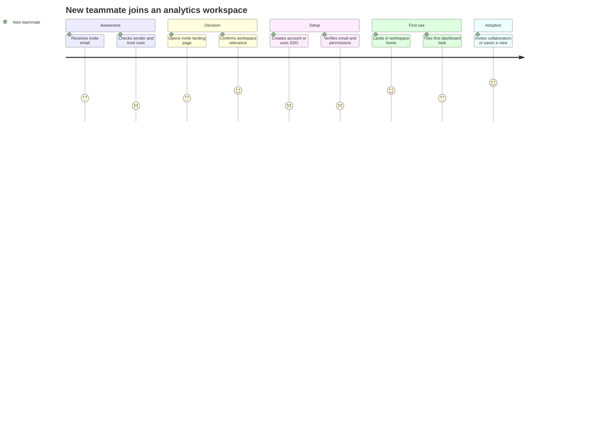

# User Journeys (including As-Is and To-Be)

A user journey visualizes the process a person goes through to accomplish a high-level goal, usually across channels and over time. It carries not just _actions_ but _thoughts, emotions, and pain points_, and it ends in _opportunities_ with owners. Without the emotional and opportunity layers, a journey is just a timeline — it loses the diagnostic value that is the whole point.

Use a journey whenever a stream needs to understand an end-to-end experience beyond one screen or session: discovery, reframing, strategy, large redesigns, onboarding new designers, justifying roadmap bets, or as a bridge into flows, blueprints, and stories.

## Recommended workflow

1. **One actor, one scenario, one high-level goal.** Never map "everyone" or "all of onboarding." Specificity is what makes it usable.
2. **Gather source evidence first** — interviews, observation, support tickets, analytics, diary/contextual data. Anchor in observed experience, not opinion. If evidence is thin, proceed on explicit assumptions and flag them.
3. **Draft major phases first**, then layer in actions, thoughts, emotions, and pain points. Timeline-first keeps the structure honest.
4. **Identify opportunities and owners** at the bottom so the map is actionable, not merely descriptive. A single phase often carries **several** pain points and **several** opportunities — capture all of them rather than flattening to one per phase; the richest diagnostic insight usually sits in a phase that fails in more than one way.
5. **Mark which phases need a flow deep-dive, experiment, or story** next.
6. **Attach metrics** — at least one user-outcome metric and one business/operational metric per key opportunity, HEART-aligned where natural.

## Common pitfalls

- Turning the journey into a vague storyboard with no evidence.
- Cramming multiple personas, scenarios, or products into one unreadable map.
- Stopping at actions and omitting thoughts, emotions, and opportunities (removes diagnostic value).
- Ignoring accessibility and exclusion risks.

## Readiness bar (acceptance criteria for the artefact)

A journey is ready when it: names a single persona and scenario; has clear phases; cites its evidence source (or flags assumptions); records actions, thoughts, and emotions; identifies top opportunities; assigns follow-up owners; and shows which phases fall outside the product boundary (cross-channel context is the point).

## Handoff package

Editable map + one-paragraph problem statement + linked evidence + ranked opportunity list + risks/dependencies + explicit notes on which opportunities need a flow or story next.

## Markdown + table template

```markdown
# User Journey: [Title]

- **Persona / actor:** [single actor]
- **Scenario:** [single scenario]
- **High-level goal:** [what success looks like for the user]
- **Evidence:** [interviews / analytics / support logs / ASSUMPTION]
- **Owner / date:**

| Phase      | User action | Touchpoint / channel | Thought / question | Emotion (1–5) | Pain points / barriers | Opportunities | Owner | Metric hypothesis |
| ---------- | ----------- | -------------------- | ------------------ | ------------- | ---------------------- | ------------- | ----- | ----------------- |
| 1. [phase] |             |                      |                    |               |                        |               |       |                   |
| 2. [phase] |             |                      |                    |               |                        |               |       |                   |

> A phase can have multiple pain points and multiple opportunities. List them within the cell (e.g. as `• …` sub-bullets or numbered items), and where it aids prioritization, pair each opportunity with the pain point it resolves. Don't force one-to-one — surfacing that a single phase fails several ways is often the most valuable finding.

**Top opportunities**

1.
2.
3.

## **Open assumptions / evidence needed**

**Next artefacts required**

- User flow(s):
- User stories:
- Service blueprint (if operational layer matters):
```

## Mermaid journey diagram

Mermaid's `journey` type plots an emotion score (1–5) per step, grouped into sections. Good for a quick emotional-arc view; pair it with the table above for the diagnostic detail.



---

# As-Is vs To-Be journeys

For any redesign, modernization, digitization, or transformation, distinguish the two — and treat them as a connected pair.

An **as-is journey** documents the current lived experience: what users do today, where they struggle, what workarounds they use, which systems and channels they touch, where delays and handoff gaps occur. It is **diagnostic**. Service blueprinting pairs well here because it connects customer actions to frontstage/backstage/support processes and exposes operational deficiencies and redundancies.

A **to-be journey** describes the intended future experience: fewer steps, clearer decisions, better emotional moments, stronger accessibility, measurable outcomes. It is **directional and strategic**, aspirational but feasible.

| Dimension        | As-Is                                                        | To-Be                                                                       |
| ---------------- | ------------------------------------------------------------ | --------------------------------------------------------------------------- |
| Purpose          | Understand current reality                                   | Define target experience                                                    |
| Evidence source  | Research, analytics, support logs, observation, process data | Strategy, opportunity areas, design principles, constraints, target metrics |
| Perspective      | Diagnostic                                                   | Aspirational but feasible                                                   |
| Primary question | "What happens today, and why does it fail?"                  | "What should happen instead?"                                               |
| Key output       | Pain points, root causes, friction moments                   | Target experience, design principles, transformation roadmap                |
| Best used for    | Audits, discovery, redesign baselines, process mapping       | Vision setting, prioritization, concept design, transformation alignment    |

## The connected-pair workflow

1. **Map the as-is first** — actual behaviors, systems/tools, channels, emotions, wait times, workarounds, failure/drop-off points, internal owners. Expect some phases to surface several distinct pain points; record each one rather than collapsing them into a single summary.
2. **Analyze the gap** — friction, process duplication, unnecessary handoffs, accessibility barriers, compliance constraints, blocked intent, operational inefficiencies. Quantify pain where possible.
3. **Define future-state design principles** — e.g., reduce cognitive load, make system status visible, eliminate duplicate data entry, support both self-service and assisted paths, minimize time-to-value, build trust.
4. **Create the to-be journey** — improved sequence, redesigned touchpoints, simplified decisions, updated operational responsibilities, improved emotional arc, desired outcomes.
5. **Translate to delivery artefacts** — flows, service blueprints, stories, requirements, experience principles, roadmap initiatives.
6. **Measure the delta** — task success rate, time to complete, adoption, support ticket volume, error rate, CSAT, NPS, operational cost, employee effort.

```text
As-Is Journey → Pain Point Analysis → Opportunity Identification →
Design Principles → To-Be Journey → User Flows → User Stories → Delivery
```

**Two hard rules:** never present a to-be without an as-is baseline; never close an as-is without naming future-state opportunities. The baseline creates alignment on the problem; the opportunities are the reason you mapped the current state at all.
