# Competitive UX/UI Benchmark — AI Ops Co-pilot

## Product context

We are building an AI operations co-pilot for operations managers at a global logistics
company who currently lose **roughly 60 percent of their day** triaging delayed shipments,
customs holds, and capacity crunches across six disconnected tools. The product must do
three things well. **First**, it must surface and rank exceptions and alerts by true
priority, not just list them chronologically or by type. **Second**, it must make its AI
reasoning visible enough that a manager can trust, challenge, or override it. **Third**, it
must fail gracefully when the AI is wrong, with graceful degradation and easy correction.

## Methodology

Pure logistics enterprise platforms (project44, Descartes, Oracle Transportation Management,
SAP Logistics Business Network, Blue Yonder, Kuebix) returned **no usable results** in Mobbin
across every query attempted. This is a real, confirmed gap, not an oversight, and it is
discussed further in Gaps Observed below. Given that, the search leaned on adjacent
industries that share the same interaction patterns: work/task management tools (ClickUp,
Linear, Plane), support ticket triage (Zendesk, Gorgias), AI-native copilot and agent
interfaces (Grammarly, Cohere, Perplexity, Claude, Lindy, Remote, Superhuman Mail), fraud and
risk dashboards (Stripe Radar, Square Risk Manager), incident response and observability
tools (incident.io, Better Stack), delivery and order tracking (Klarna, DoorDash, Apple,
adidas, Shop, Gopuff), operations mapping (Felt), and general SaaS notification and filter
patterns (Deel, Workable, Evernote, Patreon).

Fourteen distinct `search_screens` queries and one `search_flows` query were run, mostly on
the `web` platform with two `ios` queries for mobile-native tracking patterns, covering:
prioritized exception queues, support ticket triage, AI confidence and "why this
recommendation" panels, AI reasoning traces, fraud and risk ranked alerts, override and
accept and reject controls, an override correction flow, empty and low-confidence states,
incident response dashboards, logistics control tower and map dashboards, shipment tracking
detail pages, notification centers, and advanced filter panels. From all returned results, 23
finalist screens were selected across the 8 scope categories and downloaded to
`docs/benchmark/<category>/`.

As a direct supplement, the six named logistics competitors' public marketing sites
(project44, Oracle, SAP, Blue Yonder, Descartes, Kuebix) were separately visited and
screenshotted with the Playwright MCP browser, since none had Mobbin coverage. Seven
screenshots were captured across those six vendors and saved to
`docs/benchmark/competitor-sites/`, documented in their own subsection below.

## Findings by category

### Prioritized queues

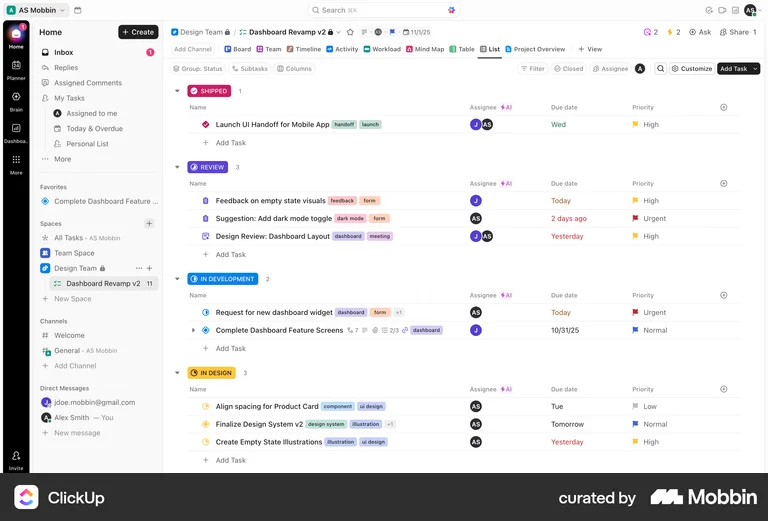
**ClickUp — priority-grouped task list.** Tasks are grouped into Urgent, High, and Normal
bands with a colored flag icon per row, rather than a flat chronological list. **The specific
move worth borrowing** is the group header carrying the count and the color coding living on
a small flag glyph, not the whole row, so density stays low. [View on Mobbin](https://mobbin.com/screens/8622d06c-55a9-4e67-9a69-092f27d558ca)

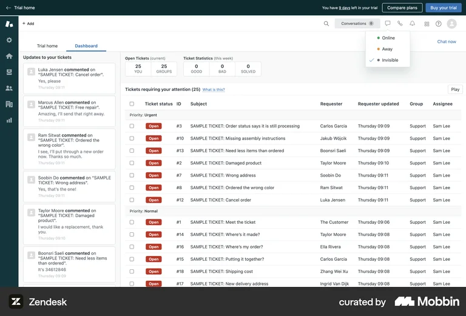
**Zendesk — "tickets requiring your attention" dashboard.** Tickets are pre-sorted into
Priority Urgent and Priority Normal sections above a flat table, with a running count in the
section title. **The specific move worth borrowing** is naming the widget as an action queue
("tickets requiring your attention") instead of a generic list, which frames the ranking as a
worklist rather than a report. [View on Mobbin](https://mobbin.com/screens/e470e94f-f275-40f1-8441-7b3ec672e2fe)

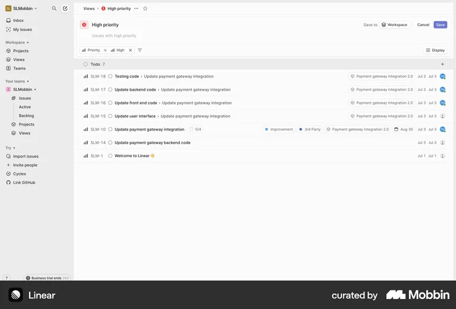
**Linear — saved "High priority" view.** A saved view filters issues down to one priority
tier with a small priority glyph (bar chart icon) per row and a due date column. **The
specific move worth borrowing** is treating priority as a first-class saved view a user can
name, share, and return to, rather than a sort toggle buried in a table header.
[View on Mobbin](https://mobbin.com/screens/b800aa6b-f352-45b1-8c0b-1635a5d91f11)

### AI reasoning disclosure

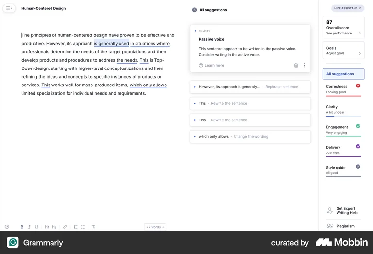
**Grammarly — inline suggestion card with rationale.** Every suggestion opens a card labeled
by category (Clarity, Correctness) with a one-line plain-English reason ("this sentence
appears to be written in the passive voice") before showing the fix. **The specific move
worth borrowing** is labeling the reasoning category before the explanation, so a manager can
scan categories to decide which reasoning is worth reading in full.
[View on Mobbin](https://mobbin.com/screens/4f2515f6-427b-4e53-880f-ac394e59816f)

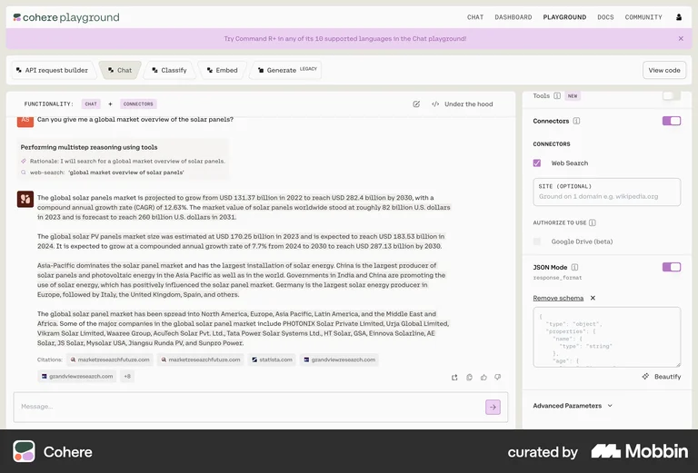
**Cohere Playground — multistep reasoning with tool calls disclosed.** The response shows a
"Performing multistep reasoning using tools" header, then the literal rationale text ("I will
search for a global market overview") and the literal tool call ("web-search: ...") before
the answer, with inline citations linking each claim back to a source. **The specific move
worth borrowing** is exposing the tool call itself, not just a summary of it, which is the
clearest form of "show your work" observed in this benchmark. [View on Mobbin](https://mobbin.com/screens/356e4765-e8b4-4c84-a0e2-01965e15ec49)

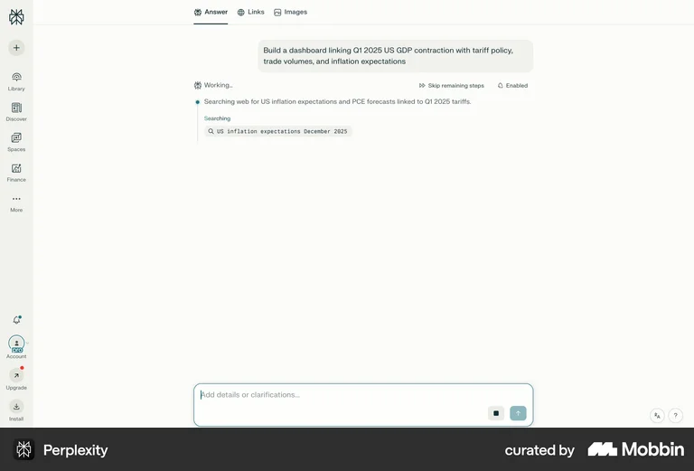
**Perplexity — live "Working" trace.** While the answer is being built, a collapsed step list
narrates each stage ("Searching web for US inflation expectations...") with the literal
search query shown beneath, and a "Skip remaining steps" control. **The specific move worth
borrowing** is giving the user an escape hatch (skip) during a visible reasoning process
instead of forcing them to wait it out. [View on Mobbin](https://mobbin.com/screens/65c3e7c2-6c18-4921-b610-b0e8c1d882eb)

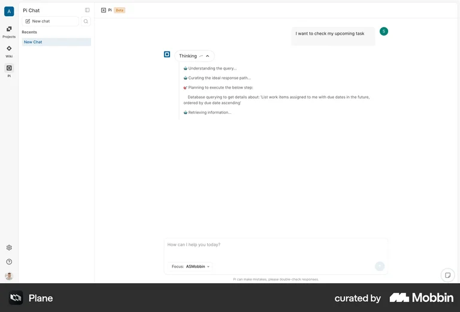
**Plane (Pi assistant) — collapsible "Thinking" trace.** A labeled, collapsible "Thinking"
block lists intermediate steps ("Understanding the query", "Planning to execute the below
step", the literal database query being run) above the final answer. **The specific move
worth borrowing** is making the trace collapsible by default. It stays available for
verification without competing with the answer for attention. [View on Mobbin](https://mobbin.com/screens/19249595-3bcc-418f-88e5-15d5b60ea3af)

### Override controls

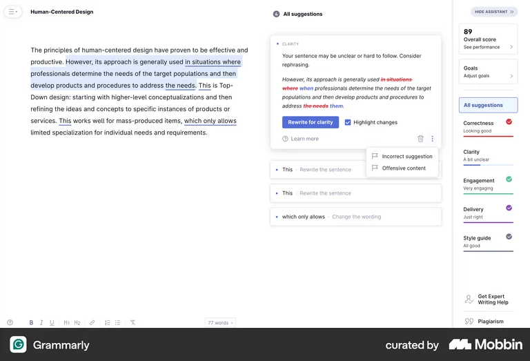
**Grammarly — rewrite plus dismiss plus "incorrect suggestion" feedback.** Beyond simple
accept and reject, a kebab menu on each suggestion offers "Incorrect suggestion" and
"Offensive content" as explicit negative-feedback reasons. **The specific move worth
borrowing** is separating "reject this one" from "tell us why it was wrong," which is exactly
the signal needed to improve a ranking or reasoning model over time.
[View on Mobbin](https://mobbin.com/screens/a09d861b-791e-4d00-98aa-72d1875b876d)

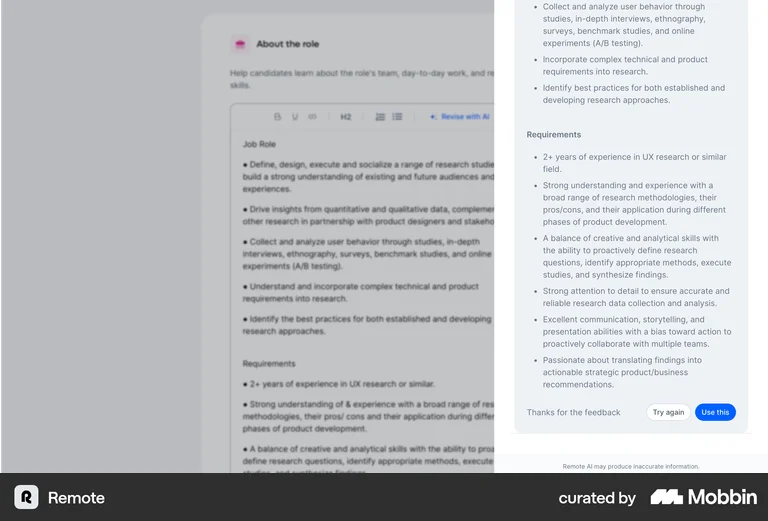
**Remote — "Try again" versus "Use this" on generated content.** Generated job description
content sits in a panel with two buttons only: regenerate or accept, plus a persistent
disclaimer that AI may produce inaccurate information. **The specific move worth borrowing**
is keeping the override surface to two clear verbs instead of a crowded toolbar, which keeps
the decision fast for a busy operator. [View on Mobbin](https://mobbin.com/screens/44344cb5-9817-4d0e-b696-e8ba936b2f82)

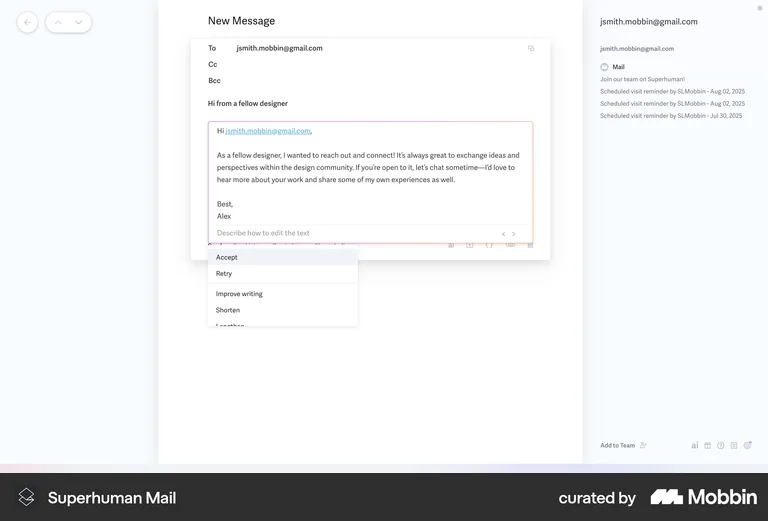
**Superhuman Mail — inline AI edit with Accept, Retry, and style shortcuts.** An AI rewrite
appears as a diff-style overlay directly in the compose field, with Accept, Retry, Improve
writing, and Shorten stacked as one contextual menu anchored to the edited text itself.
**The specific move worth borrowing** is anchoring the override menu physically at the point
of the edit rather than in a side panel, keeping the correction loop tight.
[View on Mobbin](https://mobbin.com/screens/362889f5-66fe-457f-bac0-a607d0fa09bf)

### Graceful failure states

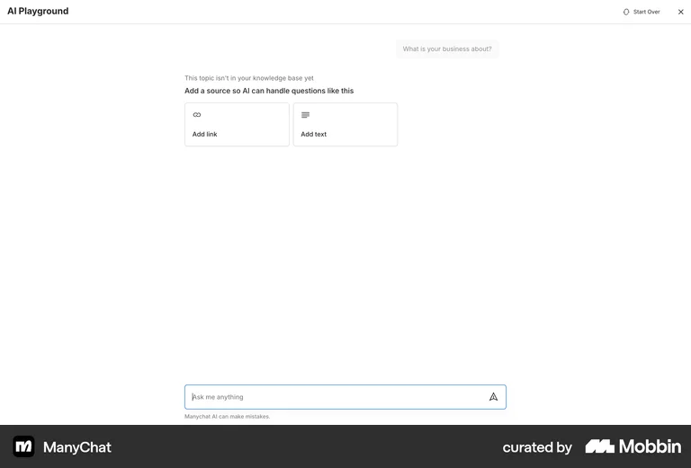
**ManyChat — "this topic isn't in your knowledge base yet."** Instead of a generic error, the
AI names the specific gap and offers two direct remediation actions, Add link and Add text,
right where the failure occurred. **The specific move worth borrowing** is pairing the
failure message with the exact fix action inline, not a link to a help article.
[View on Mobbin](https://mobbin.com/screens/84688996-8fd9-48cc-b697-fc85c8a3f9b3)

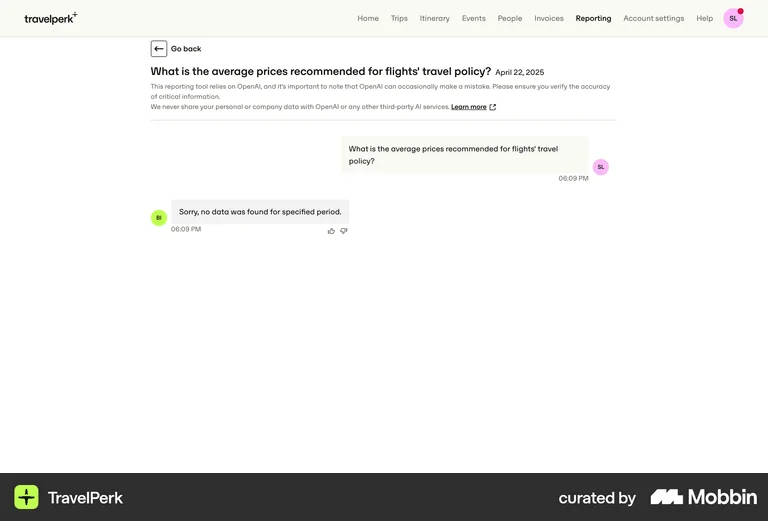
**TravelPerk — persistent AI-accuracy disclaimer plus honest "no data" answer.** A standing
banner above the chat ("this reporting tool relies on OpenAI... please verify the accuracy of
critical information") sits above a plain, undecorated "Sorry, no data was found for
specified period" response. **The specific move worth borrowing** is setting the trust
expectation once, persistently, above the thread, rather than repeating a caveat on every
message. [View on Mobbin](https://mobbin.com/screens/dd154cd6-e461-46c9-8cb3-38f6ddbc489e)

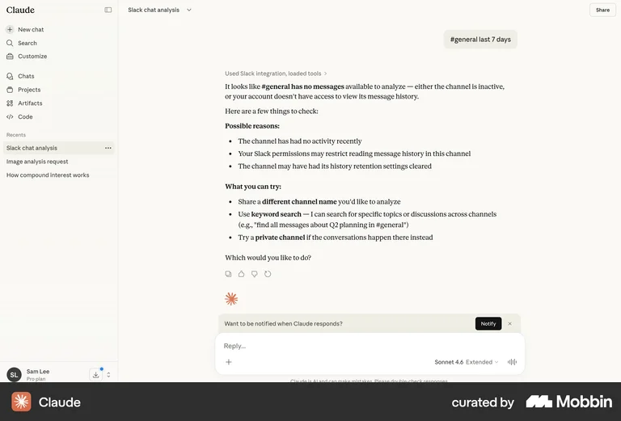
**Claude — structured failure with named possible reasons and next actions.** When a data
source returns nothing, the response is organized into "Possible reasons" (bulleted) and
"What you can try" (bulleted, each a distinct concrete action), then ends by asking the user
which path they want. **The specific move worth borrowing** is the two-part structure,
diagnose then offer choices, plus ending on a direct question that keeps the user in control
of the next step. [View on Mobbin](https://mobbin.com/screens/d268695c-600e-4373-9e5e-d4eabad5daf6)

### Logistics dashboards

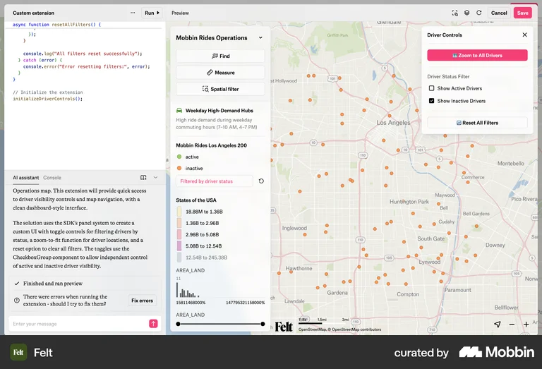
**Felt — operations map with live status filter and driver detail panel.** A control panel
toggles Active and Inactive driver visibility on a live map, with a "Zoom to All Drivers"
reset and a click-to-inspect detail card per point (driver id, zone, status). **The specific
move worth borrowing** is the status toggle plus one-click reset pairing, letting an operator
declutter a busy map instantly and just as quickly return to the full view.
[View on Mobbin](https://mobbin.com/screens/c8b96c23-975f-472b-acca-279dede6555c)

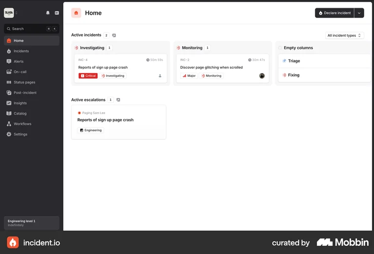
**incident.io — "Home" control tower view.** Active incidents and active escalations are
shown as compact cards grouped by state (Investigating, Monitoring), each carrying a severity
tag and elapsed timer, alongside a prominent "Declare incident" action. **The specific move
worth borrowing** is showing elapsed time per active item directly on the card, which is the
single most useful signal for triage urgency and translates directly to "how long has this
shipment been delayed." [View on Mobbin](https://mobbin.com/screens/beb49f89-6e5a-47e0-a02b-70665a3fe7bf)

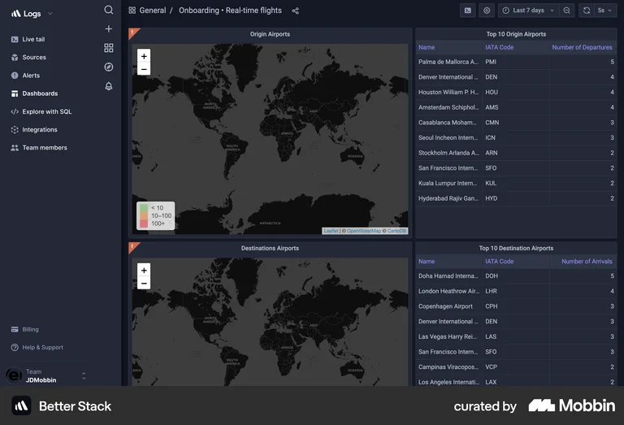
**Better Stack — live geographic log dashboard with paired origin and destination panels.**
Two maps (origin, destination) sit beside ranked top-10 tables for each, with a live-tail
control and time range selector above. **The specific move worth borrowing** is pairing a
map view with a ranked table view of the same data side by side, so a manager gets both
spatial and list context without switching screens. [View on Mobbin](https://mobbin.com/screens/9dc665e9-af97-4630-88ca-e7a6926d91be)

### Shipment tracking

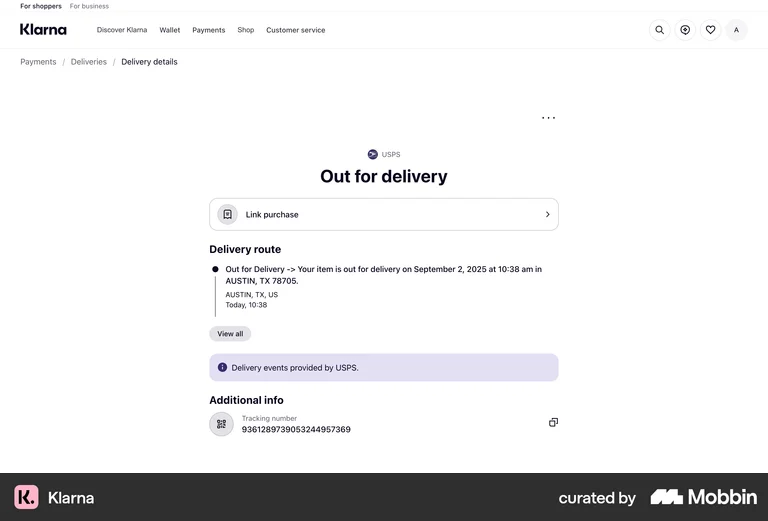
**Klarna — delivery detail with carrier-verified event log.** Status header ("Out for
delivery") sits above a vertical event timeline sourced from the carrier, with an explicit
attribution note ("Delivery events provided by USPS"). **The specific move worth borrowing**
is the source attribution line, telling the user exactly which system the data came from,
which builds trust in a multi-carrier or multi-system environment like logistics ops.
[View on Mobbin](https://mobbin.com/screens/620c8e68-b3e7-4838-baa7-dcdd4d299064)

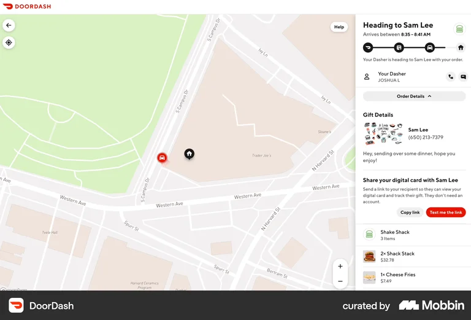
**DoorDash — live map tracking with milestone progress bar.** A horizontal milestone tracker
(store, prep, driving, arrived) sits above a live map with a moving marker and an arrival time
window. **The specific move worth borrowing** is combining a linear milestone bar with live
spatial tracking in one view, so the manager sees both "which stage" and "exactly where" at a
glance. [View on Mobbin](https://mobbin.com/screens/03555ab9-dd42-45cc-97b7-aa608e1e9c4e)

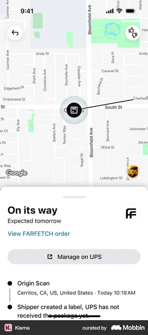
**Klarna (iOS) — mobile tracking card over full-bleed map.** A bottom sheet ("On its way,
Expected tomorrow") floats over a full-screen map, with a direct "Manage on UPS" deep link out
to the carrier's own system. **The specific move worth borrowing** is the deep link to the
carrier of record rather than trying to replicate every carrier action natively, useful when
an ops copilot aggregates multiple carrier systems it does not own.
[View on Mobbin](https://mobbin.com/screens/cba687bc-88f6-4222-8675-5c1c1fabea9f)

### Notifications and alerts

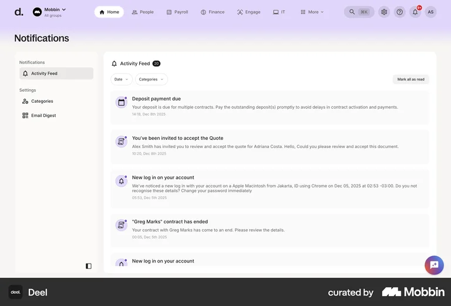
**Deel — categorized activity feed with "mark all as read."** Notifications are a plain
reverse-chronological feed with a Date and Categories filter pair above the list and a global
"mark all as read" action. **The specific move worth borrowing** is keeping notification
filtering to exactly two dimensions, time and category, which is enough to triage without
overwhelming the control surface. [View on Mobbin](https://mobbin.com/screens/34b77080-b18f-47f9-863a-959f6d7d7821)

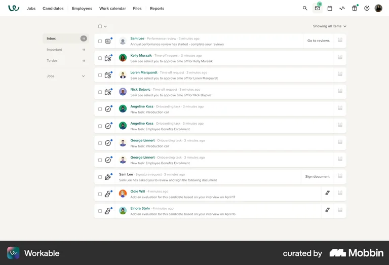
**Workable — action-oriented inbox with inline resolve actions.** Each inbox row names the
actor, the action needed ("Time-off request", "New task"), and time, and select rows carry a
direct action button ("Go to reviews") right in the row. **The specific move worth
borrowing** is putting the resolving action directly on the notification row for
high-frequency request types, cutting a full navigation step out of the triage loop.
[View on Mobbin](https://mobbin.com/screens/7394bbf7-fef9-4066-89df-881515abc89c)

### Search and filter

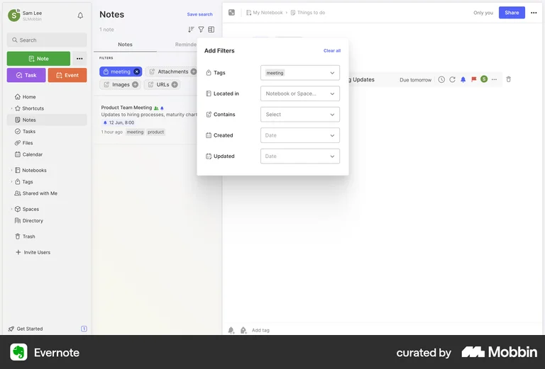
**Evernote — stacked facet filter panel.** An "Add Filters" popover stacks Tags, Located in,
Contains, Created, and Updated as independent facet rows, each collapsed to a dropdown until
engaged, with active filters shown as removable chips above the list. **The specific move
worth borrowing** is showing active filters as chips above the results while keeping the
facet builder itself in a separate, dismissable popover, so the applied state and the editing
state never crowd each other. [View on Mobbin](https://mobbin.com/screens/aa24ecdd-d20a-4a2a-b723-6080c33e055c)

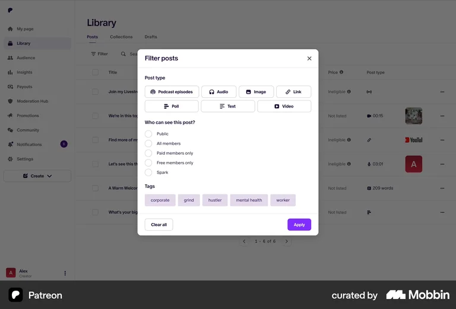
**Patreon — grouped filter modal with multi-select chip groups.** A single modal groups
filters by type (Post type, Who can see this post, Tags) using chip-style multi-select
buttons rather than dropdowns, with Clear all and Apply as the only two footer actions.
**The specific move worth borrowing** is using chip buttons instead of checkboxes for
multi-select facets when the option count is small, since chips are faster to scan and tap
than a checkbox list. [View on Mobbin](https://mobbin.com/screens/a2dc4892-3eee-4d64-8579-0d2fd9e477b7)

### Direct competitor product screenshots (web scrape supplement)

Mobbin has no coverage of the named logistics competitors, so this section supplements the
benchmark with screenshots captured directly from each vendor's public marketing site via a
Playwright web scrape. These are marketing-site product mockups and illustrative UI, not live
production screenshots, so treat them as directional evidence of each vendor's design
language and stated capabilities rather than a pixel-accurate audit of their real app.

**Follow-up deep dive.** project44, Blue Yonder, and SAP each surfaced a genuinely distinct
convergent pattern or anti-pattern on the first pass, so each vendor's own product navigation
was explored further (project44's "AI Orchestration" hub, Blue Yonder's remaining Capabilities
tabs, SAP's Features tab) to confirm whether that first signal was representative or a
one-off. Oracle, Descartes, and Kuebix were not explored further: Oracle's site is
narrative-only with no real UI, Descartes' visibility pages repeat the same illustrative
mockup style already captured, and Kuebix's absence of AI/ranking language is itself the
finding, so more pages would not add evidence.

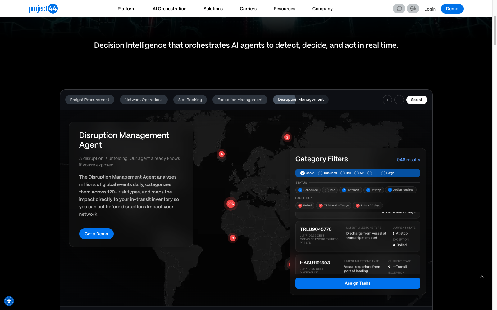
**project44 — Disruption Management Agent panel.** A live map plots active disruption
clusters as numbered red markers, paired with a "Category Filters" panel that lets an
operator narrow by mode (Ocean, Truckload, Rail, Air, LTL, Barge), status (Scheduled, Idle, In
transit, At stop, Action required), and exception type (Rolled, TSP Dwell > 7 days, Late > 20
days). Below the filters sit individual shipment cards showing container ID, latest milestone,
and current state, ending in a single "Assign Tasks" bulk action. **The specific move worth
borrowing** is exception type treated as its own filter facet, separate from status, so an
operator can isolate "shipments rolled to a later vessel" as a distinct triage lane rather
than burying it inside a generic status field.

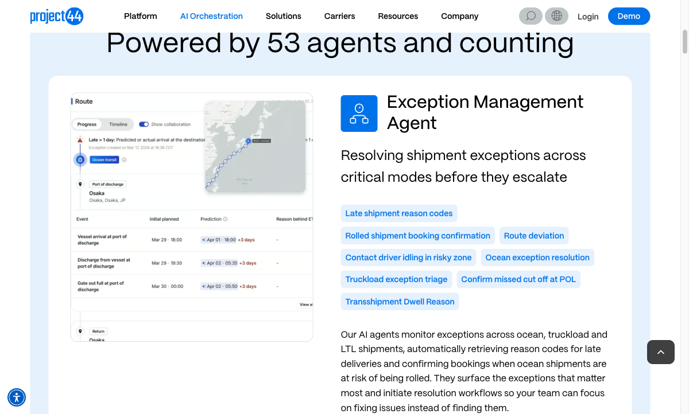
**project44 — Exception Management Agent card ("Powered by 53 agents and counting").** A
shipment route card shows a Progress/Timeline toggle and a "Show collaboration" switch above a
flagged exception ("Late > 1 day: Predicted or actual arrival at the destination"), then a
milestone table with **Initial planned**, **Prediction**, and **Reason behind ETA** columns,
each late milestone carrying a "+3 days" delta badge. **The specific move worth borrowing** is
the three-column structure itself: plan, current prediction, and reason side by side per
milestone, which is the clearest "why did this rank/change" disclosure found anywhere in the
benchmark, logistics or adjacent industry, because it ties the reasoning to a specific
comparison rather than a free-text explanation.

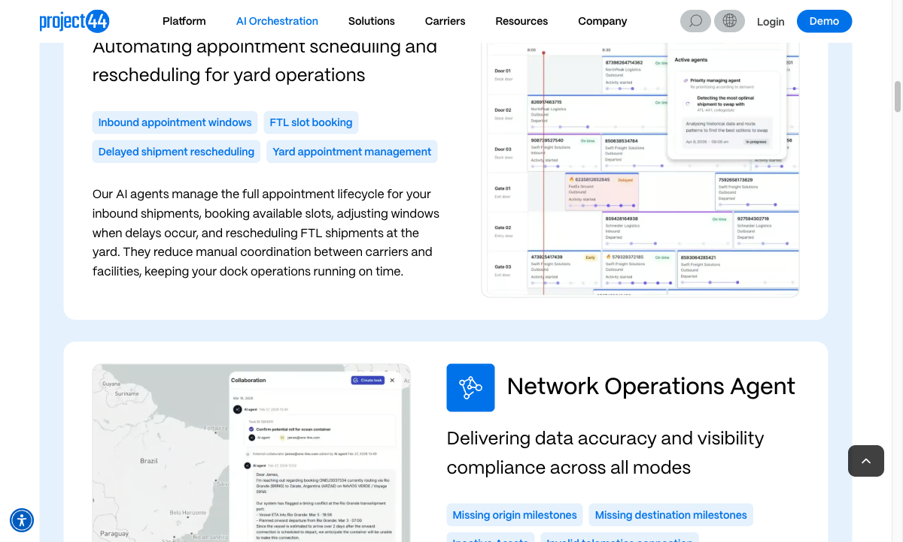
**project44 — Slot Booking Agent yard board with a live reasoning tooltip.** A dock and gate
schedule shows On time, Delayed, and Early status chips per shipment, with a floating "Active
agents" tooltip reading "Priority managing agent: Detecting the optimal shipment to swap
with... Analysing historical data and route patterns to find the best options to swap." **The
specific move worth borrowing** is surfacing the agent's literal in-progress reasoning as a
transient tooltip anchored to the board itself, rather than a static label, which signals to
the operator that a recommendation is actively being computed and on what basis.

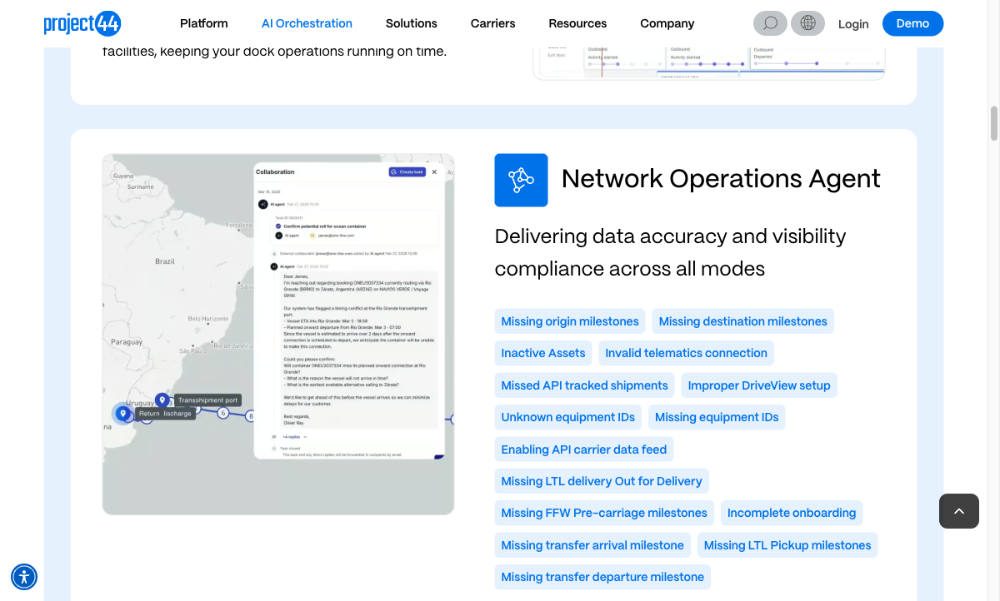
**project44 — Network Operations Agent collaboration panel.** Over a shipment route map, a
task thread shows the AI agent flagging "Confirm potential roll for ocean container," adding
an external collaborator by email, and drafting a complete outreach message to a named carrier
contact that cites the exact vessel ETA, the planned departure, and asks two specific
clarifying questions, ending "This task and any direct replies will be forwarded to recipients
by email." **The specific move worth borrowing** is the AI drafting real external
communication with its full reasoning visible and editable before send, rather than sending
silently or only summarizing that an email was sent. This is the most advanced
trust-and-verify pattern in the entire benchmark, letting a manager review exactly what the
AI will say on their behalf before it goes to a third party.

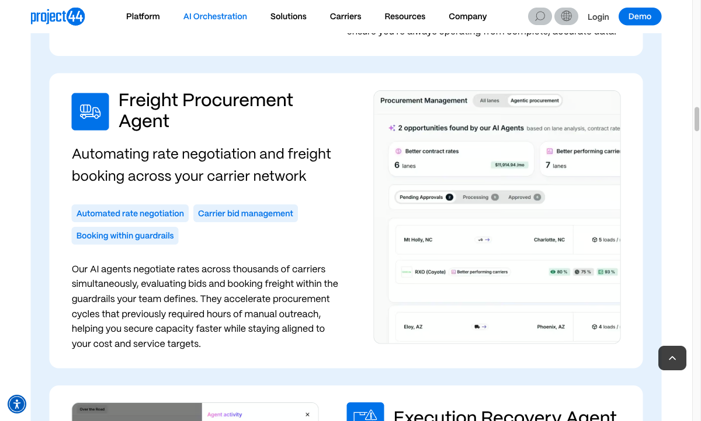
**project44 — Freight Procurement Agent panel.** A "Procurement Management" view opens with "2
opportunities found by our AI Agents based on lane analysis, contract rate..." stated directly
above the results, followed by two labeled opportunity cards (Better contract rates, Better
performing carriers) with a concrete lane count and dollar value each, then a lane list with
Pending Approvals, Processing, and Approved stage counts. **The specific move worth
borrowing** is stating the basis for a recommendation in the same sentence as the
recommendation count, so the manager sees the "why" before even opening the first result, and
gating every recommendation behind an explicit approval stage rather than auto-executing.

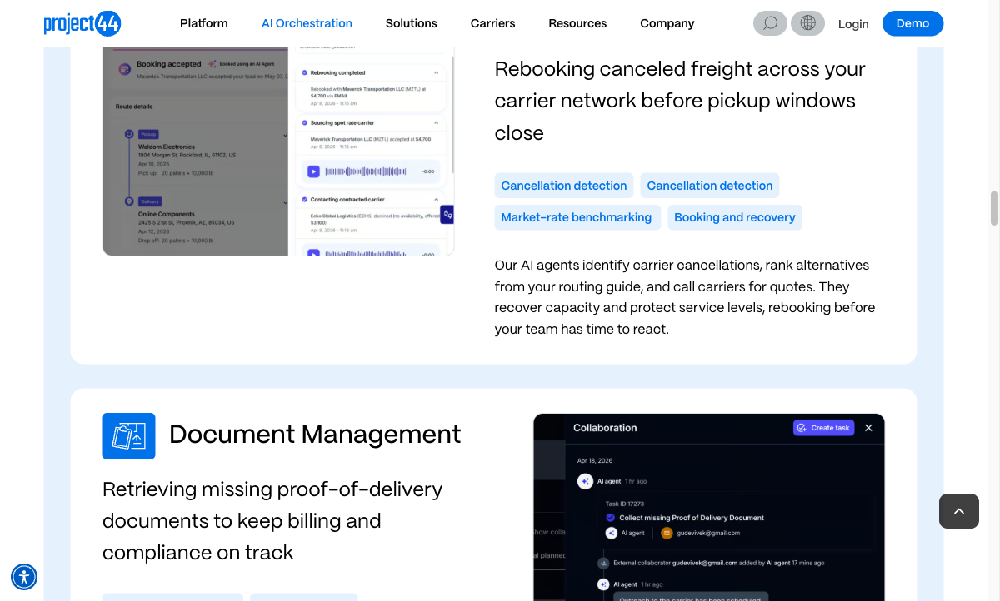
**project44 — Execution Recovery Agent activity log with playable call audio.** After a
cancellation, an "Agent activity" log narrates each recovery step in order ("Booking
accepted, Booked using AI Agent," "Sourcing spot rate carrier," "Contacting contracted
carrier"), and the carrier-outreach step includes an inline **playable audio waveform** of the
actual call, with the outcome transcribed beneath it ("Echo Global Logistics declined, no
availability, offered $53,000"). **The specific move worth borrowing** is logging the AI's own
phone-based negotiation as a scrubbable audio artifact tied to a plain-language outcome line,
which is the single strongest graceful-failure and verifiability pattern observed anywhere in
this benchmark. A manager who doubts a rejected booking can listen to the actual call rather
than trust a summary of it.

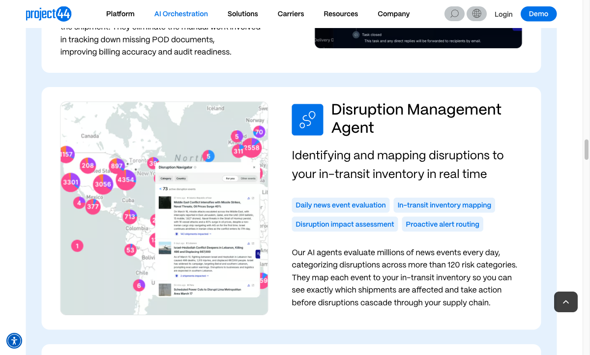
**project44 — Disruption Navigator event feed.** A world map shows disruption-density bubbles
by region, paired with a scrollable feed of real-world news events ("Middle East Conflict
Intensifies with Missile Strikes, Naval Threats; Oil Prices Surge 40%"), each with a full
summary paragraph and a direct "N shipments impacted" link. **The specific move worth
borrowing** is tying an external, human-readable news narrative directly to a shipment-impact
count, which grounds an abstract disruption in a concrete, checkable consequence for this
specific operation rather than a generic risk score.

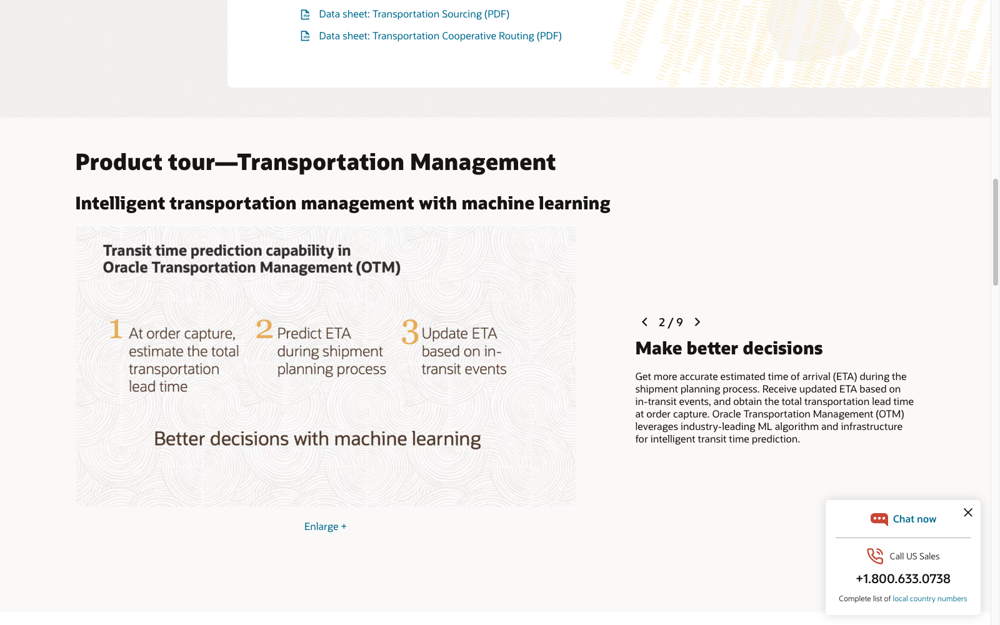
**Oracle Transportation Management — product tour carousel.** The public product tour leads
with a machine-learning transit-time prediction slide (1 of 9) rather than a raw feature list,
framing the AI capability as the headline before showing UI. The tour itself sits behind a
static, largely non-interactive carousel on the marketing site. **The specific move worth
borrowing** is minimal. This page reflects Oracle's stated market position (a mature, planning
and execution-heavy suite) more than a specific interaction pattern, and it is a useful
reminder that legacy enterprise vendors often market AI capability narratively rather than by
showing the working interface.

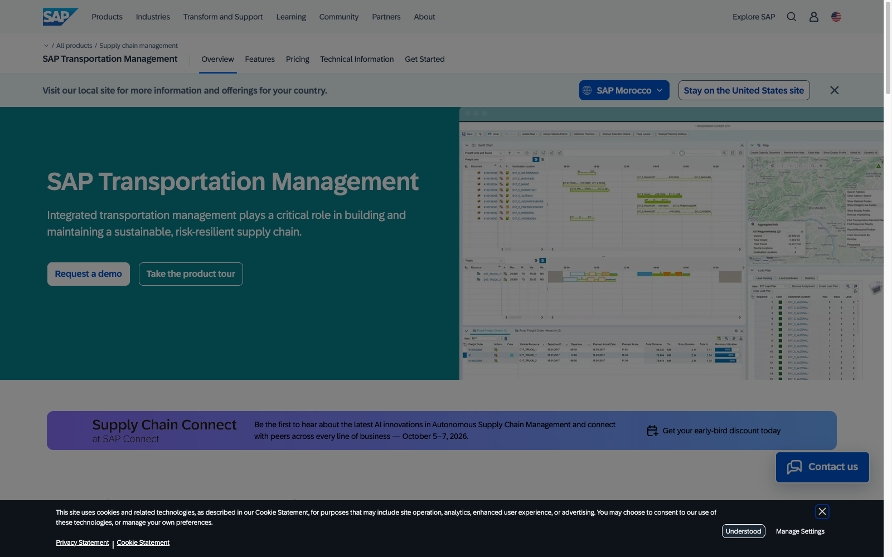
**SAP Transportation Management — Gantt-based planning cockpit.** A dense, multi-pane cockpit
combines a Gantt-style freight unit and truck timeline, a live map, an aggregated info panel
(volume, weight, total pieces), and a load plan table, all visible at once with no
progressive disclosure. **The specific move worth borrowing** is limited. This is the clearest
example in the benchmark of the "expert-mode density" failure pattern: everything is always
visible, nothing is prioritized, and the operator must scan the entire cockpit to find what
matters. This is a direct anti-pattern for our product, which should surface a ranked few
items rather than the full operational surface at once.

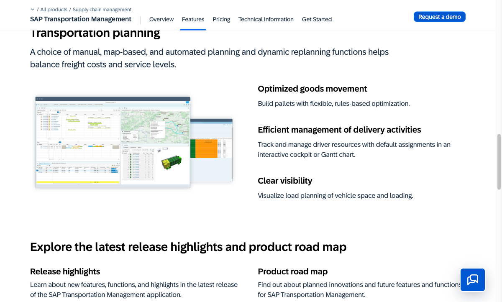
**SAP Transportation Management — transportation planning feature detail.** The Features tab
shows the same cockpit pattern a second time (Gantt timeline, map, and a 3D pallet-loading
visualization all in one screen) captioned "a choice of manual, map-based, and automated
planning and dynamic replanning functions." **This confirms the density anti-pattern is
representative of the product, not a one-off screenshot.** Two independent pages on SAP's own
site both default to showing the entire operational surface at once with no prioritization
layer on top, which raises confidence that this is how the actual planner cockpit works day to
day, not just a marketing artifact.

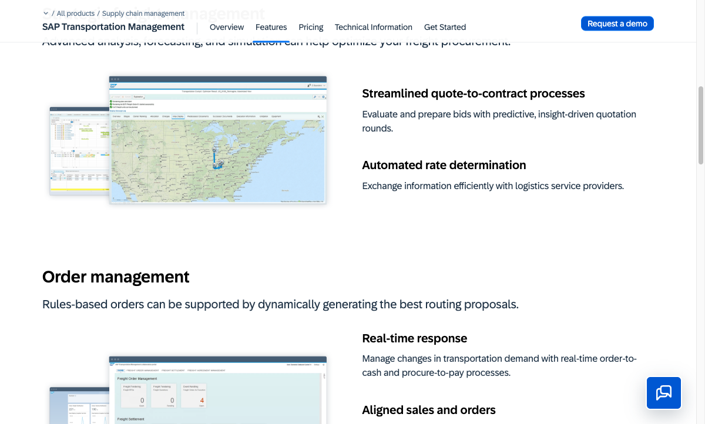
**SAP Transportation Management — order management tile dashboard.** In contrast to the Gantt
cockpit, SAP's order management screen groups related counts into small numbered tiles
(Freight Tendering, Freight Settlement, Freight Agreement Management), each tile showing
several sub-metrics as plain numbers with a highlighted count for items needing attention
(e.g. a red "4" on Exception Handling). **The specific move worth borrowing** is real,
despite sitting inside the same product as the density anti-pattern above: grouping counts
into small labeled tiles with one highlighted "needs attention" number per tile is a much
lighter-weight ranking signal than the Gantt cockpit's flat density, and shows that even a
dense legacy suite can produce a scannable summary layer when it chooses to. **The anti-pattern
lesson stands too:** this tile view exists as a separate screen from the cockpit rather than
as a layer on top of it, so the operator must still navigate away from the dense view to get
the scannable one.

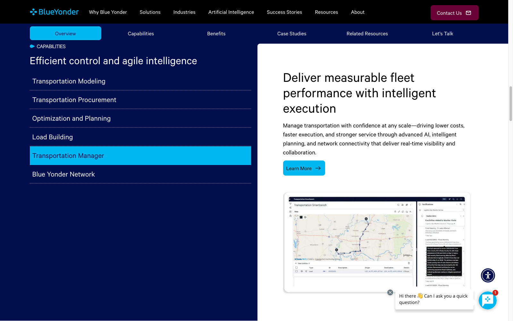
**Blue Yonder — Transportation Smartbench with weather alert notification.** A live map
showing an active route sits beside a notifications panel headed "Logistics Ops Weather
Service," listing a "Flood Warning, 5 Loads Affected" entry with a full narrative underneath:
the carrier, the affected load ID, the literal coordinates, a stated delay estimate, and a
recommended action ("evaluating alternate routing to mitigate operational impact"). **The
specific move worth borrowing** is the closest logistics-native example of AI reasoning
disclosure found anywhere in this benchmark. The notification states cause, quantified impact,
and recommended next step together in one card, which is structurally similar to the
Claude/Cohere reasoning-trace pattern from the adjacent-industry findings above, just applied
natively to a shipment exception.

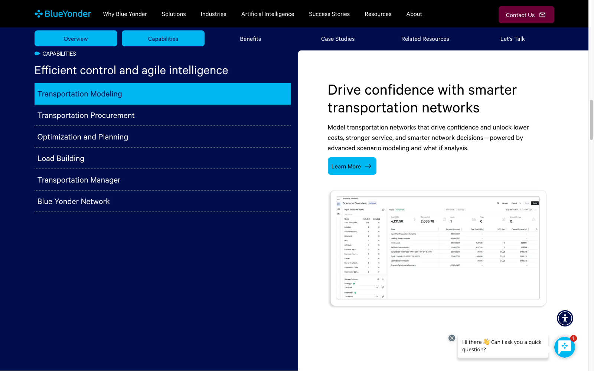
**Blue Yonder — scenario modeling results table.** A "Scenario Overview" panel shows solver
inputs (time zone, location, shipment, carrier counts included and excluded) beside a results
table with per-phase duration, cost, percent off door, and distance traveled, ending in a
"Solve Complete" status. **The specific move worth borrowing** is showing included and
excluded counts side by side per input dimension, which makes a filtered or constrained
scenario auditable at a glance instead of requiring the operator to remember what was
excluded.

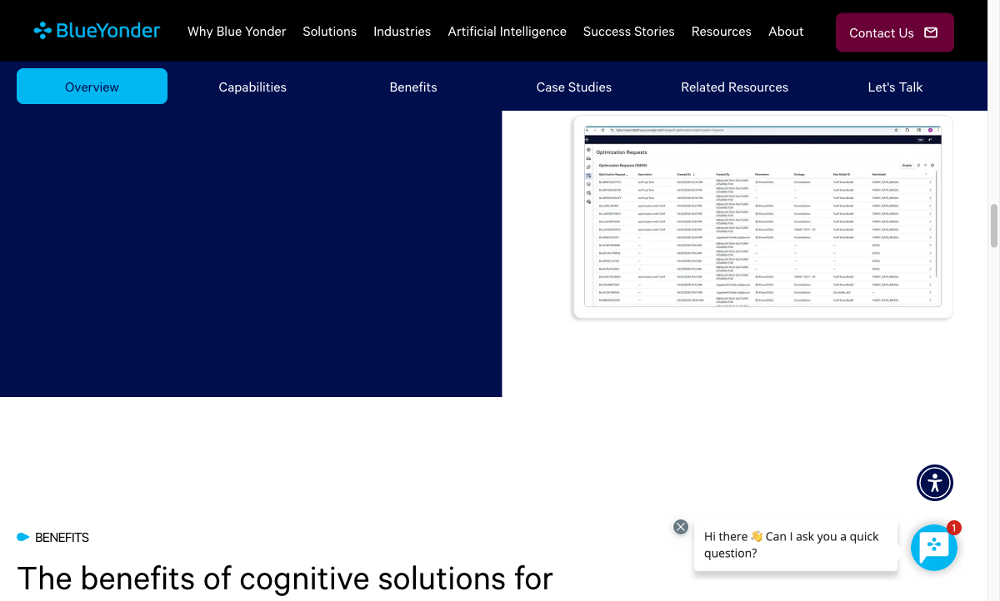
**Blue Yonder — Optimization Requests table.** The Optimization and Planning capability tab
shows a raw, dense data table (Optimization Request, Description, Created By, Parameters,
Strategy, Rate Model ID, Rate Model), every column the same visual weight, requiring
horizontal scroll to see it all. **This is a second, independent confirmation of the density
anti-pattern** already observed in SAP, from an entirely different vendor. Two of two enterprise
logistics vendors examined in depth default to flat, undifferentiated tables as their
optimization and planning surface, which raises this from a single observation to a
cross-vendor pattern: **the whole category under-invests in visual hierarchy for
operationally dense screens**, which is exactly the gap our product should not repeat.

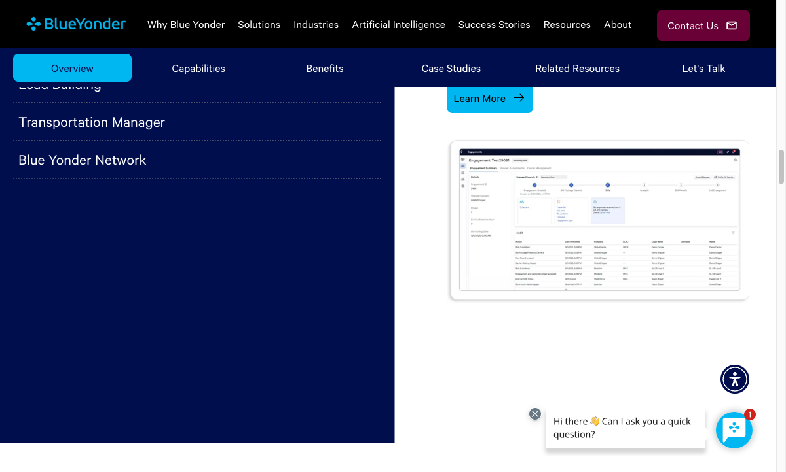
**Blue Yonder — carrier engagement pipeline with staged bidding and an audit table.** A
"Transportation Procurement" panel shows an engagement moving through named stages (Round,
Receiving Bid) with a bid-comparison summary card, sitting directly above the same
dense, unstyled audit table pattern (timestamped rows: Rate Submitted, Not Package Forward to
Carrier, Rate Round Started, one row per actor and action). **The specific move worth
borrowing** is the staged-engagement concept itself (naming which round and phase a
negotiation is in). **The anti-pattern to avoid** is pairing that clear staged view with a raw
audit table directly underneath with no summarization, the same density failure recurring a
third time across this benchmark.

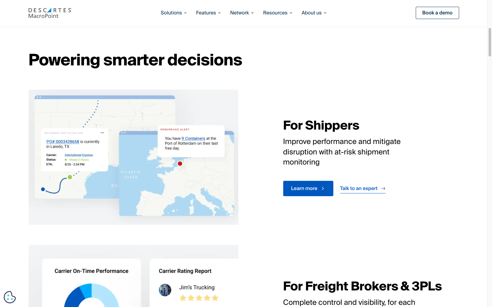
**Descartes MacroPoint — shipment notification and demurrage alert cards.** Two floating
cards over a map show a shipment notification (PO number, current location, carrier, status
"Ahead 2 Hours," ETA) and a demurrage alert ("You have 9 Containers at the Port of Rotterdam
on their last free day"). **The specific move worth borrowing** is naming the financial or
operational consequence directly in the alert copy (demurrage, last free day) rather than a
generic "attention needed" label, which is a strong pattern for making exception severity
self-evident without a separate severity legend.

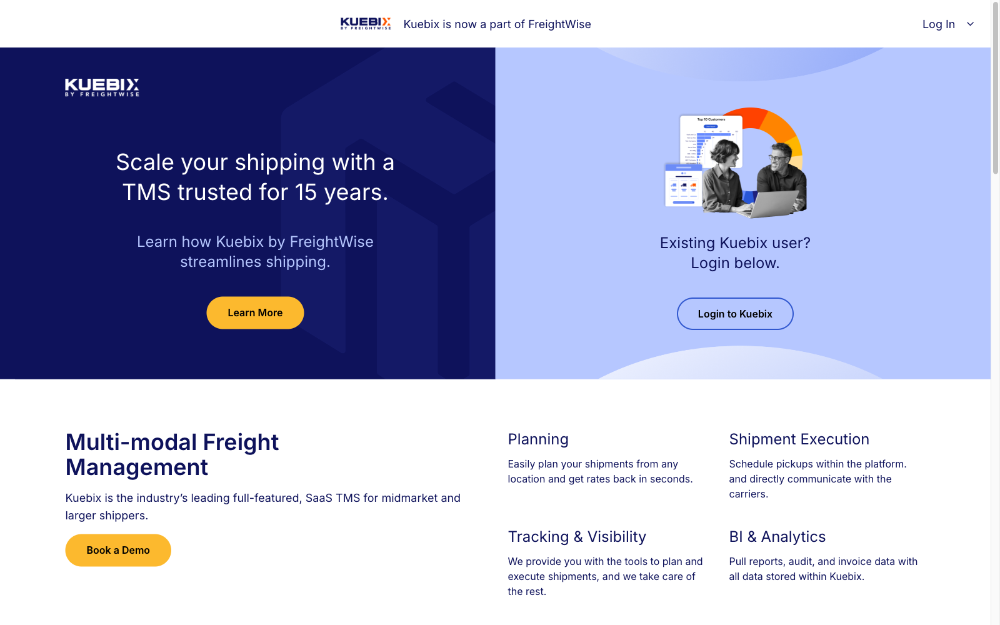
**Kuebix by FreightWise — marketing homepage.** Kuebix's public site shows only small
illustrative dashboard thumbnails (a "Top 10 Customers" report snippet) rather than any
detailed in-app screenshot, and organizes its story around four plain capability labels
(Planning, Shipment Execution, Tracking & Visibility, BI & Analytics) with no AI or
exception-ranking language anywhere on the page. **This confirms, with direct visual
evidence, the market research finding** that Kuebix's public posture is workflow
digitization rather than AI-native orchestration. It is the weakest AI signal of the six
named competitors and the easiest to differentiate against on this dimension alone.

## Convergence vs divergence

**Convergence, high confidence.** Every AI reasoning example observed (Grammarly, Cohere,
Perplexity, Plane, Claude) discloses reasoning as **structured, labeled steps rather than a
single paragraph**. Four of five separate the trace from the final answer visually, either
as a collapsible block (Plane) or a distinct card (Grammarly). This is a strong signal, not a
guess. It shows the frontier has settled on "reasoning is a distinct, dismissable UI object,"
not an inline narrative mixed into the answer text.

**Convergence, high confidence.** Every override control observed (Grammarly, Remote,
Superhuman Mail) reduces the decision to a **small, fixed set of verbs** (accept and reject,
or accept and retry) anchored physically at the point of the AI output, never in a separate
settings-style panel. Three for three agreement here, across three unrelated product
categories, is a strong pattern.

**Divergence, genuine fork.** Prioritized queues split into two competing structural
approaches. ClickUp and Zendesk **group rows under priority-band headers** (Urgent, High,
Normal, each a labeled section with its own count), while Linear treats priority as **a
saved filtered view** you switch into rather than a grouping you scroll through. The grouped
approach keeps all priorities visible at once for situational awareness. The saved-view
approach keeps the current screen focused on one tier only. Both are defensible; the choice
depends on whether the operator needs to see the full distribution (grouped) or wants to work
one priority tier at a time (view-based).

**Divergence, genuine fork.** Graceful failure states split on **how much structure to
impose on the recovery message**. ManyChat and TravelPerk keep the failure message terse,
a single sentence plus one or two direct actions. Claude imposes a two-part structure
(diagnosis bullets, then remedy bullets) before ending on a question. The terse approach is
faster to read for a simple, well-understood gap; the structured approach is better suited to
ambiguous failures where the user genuinely does not know why something failed and needs the
system to reason about it with them, which is closer to the exceptions triage case.

**Convergence, high confidence, cross-vendor.** The deep dive into project44, Blue Yonder, and
SAP surfaced a pattern the first pass could not see: **enterprise logistics vendors default to
flat, undifferentiated data tables for their most operationally dense screens.** SAP's
planning cockpit, SAP's order management detail, Blue Yonder's optimization requests table,
and Blue Yonder's procurement audit log all show the same failure independently, every column
equal weight, no ranking, no visual hierarchy, frequently requiring horizontal scroll. Two
unrelated vendors, four separate screens, one pattern. This is no longer a single observation,
it is a category-wide anti-pattern, and it is the single most confident finding in this
entire benchmark because it recurs across competitors who do not share a codebase or design
team.

**Convergence, high confidence, logistics-native.** project44 is the only competitor whose
product screenshots show real, worked exception-reasoning UI, and once examined in depth it
converges with the adjacent-industry AI-reasoning finding above rather than contradicting it.
Its Exception Resolution Agent (plan vs prediction vs reason, per milestone), its Slot Booking
Agent (a live tooltip narrating why a specific swap is being evaluated), and its Freight
Procurement Agent (stating the analytical basis in the same sentence as the recommendation
count) all independently reach the same principle observed in Grammarly, Cohere, Perplexity,
and Claude: **state the reasoning next to the recommendation, structured, not as free text
apart from it.** This confirms the pattern generalizes across categories rather than being an
artifact of AI-chat-style products specifically.

**Divergence, genuine fork, newly surfaced.** Trust-building on AI-initiated external actions
splits into two depths. Blue Yonder's weather-alert card and project44's procurement
opportunity cards state reasoning **and stop there**, presenting a conclusion for the manager
to accept or reject. project44's Network Operations Agent and Execution Recovery Agent go
further, showing the **literal artifact of the AI's own action** (the drafted outreach email
before it sends, the recorded audio of a completed carrier call). The first depth is
sufficient for internal recommendations a manager approves before anything happens externally.
The second depth is necessary once the AI is empowered to contact a third party (a carrier, a
customer) on the manager's behalf, since the manager's trust question changes from "is this
prioritization correct" to "what exactly did the AI say or do in my name."

## Implications for our product

**Ranking exceptions.** Adopt the **priority-band grouping pattern** (ClickUp, Zendesk)
rather than the saved-view pattern (Linear) as the primary queue, because operations managers
need full situational awareness across all severities in one scan, not a single filtered
slice. Pair each band with an elapsed-time signal per item, following incident.io's "how long
has this been active" card timer, since delay duration is itself a ranking input in logistics
(a customs hold open 2 hours differs from one open 2 days even at equal nominal severity).

**Visible AI reasoning.** Adopt the **collapsible, labeled trace pattern** (Plane, Cohere,
Perplexity) as the default disclosure mechanism for "why this rank" or "why this
recommendation." Keep the trace collapsed by default so the primary queue stays scannable,
but make every trace expandable inline at the item level rather than requiring navigation to
a separate reasoning screen. Where the reasoning cites a real source or tool call (Cohere's
literal tool invocations, Klarna's carrier attribution), show the literal source, not a
paraphrase, since a manager who wants to challenge the AI needs to verify against the
original signal (the carrier feed, the customs system) not the AI's summary of it.

**Graceful failure.** Adopt the **two-part structured recovery pattern** (Claude) rather than
the terse single-line pattern for the exceptions triage use case specifically, since ranking
failures (wrong priority, missing data on a shipment) are inherently ambiguous rather than
simple gaps. Name the possible reasons the ranking may be wrong, offer concrete next actions
(re-rank, view raw source data, escalate to a human), and end on a direct question that hands
control back, following Claude's pattern. Combine this with Grammarly's separated
negative-feedback reason (distinct from a plain reject) so every override doubles as a
correction signal the ranking model can learn from.

**Avoid the category-wide density anti-pattern.** Every operationally dense screen surfaced
by SAP or Blue Yonder in this benchmark is a flat table or an all-panes-visible cockpit with
no ranking layer on top. Our product's core differentiation is exactly the layer these
competitors skip: never ship a raw table as the primary view for an exception queue. If a
detailed table is needed for audit or drill-down (a legitimate need, evidenced by Blue
Yonder's own audit logs), place it one level below the ranked summary, not beside it or in
place of it, following SAP's own order-management tiles as the (currently disconnected)
proof that a lighter summary layer is achievable even inside a dense legacy product.

**Show the literal artifact, not a summary, once the AI acts externally.** For any feature
where the copilot drafts or takes an action a carrier, customs broker, or customer will see
(an email, a call, a status update), follow project44's Network Operations Agent and Execution
Recovery Agent precedent: surface the actual drafted message or a scrubbable recording of the
actual call, not a paraphrase of what was sent or said. Reserve the lighter
reasoning-plus-conclusion pattern (Blue Yonder's alert card, project44's procurement
opportunity card) for internal recommendations that stop at the manager and go no further
until approved.

## Gaps observed

**Pure logistics competitors have no meaningful Mobbin presence, confirmed and then
qualified by a direct web scrape.** Every query targeting project44, Descartes, Oracle
Transportation Management, SAP Logistics Business Network or TM, Blue Yonder, and Kuebix by
name or by generic "logistics control tower" phrasing returned either zero relevant results or
unrelated SaaS tools (Shopify, Felt, generic map builders) in Mobbin. To close that gap we
scraped each vendor's public site directly with Playwright, then went a level deeper on the
three vendors (project44, Blue Yonder, SAP) whose first-pass screenshot showed a genuine
signal, following each vendor's own product navigation rather than re-running the same search
pattern six times. **That deeper pass changes the shape of this finding.** SAP and Blue Yonder
confirm the whitespace: both show dense, undifferentiated tables as their default treatment of
operationally busy screens, now cross-vendor confirmed rather than a single observation.
Oracle and Kuebix remain unchanged, Oracle markets AI narratively without showing working UI,
Kuebix shows no AI or ranking language at all. **project44 is the exception to the whitespace
finding, not an example of it.** Its "AI Orchestration" hub alone yielded seven distinct,
richly worked exception-handling screens (an exception-resolution milestone table, a live
reasoning tooltip, an AI-drafted external email awaiting send, a recorded carrier call
transcript, a procurement recommendation stating its own basis, and a world-event-to-shipment
impact feed) that collectively show more mature AI-reasoning UI than anything found in the
adjacent-industry Mobbin search. **project44 should now be treated as a primary competitive
reference for this product, not a whitespace data point**, while SAP, Blue Yonder, Oracle, and
Kuebix remain evidence of the gap our product should exploit.

**Adjacent AI-native products supplied the Mobbin-sourced reasoning and override exemplars,
but project44's own site is now the strongest single reference overall.** Every
reasoning-disclosure and override-control exemplar sourced through Mobbin came from a
non-logistics AI-native tool (Grammarly, Cohere, Perplexity, Claude, Plane, Remote, Superhuman
Mail), which held up as the initial finding. The follow-up scrape complicates it in a useful
way: project44's own marketing site independently converges on the same underlying principles
(structured reasoning next to the recommendation, a fixed small set of override verbs) while
adding depth the Mobbin set never showed, namely the AI's own drafted communications and
recorded actions as verifiable artifacts. Our product's differentiated surfaces should
therefore be benchmarked against **both** sets together, the adjacent AI-native products for
general interaction-pattern grounding, and project44 specifically as the closest
same-category competitor actually attempting this problem, not treated as separate categories
with no crossover.

**No true control-tower map-plus-ranked-queue combination was found in one product.** Better
Stack came closest (map and ranked table side by side) but for infrastructure logs, not
shipments. Felt is a generic mapping tool repurposed with a fictional "rides" dataset, not a
real logistics product. This suggests **the map-and-queue combination view itself may be an
opportunity for differentiation** rather than a solved pattern to copy wholesale.
