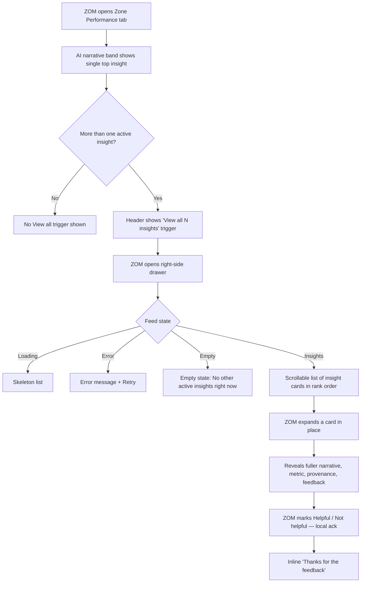

# Product Requirements Document

## AI Operations Co-Pilot

### BCG X | Experience Design — Spring 2026

---

| Field              | Value                                                                                                                                                                                                                                                                                                                                                                                                                                                                                                                                                                                                                                                                                                                                                              |
| ------------------ | ------------------------------------------------------------------------------------------------------------------------------------------------------------------------------------------------------------------------------------------------------------------------------------------------------------------------------------------------------------------------------------------------------------------------------------------------------------------------------------------------------------------------------------------------------------------------------------------------------------------------------------------------------------------------------------------------------------------------------------------------------------------ |
| **Version**        | 1.7 — Geospatial Triage Surface aligned to shipped `/workspace` build (map + feed as one linked triage instrument); new Section 5.1.1, FR-53–FR-58, AC-22–AC-23. v1.6 — Warehouse promoted to first-class entity in the exception data model; Sections 5.0.1, 5.1, 7 Updated                                                                                                                                                                                                                                                                                                                                                                                                                                                        |
| **Status**         | For Review                                                                                                                                                                                                                                                                                                                                                                                                                                                                                                                                                                                                                                                                                                                                                         |
| **Product**        | AI Operations Co-Pilot                                                                                                                                                                                                                                                                                                                                                                                                                                                                                                                                                                                                                                                                                                                                             |
| **Client Context** | Global logistics company, 400+ warehouses                                                                                                                                                                                                                                                                                                                                                                                                                                                                                                                                                                                                                                                                                                                          |
| **PRD Owner**      | BCG X Experience Design                                                                                                                                                                                                                                                                                                                                                                                                                                                                                                                                                                                                                                                                                                                                            |
| **Last Updated**   | Session 17                                                                                                                                                                                                                                                                                                                                                                                                                                                                                                                                                                                                                                                                                                                                                         |
| **Change Summary (v1.8)** | Downstream alignment to what shipped on the **Zone Performance tab of `/performance`**: the "View all active AI insights" feature. New Section 5.13 (Zone Performance AI Insights, all-user surface) records the shipped model — an AI narrative band leading with the single top insight (FR-ZP-01), a **count-bearing "View all N insights" trigger** that opens a **right-side drawer** listing every active insight (FR-ZP-02), each rendered as a scrollable insight card with headline, coarse severity, category, and supporting metric (FR-ZP-03) that **expands in place** (accordion) to reveal fuller narrative, provenance, and **per-insight Helpful / Not helpful** local feedback (FR-ZP-04, FR-ZP-05), with loading / empty / error states covered (FR-ZP-07). FR-ZP-06 codifies the standing **no-raw-score ranking convention** — insight priority is expressed only via coarse severity vocabulary and list order, never a numeric AI score [LOCKED]. Zone Performance tab only; documents already-built behavior. |
| **Change Summary (v1.7)** | Downstream alignment to what shipped on the `/workspace` route: the map and feed now operate as **one linked triage instrument**, not a map-forward view with a subordinate list. New Section 5.1.1 (Geospatial Triage Surface) captures the shipped model: an even 50/50 feed:map split (was 40/60 map-forward); severity-encoded pins (size + color together) with cluster badges colored by the worst tier and a distinct "being handled" ring on delegated/escalated exceptions (FR-53); symmetrical feed↔map linking on hover, single-pin click, and cluster-pin click (FR-54); a hover **preview** popover distinct from the detail view (FR-55); a persistent map inset in the detail state (FR-56); and the FR-52 / AC-21 **no-geodata fallback now implemented** as a map-corner indicator that links back into the feed (FR-52 amended, FR-57, AC-23). FR-58 records that the F-08 route ribbon remains **deferred and contingent on OQ-08** — not delivered. AC-22 added for the linked-instrument behaviors. `/workspace` route only. |
| **Change Summary (v1.6)** | Driven by ZOM feedback that a ZOM works with many warehouses, so exceptions should be associated with warehouses. New Section 5.0.1 (Warehouse and Cluster Registry) defines the warehouse as a first-class entity (id, name, location, coordinates) and the cluster as the set of a ZOM's warehouses — extending, not re-opening, the locked ZOM definition (DX-01/DX-03). FR-02 amended: warehouse is a required, non-null association on every exception, and display location/coordinates are derived from the warehouse rather than a free-text `location` string. FR-51 (sort/group feed by warehouse name) and FR-52 (warehouse identity on card/detail + warehouse-anchored map pins) added to Section 5.1. AC-21 added to Section 7. UI-affecting on the /workspace route only. |
| **Change Summary (v1.5)** | Journey 4.5 (Adoption Tracking — Director-only, visibility + export, 4 flows: 5.1a–5.1c + 5.1f) and Journey 4.6 (Conversational Intelligence — ZOM primary, Director Tier A read-only, 5 stages) added. Section 3.2 (Director persona) updated with J4.5 surface reference. Section 4 preamble updated: journey count corrected to six; J4.5/J4.6 entry points noted. FR-ADOPT-01–03, FR-ADOPT-05–07 added as new Section 5.11 (P1); FR-CONV-01–11 added as new Section 5.12 (P0/P1). AC-14–AC-20 added to Section 7. Extension V-04 renamed to V-09 (Conversational Intelligence Layer) with expanded scope; DX-05 resolved. Assumption register updated: A-10, A-11, A-12 added. FigJam board updated: Journey 4.5 and 4.6 frames added, section header updated. |

---

> **Notation convention used throughout this document:**
>
> - Items marked **[ASSUMPTION]** are minimum reasonable inferences made where the brief or research does not provide explicit data. All assumptions are hypotheses to validate.
> - Items marked **[LOCKED]** are decisions confirmed by the product team and should not be re-litigated without explicit flagging.
> - No data, personas, metrics, or constraints have been invented. All claims are traceable to the design brief (AIXD Brief [1]), the governance framework ([2]), or the market research report ([3]).

---

## 1. Problem Statement

Zone Operations Managers at a global logistics company spend approximately 60% of their working day manually triaging alerts across six disconnected tools — a fragmentation that causes missed exceptions, delayed responses, and structural operational burnout, directly eroding service levels and cost efficiency. The opportunity is to build an AI-native exception co-pilot that ingests signals from those fragmented systems, intelligently prioritizes what demands action, and empowers managers to resolve exceptions decisively — replacing passive alert scanning with confident, guided operational decision-making.

---

## 2. Business Case

### 2.1 Why the Client is Building This

The client operates a logistics network spanning 400+ warehouses and faces simultaneous pressure to improve service reliability, reduce operational costs, and retain an operations workforce showing signs of burnout from tool fragmentation and alert overload. The current state — 60% of manager time absorbed by alert triage across six disconnected systems — is both a people problem and a performance problem: exceptions are missed, response is delayed, and the cognitive burden of context-switching across tools means managers are reactive rather than decisive. This is not a gap that can be closed with a better dashboard; it requires a system that reasons across fragmented signals, interprets operational priority, and guides action.

The business case for AI at this layer is reinforced by market-wide signals. AI adoption in supply chains is expected to rise from 28% of organizations today to 82% within five years (MHI/Deloitte, cited in [2]), and the digital logistics market is growing at a 17.1% CAGR toward an estimated $155B by 2034 ([3]). Competitors including project44 and Descartes are already deploying AI-driven exception management agents, and structural labor pressures — the IRU's 2025 driver-shortage report describes the gap as structural, not cyclical ([3]) — mean operations teams cannot simply add headcount to absorb exception volume. The client's window to establish an AI-native operations capability before competitive pressure compounds is demonstrably short.

### 2.2 Why an AI Co-Pilot Is the Right Solution

Rule-based alerting and conventional workflow tooling have already been deployed by this client; they are the source of the six disconnected tools. What those systems cannot do is reason across fragmented, multi-source signals to produce a single prioritized, explainable, actionable view. An AI co-pilot that reduces triage time, accelerates exception resolution, and maintains full human control at consequential decision points directly addresses the operational and commercial problem. The governance framework ([2]) confirms that logistics AI creates measurable value specifically in high-friction, repetitive, cross-system exception workflows — precisely the use case defined by this brief. This is also the highest-ranked intervention opportunity in the market research ([3], Ranked Opportunity #1): "AI exception orchestration control tower."

### 2.3 Success Metrics

**Primary Success Metric**

| Metric                                   | Definition                                                                         | Target                                       | Measurement Window  |
| ---------------------------------------- | ---------------------------------------------------------------------------------- | -------------------------------------------- | ------------------- |
| Mean Time to Exception Resolution (MTTR) | Average elapsed time from exception detection to verified resolution, per incident | ≥ 40% reduction from pre-deployment baseline | 90 days post-launch |

**Secondary Success Metrics**

| #    | Metric                            | Definition                                                                    | Target                                                            | Rationale                                                                                                         |
| ---- | --------------------------------- | ----------------------------------------------------------------------------- | ----------------------------------------------------------------- | ----------------------------------------------------------------------------------------------------------------- |
| SM-1 | Alert Triage Time                 | % of ZOM's working day spent on alert scanning and triage across tools        | Reduce from ~60% to < 30% within 60 days                          | Directly measures the problem stated in the brief; indicator of co-pilot adoption and efficiency gain             |
| SM-2 | AI Recommendation Acceptance Rate | % of AI-recommended actions routed by ZOMs **without modification** (unmodified Delegate/Escalate, no reason capture triggered) | ≥ 70% within 60 days                                              | Proxy for model trustworthiness and relevance; if too low, AI is generating noise not signal                      |
| SM-3 | Exception Escalation Rate         | % of exceptions requiring escalation beyond the ZOM level for resolution      | ≥ 25% decrease from baseline                                      | Measures first-responder effectiveness; fewer escalations indicates ZOMs are resolving more with co-pilot support |
| SM-4 | ZOM Satisfaction Score            | Net Promoter Score or equivalent survey of primary users at regular intervals | Net positive shift from baseline within 30 days; target NPS ≥ +20 | Measures trust, usability, and adoption quality; leading indicator before outcome metrics mature                  |

> **[ASSUMPTION]** Baseline values for all metrics are assumed to exist in client operational data and will be established in a pre-deployment measurement sprint. If unavailable, a 30-day shadow period before co-pilot activation will be used to establish benchmarks.

---

## 3. User Personas

> **[LOCKED]** The Zone Operations Manager (ZOM) is defined as a zone or cluster operations manager overseeing a defined group of warehouses within the 400+ network. This positioning was resolved from Discrepancy DX-01 and is confirmed as the working definition for the duration of this sprint.

---

### 3.1 Primary Persona: Zone Operations Manager (ZOM)

**Title / Role:** Zone Operations Manager (also: Cluster Operations Lead, Regional DC Manager)

**Organizational Context:** Mid-level operational decision-maker, sitting one level above individual warehouse/site managers and below the Logistics Director. Responsible for the daily operational performance of an assigned cluster of warehouses — [ASSUMPTION: typically 5–20 sites per ZOM within the client's 400+ network, based on geographic proximity and warehouse scale]. Accountable for OTIF performance, exception resolution, carrier coordination, and escalation management within their cluster.

**Working Environment:** Primarily desktop-based (control room or office context); time-pressured with frequent interruptions; manages multiple concurrent exceptions across a shift; communicates heavily via email, messaging, and phone in parallel with tool-based interfaces. [ASSUMPTION: mobile is secondary for MVP; desktop is the primary design target.]

**Current Tool Fragmentation:** The ZOM currently monitors exceptions across six disconnected systems: FleetCommand TMS (shipment routing and carrier status), Nexus WMS (dock and warehouse operations), SignalTrack (real-time carrier visibility), BorderIQ (customs and compliance), OrderPulse (customer orders and SLAs), and OpsDesk (manually reported incidents). Each system has its own alert logic, UI, and notification channel — requiring the ZOM to mentally unify signals that have no shared priority model.

**Behavioral Patterns:**

- Manages by scanning: opens the highest-urgency items first at shift start, not a structured briefing
- Reactive and fast-moving: makes dozens of small operational decisions per hour; prefers speed over depth in triage
- Context-switches constantly across the six tools; current tooling enforces this rather than solving it
- Trusts operational experience over systems; will override AI if their judgment disagrees and needs the AI to earn trust by being right and transparent
- Risk-averse on customer commitments; escalates or seeks approval rather than guessing on high-consequence actions
  **Pain Points:**

1. Six disconnected systems generate alert volume with no shared priority logic — mental unification is entirely the ZOM's burden
2. No distinction between urgent and important; all alerts feel equally demanding until investigated
3. When an exception is identified, there is no guided "next action" — any follow-up diagnosis, decision, and coordination are done ad hoc based on experience
4. Manual carrier check-calls and follow-ups consume a disproportionate share of time (Descartes, [3]: teams still face "manual follow-ups, tracking drops, uncertain arrival events")
5. Alert fatigue causes important exceptions to be missed alongside trivial ones
6. Professional anxiety about missing a critical event in the noise
   **Unmet Needs:**
7. A single, intelligently prioritized view of what demands attention right now, ranked by operational impact
8. Clear explanation of why each exception matters — interpreted significance, not raw data
9. Guided action options per exception — decide without rebuilding context from scratch
10. Override, correction, and delegation with zero process friction
11. Honest transparency about what the AI knows, infers, and does not know
    **Relationship with AI:** Skeptical but open. Will adopt AI assistance if it demonstrably reduces cognitive load and is transparent about uncertainty. Will abandon it quickly if it generates noise, acts without explanation, or fails silently on high-stakes decisions.

---

### 3.2 Secondary Persona: Logistics Director / Network Operations Lead

**Role Context:** Senior operations leader with network-wide oversight responsibility. Does not perform minute-to-minute exception triage. Uses the co-pilot for escalation resolution, approval of high-consequence actions, review of systemic exception patterns across clusters, and monitoring of AI adoption and performance across ZOMs.

**Primary Interaction Patterns:**

- Reviews escalations routed from ZOMs with full context brief assembled by the AI
- Approves, modifies, or rejects Tier 3 high-consequence AI-recommended actions (see Section 5.0)
- Monitors cross-cluster performance roll-up for systemic exception pattern detection
- Configures authority thresholds, escalation rules, and AI autonomy policies per region
- Monitors AI adoption and performance across ZOMs via the Adoption Tracking dashboard (Journey 4.5) — a dedicated read-only surface separate from the escalation inbox, covering AI recommendation acceptance rates, override patterns, and cluster-level adoption depth
- Uses the conversational interface for Tier A read-only queries within their cluster roll-up scope only — no workflow execution through chat (see Journey 4.6)

**Why Included:** The brief implies authority boundaries exist for certain exception types. The governance framework ([2]) requires a defined human above the ZOM in the consequential decision loop. Tier 3 actions (e.g., premium freight booking, customer delivery date modification) require this approver.

**Deprioritized Flows for MVP:** Policy configuration UI (Extension V-07) and proactive anomaly alerting (FR-ADOPT-08) are Extensions (see Section 8). The Adoption Tracking dashboard (Journey 4.5) is a Sprint 2 deliverable requiring 30 days of baseline audit data.

---

### 3.3 Secondary Persona: Transportation Planner / Dispatcher

**Role Context:** Execution-level user responsible for carrier assignments, tendering, and rebooking. Does not use the co-pilot as a primary workspace. Receives _delegated tasks_ from the ZOM when a co-pilot exception requires a carrier-side response.

**Primary Interaction Patterns:**

- Receives delegated exception tasks from ZOM, including exception context brief and AI recommendation
- Executes carrier-side actions (rebooking, alternative routing) within the co-pilot's task interface
- Returns status updates to the ZOM's exception queue
  **Why Included:** The brief asks what the product does when the ZOM delegates. Delegation is meaningless without a defined recipient. Journey 4.4 defines the delegation flow from ZOM to Dispatcher. A Dispatcher-native primary interface is Extension V-05. At MVP, the dispatcher may receive delegated tasks via existing operational systems and/or email/SMS messages.

---

### 3.4 Tertiary Stakeholder: Legal / Compliance Authority

**Role Context:** Internal legal, trade compliance, or regulatory affairs specialist. Is not an active co-pilot user; receives Tier 4 exception escalations (customs holds with legal classification, sanctions screening flags, trade compliance holds) assembled and routed by the AI. Interacts with the system only to confirm receipt, acknowledge the brief, and record disposition outcome.

**Why Included:** [LOCKED] Customs hold exceptions are integrated into the co-pilot's escalation pathway. When BorderIQ signals a legal or sanctions-grade customs hold, the AI classifies it as Tier 4 and routes it to this authority with a full context brief. The Legal/Compliance Authority does not triage; they receive a pre-assembled case for decision. Their response is logged in the co-pilot's audit trail.

**Interaction Design Note:** The co-pilot interface for this stakeholder is minimal by design — a notification with the case brief and a single-decision interface (Acknowledge / Record Disposition). A full compliance workflow interface is Extension V-06.

---

## 4. User Journeys

> Journeys are written from the ZOM's perspective unless noted. Each step captures what the user does and why, and what they are trying to find out at that moment. Implementation detail is intentionally absent here — it lives in Section 5 (Functional Requirements).
>
> **This section defines six journeys.** Journey 4.4 (Delegation) is a branched journey that enters from Journey 4.1 Step 6d. Journey 4.3 (Escalation) is similarly branched from Journey 4.1 Step 5. Journey 4.5 (Adoption Tracking) is a Director-only surface entered independently from the main nav — not branched from any ZOM journey. Journey 4.6 (Conversational Intelligence) is accessible from any screen via the persistent chat panel in the nav rail. The FigJam board (`e8Ftulvja3fluWOLqsRKpL`) holds stage-level journey maps for all six journeys including step format and design-guiding failure points — see Session 05 (J4.1–J4.4) and Session 15 (J4.5–J4.6) outputs.
>
> **Design pitfall taxonomy (P-02, locked Session 05):** When translating these journeys into flows and hi-fi screens, evaluate every design decision against four categories of AI-native failure risk: (1) over-reliance and automation complacency; (2) trust feedback loops that never close; (3) format-channel handoff mismatches; (4) correctness failures disguised as efficiency gains.

---

### Journey 4.1 — Core: Exception Triage and Resolution

**User:** Zone Operations Manager
**Goal:** Identify and confidently resolve the highest-priority operational exception at the start of a shift
**Entry Point:** ZOM opens the co-pilot at shift start or returns after a period of time away from their desk
**Success State:** The most critical exception is resolved, delegated [→ Journey 4.4], or escalated [→ Journey 4.3] with a clear owner; the ZOM has not had to context-switch into any of the six source systems to get there

| Step | What the user does, and why                                                                                                                                                                                                                                                                                                                                               | What they are trying to find out                                                                                                                                                                                                                                                                                      |
| ---- | ------------------------------------------------------------------------------------------------------------------------------------------------------------------------------------------------------------------------------------------------------------------------------------------------------------------------------------------------------------------------- | --------------------------------------------------------------------------------------------------------------------------------------------------------------------------------------------------------------------------------------------------------------------------------------------------------------------- |
| 1    | The ZOM opens the co-pilot expecting to find their operational situation already assembled — not to spend time constructing it from six separate tools. They need an immediate, honest picture of what demands their attention before they do anything else.                                                                                                              | What is the most pressing issue in my cluster right now? Has anything critical happened since I was last active? Am I walking into a crisis or a manageable shift?                                                                                                                                                    |
| 2    | The ZOM reads quickly through the top exceptions, making a rapid first pass before committing attention to any single one. They are mentally sorting what deserves investigation first without yet opening anything.                                                                                                                                                      | What type of exception is each item? How severe is it, and how long has it been open? Why does this one rank above that one? Can I immediately recognize any items as requiring my direct action versus ones that can wait?                                                                                           |
| 3    | The ZOM opens the exception they believe is most critical, intending to understand the full picture before deciding how to respond.                                                                                                                                                                                                                                       | What actually happened, and when? Which shipments, customers, or commitments are affected? Is this genuinely as urgent as it appears? How much of what I'm seeing is confirmed versus inferred or estimated?                                                                                                          |
| 4    | The ZOM reads the AI's interpretation of the exception, cross-referencing it against their own operational knowledge. They are not accepting the AI's reading on faith — they are checking whether it makes sense given what they know.                                                                                                                                   | Is the root cause correctly identified? What downstream impact is being predicted, and does that match what I know about these orders and this customer relationship? How confident should I be in this assessment, and what data is it actually based on? Is there anything the system is missing that I know about? |
| 5    | The ZOM weighs the options in front of them, considering each against their judgment, their authority level, and the operational context at that moment. This is the decision point — they are not rubber-stamping a recommendation. In the co-pilot there is no separate approve step: the ZOM's move is to route the recommendation to whoever owns the next action, and the tier decides how (T1/T2 Delegate; T3/T4 Escalate → Journey 4.3).                                  | What will this action actually do? What are the trade-offs between options — cost, speed, risk? Do I have the authority to approve this, or does it need to go up the chain [→ Journey 4.3]? What happens if I wait, or do nothing?                                                                                   |
| 6a   | The ZOM agrees with the recommendation as-is and routes it to the right recipient — the act of routing is the execution, so there is no separate approve. Because nothing changed, no reason is asked of them.                                                                                                                                                                                         | Is the action being executed now? Will I be kept informed when something changes in response — a carrier reply, a milestone update, or a resolution confirmation?                                                                                                                                                     |
| 6b   | The ZOM broadly agrees with the recommended path but needs to adjust a specific parameter based on knowledge the system doesn't have — perhaps a prior arrangement with the carrier, or a customer expectation that changes the calculus. Editing the instruction marks the package Modified; before it routes, they name why in a short reason category so the recipient sees what changed. | Can I change this before routing? Will what the recipient acts on reflect my adjustment, not the original recommendation? How quickly can I say why I changed it?                                                                                                                                                                                       |
| 6c   | The ZOM disagrees with the recommended path and picks a different alternative, or writes their own action entirely. Their operational judgment takes precedence, and alternatives are immediately visible rather than constructed from scratch. Choosing an alternative or writing their own marks the package Modified, so a reason category is required before it routes.                                                                                                                         | What are my alternatives — including any AI-suggested options — and what are the trade-offs between them? Can I route one quickly, or define my own? What reason do I give for the change?                                                                                      |
| 6d   | The ZOM determines this exception needs someone else to handle — because of their specific expertise, their carrier relationship, or their capacity at this point in the shift. The ZOM wants to hand it off cleanly without the recipient needing to start from scratch. **This step branches to Journey 4.4.**                                                          | Who can I assign this to? Will they receive everything they need to act without coming back to me with questions? Will I still be informed when it's resolved? [→ Journey 4.4]                                                                                                                                        |
| 7    | With the first exception handled or in motion — including any exceptions routed to Journey 4.3 or Journey 4.4 — the ZOM returns to the broader list to continue working through what remains.                                                                                                                                                                             | What else needs my attention? Has anything changed or escalated while I was focused on the first item? Which items have moved to in-progress or been resolved since I last looked?                                                                                                                                    |
| 8    | The ZOM receives confirmation that the exception has closed — through an automated signal, a partner response, a dispatcher's completion confirmation, or their own manual mark. They want a moment of closure before moving on.                                                                                                                                          | Is this fully resolved, or are there still open threads? How long did it take from detection to resolution? Is there anything I need to note or flag before closing this out?                                                                                                                                         |

---

### Journey 4.2 — Trust: Correcting an AI Prioritization Error

**User:** Zone Operations Manager
**Goal:** Correct an AI prioritization mistake quickly, without losing operational momentum or confidence in the system
**Trigger:** ZOM notices an exception was ranked incorrectly — either surfaced too high (false urgency) or not surfaced at all (a genuine miss)

> This journey has two parallel paths: Path A is a false-positive (over-ranked exception) and Path B is a false-negative (missed exception). Both converge at Step 3.

| Step                             | What the user does, and why                                                                                                                                                                                                    | What they are trying to find out                                                                                                                                                                                                                                |
| -------------------------------- | ------------------------------------------------------------------------------------------------------------------------------------------------------------------------------------------------------------------------------ | --------------------------------------------------------------------------------------------------------------------------------------------------------------------------------------------------------------------------------------------------------------- |
| 1a _(Path A — Over-ranked)_      | The ZOM opens an exception near the top of the feed but quickly determines it does not warrant the urgency it has been given. Their operational knowledge tells them something the AI has either misread or lacks context for. | What is driving this high ranking? Is there something I'm missing, or has the system genuinely misjudged this situation? Is it safe to deprioritize it?                                                                                                         |
| 2a                               | The ZOM acts to correct the ranking. They want to fix their active working view quickly and register their judgment with the system — without being pulled into a lengthy feedback process.                                    | How quickly can I lower this exception's priority? What reason can I give that accurately reflects why the ranking was wrong?                                                                                                                                   |
| 1b _(Path B — Missed exception)_ | The ZOM is aware of an operational problem that has not appeared in the co-pilot. They know from direct observation or a communication that something is wrong — and the AI has failed to surface it.                          | Why wasn't this surfaced? Is there a data feed issue, or has the AI genuinely missed something it should have caught? How do I find it — by shipment ID, warehouse ID, or another identifier I already have — and bring it into the feed at the right priority? |
| 2b                               | The ZOM manually brings the missed exception into the feed, assigning it the priority they believe it deserves. They want both the operational correction and the system record of the miss.                                   | Is the exception now visible and ranked correctly? Has my action been registered as a correction rather than a new manual entry?                                                                                                                                |
| 3                                | The ZOM sees the system acknowledge their correction and returns immediately to triage. They expect the acknowledgment to be brief and honest — no over-promising about what happens next.                                     | Has my correction actually been captured? Will this affect how similar situations are handled in the future — and if so, over what timeframe and in what way?                                                                                                   |

---

### Journey 4.3 — Escalation: High-Consequence Exception Requiring Director or Legal Approval

**User:** Zone Operations Manager → Logistics Director (Tier 3) or Legal/Compliance Authority (Tier 4)
**Goal:** Transfer authority for a decision that exceeds the ZOM's remit, without losing time, context, or the ability to continue working on other exceptions
**Entry Point:** Branched from Journey 4.1 Step 5, when a T3 or T4 threshold is reached at the action surface

> Steps 1–3 are from the ZOM's perspective. Steps 4–7 follow the approver. The journey is designed so neither party needs to contact the other directly or open a source system.

| Step                                          | What the user does, and why                                                                                                                                                                                                                                                                                                                | What they are trying to find out                                                                                                                                                                                                                                                                                           |
| --------------------------------------------- | ------------------------------------------------------------------------------------------------------------------------------------------------------------------------------------------------------------------------------------------------------------------------------------------------------------------------------------------ | -------------------------------------------------------------------------------------------------------------------------------------------------------------------------------------------------------------------------------------------------------------------------------------------------------------------------- |
| 1                                             | The ZOM reaches a point in the exception resolution flow where the action required exceeds their configured authority. They recognize they cannot proceed unilaterally — not because the co-pilot stops them, but because they understand the stakes and the policy boundaries.                                                            | Who needs to approve this, and what exactly triggered the need for escalation? Is this a cost threshold, a customer commitment change, or something else? Will I understand clearly why it can't be my call?                                                                                                               |
| 1a _(Customs hold with legal classification)_ | The ZOM encounters a customs hold exception that the AI has classified as having legal or sanctions-level implications. They understand immediately that this is not within their expertise or authority to resolve, and that mishandling it could carry serious consequences.                                                             | What is the specific nature of this hold? Why has it been classified at this level rather than as an operational issue? Who is the right person to handle this, and what will they receive from the co-pilot to guide their decision? Is there anything I need to do in the meantime, or do I simply route it and move on? |
| 2                                             | The ZOM reviews the escalation brief that the co-pilot has assembled on their behalf. They check whether it accurately represents the situation and add any operational context the approver will need that isn't already captured.                                                                                                        | Does this brief tell the full story accurately? Is there anything I know — about the customer, the carrier relationship, or recent history — that the approver needs to make the right call and that the system hasn't included?                                                                                           |
| 3                                             | The ZOM submits the escalation and returns immediately to working through the rest of their queue. They expect the escalation to proceed without them needing to follow up manually.                                                                                                                                                       | Has the escalation been routed to the right person? Will I be informed when they respond, without having to chase it? Can I treat this as handled for now and continue my shift?                                                                                                                                           |
| 4                                             | The approver receives the escalation and reviews the brief. _(Perspective shifts to Logistics Director or Legal/Compliance Authority.)_ They need to make a decision without direct access to the source systems and without needing to speak to the ZOM first.                                                                            | What happened, and what is the full picture of this exception? What exactly is being asked of me? Do I have everything I need to decide right now?                                                                                                                                                                         |
| 5                                             | The approver makes a decision based on the brief in front of them. The Logistics Director approves, modifies, or rejects the proposed action. The Legal/Compliance Authority acknowledges the hold and formally records their disposition — they are not approving an operation but confirming legal ownership and documenting an outcome. | What will actually happen as a result of my decision? If I modify the terms, will my version be what gets executed? Is my decision being formally recorded against my name, and does it satisfy the audit and compliance requirements for this type of exception?                                                          |
| 6                                             | The ZOM receives notification of the approver's decision, including the reasoning behind any modification or rejection. They need to understand the outcome clearly enough to act on it without a follow-up conversation.                                                                                                                  | What did they decide, and why? If they modified or rejected the proposed action, what do I need to do next? Is this exception now unblocked, or does it need a different resolution path?                                                                                                                                  |
| 7                                             | If applicable, the ZOM confirms the approved action and closes out the exception. They want to verify the full chain of events — what happened, who decided what, and when — has been captured before moving on.                                                                                                                           | Has the action been executed as approved? Is the complete escalation chain recorded, including both my submission and the approver's decision? Is this exception fully resolved, or are there downstream steps I need to track?                                                                                            |

---

### Journey 4.4 — Delegation: Assigning an Exception to a Dispatcher

**User:** Zone Operations Manager (Steps 1–3 and 5) / Transportation Planner / Dispatcher (Step 4)
**Goal:** Transfer a high-context exception to a dispatcher cleanly and confirm genuine resolution without re-engaging in the underlying carrier work
**Entry Point:** Branched from Journey 4.1 Step 6d — ZOM selects "Delegate" at the action surface, positioned between J4.1 steps 05 (Decide & Act) and 06 (Monitor & Close)
**Success State:** Dispatcher receives a complete, self-contained handoff and resolves the exception without requiring ZOM input; ZOM receives confirmed resolution and the full delegation chain is recorded in the audit trail

> **[LOCKED — Session 05]** This journey was added in Session 05 following confirmation that delegation is a structurally distinct interaction pattern from the core triage loop — different user perspective, different action surface, different failure modes, and a different receiving-end design requirement (the dispatcher). It amends Decision D-07.
>
> Steps 1–3 are from the ZOM's perspective. Step 4 follows the Dispatcher. Step 5 returns to the ZOM.

| Step | What the user does, and why                                                                                                                                                                                                                                                                                                                                                                                                                                                                                                                                                                                                                               | What they are trying to find out                                                                                                                                                                                                                       |
| ---- | --------------------------------------------------------------------------------------------------------------------------------------------------------------------------------------------------------------------------------------------------------------------------------------------------------------------------------------------------------------------------------------------------------------------------------------------------------------------------------------------------------------------------------------------------------------------------------------------------------------------------------------------------------- | ------------------------------------------------------------------------------------------------------------------------------------------------------------------------------------------------------------------------------------------------------ |
| 1    | The ZOM reviews the exception and determines that a dispatcher is better positioned to resolve it — because of a specific carrier relationship, specialist knowledge, or because their own concurrent exception load makes self-resolution impractical at this point in the shift. They select "Delegate" from the available action options and identify the right dispatcher by name, role, or region.                                                                                                                                                                                                                                                   | Can I hand this off and retain operational visibility? Who is the right recipient — and do I have any signal about their current availability or workload before I assign this to them?                                                                |
| 2    | The ZOM reviews the AI-generated handoff package — the exception brief, recommended action, relevant context, pre-populated deadline, and priority level — and verifies these for accuracy. They add a ZOM note covering any operational context the AI wouldn't know: prior carrier arrangements, relationship nuance, or deadline constraints specific to this customer or route.                                                                                                                                                                                                                                                                       | Does this package give the dispatcher everything they need to execute without coming back to me? Have I captured operational context — prior agreements, relationship sensitivities, urgency framing — that the system can't know on its own?          |
| 3    | The ZOM confirms the assignment and sends the delegated task. They return immediately to their exception queue without needing to monitor the delegation actively — expecting to be notified of progress and resolution rather than having to follow up manually.                                                                                                                                                                                                                                                                                                                                                                                         | Has the handoff reached the right person? Will I be informed when this is resolved without having to chase it? Can I treat this as handed off and continue working through the rest of my queue?                                                       |
| 4    | _(Perspective shifts to Transportation Planner / Dispatcher.)_ The Dispatcher receives the delegated task notification with the full context brief, ZOM notes, recommended action, and deadline. They review what is being asked of them and execute the carrier-side response — rebooking, check-call, alternative routing, or direct carrier contact — using their available tools. They send a status update or completion confirmation back to the ZOM's exception queue. [ASSUMPTION: at MVP, delivery of this task is via existing operational systems and/or email/SMS — Decision E-03. A dispatcher-native co-pilot interface is Extension V-05.] | Do I have everything I need to execute this without contacting the ZOM for more context? What am I being asked to do, by when, and what is the ZOM's priority framing for this exception relative to the others in my queue?                           |
| 5    | The ZOM receives the dispatcher's completion status in their exception queue. They review the outcome — what was done, by whom, and when — confirm resolution, and verify that the full delegation chain is recorded in the audit trail before closing the exception.                                                                                                                                                                                                                                                                                                                                                                                     | Is this genuinely resolved, or has it been partially addressed in a way that still requires follow-up from me? Is the delegation chain — ZOM delegated, dispatcher actioned, outcome confirmed — complete enough for audit purposes and shift handoff? |

---

### Journey 4.5 — Adoption Tracking: Director AI Performance Dashboard

**User:** Logistics Director / Network Operations Lead
**Goal:** Understand how the co-pilot is performing across the network — where AI is helping, where it is failing, and which clusters need attention or support
**Entry Point:** Director navigates to the Adoption & Performance module from the main nav — a dedicated surface separate from the escalation inbox and policy config surfaces
**Success State:** Director has a clear, portable picture of AI health and ZOM adoption, grounded in aggregated data, without any workflow execution from this surface
**Primary periodicity:** Weekly review; no real-time alerting at MVP
**ZOM visibility:** None. ZOMs do not see this surface, any of its data, or any per-ZOM comparative metrics. [LOCKED — D-87]
**Visibility-only constraint:** No workflow execution, no policy configuration, and no in-app alerting are available from this surface. [LOCKED — D-89] The only action affordance is export (Step 4).

> **FigJam reference:** Journey 4.5 frame on the "User Personas + Journeys" page, Session 15. MVP scope: four flows — 5.1a (network health snapshot), 5.1b (AI performance and override pattern drill-down), 5.1c (ZOM adoption heatmap), 5.1f (export). Flows 5.1d (superuser analysis) and 5.1e (source pattern analysis) are deferred to post-MVP.
>
> **[ALIGNED-TO-BUILD 2026-07-06]** As shipped on the `/performance` AI Adoption tab, Step 3's cluster adoption view is realized as a **named per-ZOM adoption leaderboard** (Rank, ZOM name, Volume, Accepted / Modified / Rejected %, top-adopter badge), not a cluster-level heatmap — a deliberate, previously-approved override of the cluster-only lock (see the §5.11 shipped-behavior note). The signed-in **Director is not on the leaderboard** (a Director is not a ZOM), so Step 3's ZOM-adoption comparison is read from the ranked ZOM rows rather than a self-row. The **outcome mix over time** and **model gaps** views from Step 2 render **together** on the same tab, not behind a toggle.

| Step | What the user does, and why                                                                                                                                                                                                                                                                                                                                                                                                                | What they are trying to find out                                                                                                                                                                                                                                                             |
| ---- | ------------------------------------------------------------------------------------------------------------------------------------------------------------------------------------------------------------------------------------------------------------------------------------------------------------------------------------------------------------------------------------------------------------------------------------------ | -------------------------------------------------------------------------------------------------------------------------------------------------------------------------------------------------------------------------------------------------------------------------------------------- |
| 1    | The Director opens the Adoption & Performance module expecting a network-level snapshot already assembled — not a raw data dump. They read the headline metrics brief: total exceptions handled this week, percentage flowing through AI-assisted paths, and MTTR trend versus the prior week. They note any system-wide anomaly flags surfaced in the brief.                                                                              | Is the co-pilot working? Is adoption growing, plateauing, or declining? Are the headline metrics moving in the right direction? Is there anything on the network that needs immediate attention?                                                                                             |
| 2    | The Director reviews the AI performance tile — specifically looking at where the model is getting recommendations right and where ZOMs are consistently overriding or correcting it. They examine the override pattern breakdown by exception type, source system, and reason code, trying to identify whether the pattern is isolated (a data quality issue, a model gap, a policy misconfiguration) or systemic.                         | What is the AI recommendation acceptance rate this week versus last? Where are ZOMs correcting or overriding AI most often — and does the pattern point to a data quality issue, a model gap, or a policy misconfiguration I can address? Which error types require different interventions? |
| 3    | The Director reviews the ZOM adoption heatmap — a cluster-by-cluster view of how actively ZOMs are using AI-assisted triage versus falling back to manual workflows. They are looking for clusters with low AI engagement that may signal a training gap, a trust problem, or a tooling issue worth investigating. They cross-reference low-adoption clusters against the override patterns from Step 2 to see if problems are co-located. | Which clusters are embracing AI-assisted triage and which ones are bypassing it? Is low adoption in a specific cluster due to a data feed issue, a ZOM confidence problem, or something else I need to address outside this dashboard?                                                       |
| 4    | The Director selects Export and chooses a format — PDF for a structured summary suitable for a leadership briefing, or CSV for raw metrics. They download the file. The export captures the same sections and hierarchy as the dashboard view — it is a portable version of what they have just read, not a raw data extract.                                                                                                              | Do I have a clean, self-contained account of the co-pilot's performance that I can present to my leadership team or share with the client's executive stakeholders without needing to reconstruct the narrative?                                                                             |

---

### Journey 4.6 — Conversational Intelligence: AI Chat as an Execution Surface

**User:** Zone Operations Manager (primary); Logistics Director (Tier A read-only queries only, within their cluster roll-up scope)
**Goal:** Get operational information and execute common workflows through natural language when navigating a series of screens would be slower or less intuitive than describing what you want
**Entry Point:** Persistent chat icon in the nav rail, opening as a side-panel overlay without navigating away from the current screen; or a dedicated conversational view for longer multi-step interactions
**Modality note:** Chat is a _parallel_ execution path, not a replacement for the structured UI. Every action available through chat is also available through the normal screen flow. The T0–T4 tier framework applies to all actions regardless of input modality. [LOCKED — D-92, D-93]

> **FigJam reference:** Journey 4.6 frame on the "User Personas + Journeys" page, Session 15. Five stages: OPEN CHAT · QUERY & CLARIFY · INTERPRET AI REASONING · EXECUTE ACTION · HANDLE LIMITS.
>
> **Capability taxonomy (locked — D-93):** Tier A = show only, no approval (read-only queries); Tier B = execute with ZOM confirmation card (T1/T2 actions); Tier C = prepare and route (escalation/delegation packages — approver still receives standard notification); Tier D = hard boundary, never available via chat (T4 actions, approver-side decisions, batch cluster actions, policy config, adoption analytics, free-form novel action types).

| Step | What the user does, and why                                                                                                                                                                                                                                                                                                                                                                                                                                                                                                                           | What they are trying to find out                                                                                                                                                                                                          |
| ---- | ----------------------------------------------------------------------------------------------------------------------------------------------------------------------------------------------------------------------------------------------------------------------------------------------------------------------------------------------------------------------------------------------------------------------------------------------------------------------------------------------------------------------------------------------------- | ----------------------------------------------------------------------------------------------------------------------------------------------------------------------------------------------------------------------------------------- |
| 1    | The ZOM opens the chat panel mid-triage — either because they want a quick answer to a specific operational question without leaving their current screen, or because they want to complete a multi-step workflow faster than navigating the structured flow. The chat opens as a non-destructive overlay and greets with a one-line situational header: active exception count and highest-priority item, so the ZOM knows the AI has current context.                                                                                               | Can I get the answer I need — or start the action I want — without navigating away from where I am? Does the AI know what I am currently looking at?                                                                                      |
| 2    | The ZOM asks an informational question about the current state of their feed, a specific exception, a carrier's performance history, or the status of an in-flight action (Tier A). The AI retrieves and surfaces the answer in the chat panel with the same Confirmed / Inferred / Unknown epistemic labels used in the structured detail view.                                                                                                                                                                                                      | What is the current status of shipment X? How many cold-chain exceptions are open in my cluster right now? What was the last carrier response on exception 1204? Has the delegation I sent been acknowledged?                             |
| 3    | The ZOM asks the AI to explain something specific about an exception — not just retrieve data, but interpret it in operational plain language. They want the AI's reasoning surfaced in the chat without having to expand the evidence trace in the structured detail view.                                                                                                                                                                                                                                                                           | Why did the AI flag this exception at priority 1? What is the confidence on that ETA prediction, and what would change it? Is this carrier pattern unusual relative to the last 30 days?                                                  |
| 4    | The ZOM instructs the chat to execute a workflow action (Tier B) or prepare a routing package (Tier C). The AI parses the instruction and presents a structured confirmation card — showing the action type, exception ID, tier badge, projected consequence, and Confirm / Cancel controls — before executing anything. If the AI misunderstood the instruction, the ZOM corrects in plain language and receives an updated confirmation card. On ZOM confirmation, the action executes and the relevant exception feed card updates simultaneously. | Did the AI understand exactly what I asked it to do? Is the action it is about to take correct — right exception, right tier, right consequence? Can I correct it easily if it got something wrong?                                       |
| 5    | The ZOM uses the chat to initiate a multi-step workflow that would normally require navigating several screens. The AI breaks the sequence into discrete steps, shows inline progress, asks for human confirmation at each consequential gate, and provides a summary of what it did when the sequence is complete.                                                                                                                                                                                                                                   | Is the AI completing the steps in the right order? Is it asking for confirmation at the right moments — not too many checkpoints for trivial steps, but clear gates before anything consequential? Is the final outcome what I asked for? |
| 6    | The ZOM requests something the chat cannot do — a T4 action, an approver-side decision, a request outside their cluster scope, or a workflow not in the defined action catalog. The chat declines in plain language, states the specific reason (tier restriction / scope boundary / accuracy limit), and offers the nearest available alternative including a direct link to the appropriate structured screen.                                                                                                                                      | Why couldn't the chat do what I asked? What do I need to do instead, and where do I go from here?                                                                                                                                         |

---

## 5. Functional Requirements

Requirements are organized by capability domain. Priority: **P0** = MVP Core (must ship), **P1** = MVP Important (should ship), **P2** = Post-MVP.

---

### 5.0 Source System Registry

> **[LOCKED]** The following six systems are the canonical data sources the co-pilot aggregates from. These are the "six disconnected tools" referenced in the brief, defined as mock systems with defensible real-world counterparts.

| System               | Type                                      | Real-World Counterparts                                                           | Data Provided to Co-Pilot                                                                                                                         | Primary Exception Types                                                                                                       |
| -------------------- | ----------------------------------------- | --------------------------------------------------------------------------------- | ------------------------------------------------------------------------------------------------------------------------------------------------- | ----------------------------------------------------------------------------------------------------------------------------- |
| **FleetCommand TMS** | Transportation Management System          | Oracle TM, SAP TM, Blue Yonder TM, MercuryGate                                    | Route plans, carrier assignments, tender status, booking confirmations, freight cost estimates, TMS-modeled ETA                                   | Tender failures, routing guide violations, carrier non-response, freight cost overruns                                        |
| **Nexus WMS**        | Warehouse Management System               | Manhattan Associates WMOS, Blue Yonder WMS, Infor WMS                             | Dock schedules, inbound/outbound shipment status, inventory levels, pick-pack-ship progress, receiving events, ASN matching                       | Dock congestion, inventory discrepancy, short shipments, ASN mismatch, labor shortfall                                        |
| **SignalTrack**      | Real-time carrier visibility & telematics | project44, FourKites, Shippeo, Descartes Visibility                               | GPS/telematics events, carrier milestone confirmations, geofence triggers, ETA predictions, cold-chain condition monitors                         | Tracking drops, missed milestones, ETA deviation beyond threshold, carrier silent period, cold-chain breach                   |
| **BorderIQ**         | Customs & trade compliance                | Descartes CustomsInfo, Amber Road (E2open), Oracle GTM, Thomson Reuters ONESOURCE | Customs filing status, hold type and reason codes, document completeness scores, duty/tariff flags, ICS2/eFTI status, sanctions screening results | Customs holds (Documentation Gap / Regulatory / Legal sub-types), missing documents, prohibited goods alerts, sanctions flags |
| **OrderPulse**       | ERP / Order management                    | SAP S/4HANA, Oracle ERP Cloud, NetSuite, Infor CloudSuite                         | Customer orders, delivery commitments, SLA tier per customer, order change events, invoice status, customer priority ratings                      | Order change/cancellation, SLA breach prediction, invoice discrepancy, order volume surge                                     |
| **OpsDesk**          | Operational incident & alert management   | ServiceNow, PagerDuty, Jira Service Management                                    | Manually filed incident tickets, escalation history, cross-system alert aggregation, shift handoff notes                                          | Manually reported incidents, unacknowledged alerts, escalation breaches, shift-handoff risk items                             |

**Integration Requirements:**

| ID        | Requirement                                                                                                                                                                                                | Priority |
| --------- | ---------------------------------------------------------------------------------------------------------------------------------------------------------------------------------------------------------- | -------- |
| FR-SYS-01 | Co-pilot maintains a live connection to all six source systems via configurable API/EDI/webhook connectors. Each connection has an independent health status indicator visible in the system status panel. | P0       |
| FR-SYS-02 | All exception events from source systems are received, normalized into the canonical exception data model, and available in the ZOM's feed within ≤ 60 seconds of origin event for high-severity types.    | P0       |
| FR-SYS-03 | Feed failures from any individual source system surface as visible data quality warnings in the exception feed — not silent suppression. ZOM sees which system is degraded and for how long.               | P0       |
| FR-SYS-04 | Every exception card displays the originating source system badge(s). Exceptions that correlate signals from multiple source systems display all contributing sources.                                     | P0       |
| FR-SYS-05 | New source system connectors can be added without requiring a platform redeploy. Connector configuration is managed via Admin interface.                                                                   | P1       |

---

### 5.0.1 Warehouse and Cluster Registry

> **[LOCKED — extends DX-01/DX-03, does not re-open them]** The **warehouse** (site) is the ZOM's core organizing unit and a **first-class entity** in the exception data model. Consistent with the locked persona positioning — a ZOM oversees a **cluster of 5–20 warehouses** within the 400+ network (§3.1, DX-01) and sees a **cluster-scoped view** (DX-03) — every exception occurs at or for a specific warehouse, and the feed is organized around the warehouses the ZOM actually manages. This registry defines the entity; it does not change who the ZOM is.

**Why now:** the earlier data model carried only a free-text `location` string on each exception (e.g. "Laredo, TX"), so exceptions were **not associated with the ZOM's real unit of work**. A ZOM thinks in **named sites** ("Dallas South DC", "Laredo Cross-Dock"), not raw place strings, and cannot sort or group their feed the way they reason about their cluster. Promoting the warehouse to a named entity closes that gap.

**Canonical warehouse entity (minimal, demo-appropriate):**

| Field         | Type                   | Notes                                                                                                                                                                              |
| ------------- | ---------------------- | -------------------------------------------------------------------------------------------------------------------------------------------------------------------------------- |
| `id`          | string (code)          | Stable warehouse/site code, human-usable as an identifier (e.g. `DAL-S`, `LAR-XD`). This is the **"warehouse ID"** the ZOM already uses to find a missed exception (Journey 4.2 step 1b). |
| `name`        | string                 | Human-readable site name — the primary label and **sort/group key** for the feed (e.g. "Dallas South DC", "Laredo Cross-Dock"). Never a raw place string.                          |
| `location`    | string                 | Short geographic display label (city/region, e.g. "Laredo, TX"). **Absorbs** the exception's former free-text `location`.                                                          |
| `coordinates` | `{ lat, lng }` \| null | Site geo-point for map pins. `null` where a site has no plotted point; the map degrades to list-only per Flow 4.1b / A-09, never silently dropping the exception.                    |

**Model rules:**

- A **cluster** is the set of warehouses assigned to one ZOM (5–20 sites). No separate cluster entity is required for the demo — the cluster is simply the distinct set of warehouses present across the ZOM's feed.
- The warehouse registry is a small mock lookup (one entry per site in the ZOM's cluster). Exceptions reference a warehouse **by identity**, not by copying place strings.
- Geographic truth lives on the **warehouse**, not the exception: an exception's display location and map pin are **derived from its associated warehouse**, so the same site always renders identically across cards, sort headers, and map pins.

---

### 5.1 Exception Ingestion and Data Normalization

| ID    | Requirement                                                                                                                                                                                                               | Priority |
| ----- | ------------------------------------------------------------------------------------------------------------------------------------------------------------------------------------------------------------------------- | -------- |
| FR-01 | System ingests real-time exception events from the six defined source systems (Section 5.0). At MVP: FleetCommand TMS, Nexus WMS, SignalTrack, and OpsDesk are required. BorderIQ and OrderPulse are P1.                  | P0 / P1  |
| FR-02 | **[AMENDED — warehouse association]** System normalizes all inbound events into a canonical exception data model: exception type, **the associated warehouse (the site where or for which the exception occurred, referenced by warehouse `id` from the Warehouse Registry §5.0.1 — required and non-null for every exception)**, other affected entity IDs (shipment, order, carrier), severity signal, source system, timestamp, confidence score, and raw event payload. The exception's display location and map coordinates are **derived from its associated warehouse**, not stored as a separate free-text string on the exception. | P0       |
| FR-03 | System detects and presents duplicate or conflicting events from different source systems as a single unified exception card, with source provenance visible and differences highlighted.                                 | P0       |
| FR-04 | System supports manual exception entry by the ZOM for events not captured by automated source system feeds.                                                                                                               | P0       |
| FR-05 | Every exception card and detail view displays: source system(s), event timestamp, and data freshness indicator ("Last updated X min ago"). Stale data (beyond configurable threshold) is flagged with a visual indicator. | P0       |
| FR-06 | System supports configurable feed polling or event-push intervals per source system. High-severity exception types (Tier 3/4 triggers) must have ≤ 60-second event latency.                                               | P1       |
| FR-51 | **[NEW — warehouse association]** The exception feed can be **sorted and grouped by warehouse** (site `name`), matching how a ZOM reasons about their cluster. Warehouse ordering is offered alongside the default AI-priority ordering; when active, exceptions are grouped under their warehouse `name` header with the site's exception count, and the ZOM can collapse or expand each site. Switching sort mode is instant with no page reload and does not change the underlying priority scores. This is the direct answer to the ZOM feedback that "a ZOM works with many warehouses, so it makes more sense for exceptions to be associated with warehouses." | P0       |
| FR-52 | **[AMENDED — no-geodata fallback now shipped]** Every exception card and detail view displays its **associated warehouse identity** — site `name` as the primary label, with the warehouse `id`/code and short `location` available — resolved from the Warehouse Registry (§5.0.1), never a raw free-text place string. In the map view, exceptions are plotted at their **warehouse coordinates**; multiple exceptions at the same site cluster onto that site's pin. Exceptions whose warehouse has null coordinates are **not dropped**: they surface via the map-corner off-map indicator specified in FR-57 (§5.1.1) rather than being silently skipped. This satisfies the previously **[PROPOSED]** no-geodata fallback (Flow 4.1b / A-09), now implemented on `/workspace`. | P0       |

---

### 5.1.1 Geospatial Triage Surface — Feed + Map as One Linked Instrument

> **[ALIGNED TO SHIPPED BUILD — `/workspace` route]** This section documents the triage surface **as built**. The feed and the map are **one linked triage instrument over a single shared working set**, not a map-forward view with a subordinate list. Every requirement below reflects behavior already shipped, except FR-58, which records a deliberately **deferred** feature so its contingent status stays intact. Geospatial triage remains scoped per A-09 and gated on OQ-08 (Appendix A) — the linked-instrument model is the confirmed interaction design; carrier-wide geocoordinate reliability is still the open validation question.

| ID    | Requirement                                                                                                                                                                                                                                                                                                                                                                                                                                                                                                                                                                                                                                                                                                                                                                                                                                                                                | Priority |
| ----- | ------------------------------------------------------------------------------------------------------------------------------------------------------------------------------------------------------------------------------------------------------------------------------------------------------------------------------------------------------------------------------------------------------------------------------------------------------------------------------------------------------------------------------------------------------------------------------------------------------------------------------------------------------------------------------------------------------------------------------------------------------------------------------------------------------------------------------------------------------------------------------------------- | -------- |
| FR-53 | **[NEW — pin visual hierarchy]** Map pins encode **severity by size and color together**: Tier 1 pins are the largest and use the severity color, Tier 2 pins are mid-sized and use a warning color, and Tier 3 / Tier 4 pins are smaller and muted. When multiple exceptions share one warehouse, the site renders a **cluster pin with a count badge colored by the worst (highest-tier) exception** at that site, so the map reads priority at a glance without expanding anything. Exceptions that have been **delegated or escalated** carry a distinct static **"being handled" ring** on their pin, visually separating in-flight work from untouched exceptions. | P0       |
| FR-54 | **[NEW — symmetrical feed↔map linking]** The feed and map are bidirectionally linked over the shared working set. **Hovering a feed card** lifts and pulses its map pin (the whole-site pin when the warehouse has multiple exceptions). **Hovering a map pin** highlights the corresponding feed card(s) (left accent + background shift) and scrolls the topmost relevant card into view. **Clicking a single-exception pin** opens that exception's detail view, identical to clicking its card. **Clicking a cluster pin** (multiple exceptions at one warehouse) **filters the feed to that site's exceptions** — a filtered feed state, not an inline pin list. Filtering the feed continues to filter the map, and vice versa, because both render the **same working set**. | P0       |
| FR-55 | **[NEW — hover preview popover]** Hovering a pin surfaces a lightweight **preview** popover, deliberately distinct from the detail view. A **single-pin** preview shows: exception title + priority, warehouse name + code, one type-specific operational fact, the AI **recommended-action verb phrase only**, time-since-detection, source badges, and a **"View exception"** affordance. A **cluster-pin** preview shows the warehouse + exception count and a **ranked top-3**, with a **"View all N at this site"** link that filters the feed (per FR-54). The preview **excludes** the full AI summary, evidence trace, confidence score, and the Notes / Timeline tabs — those remain in the detail view (§5.3, §5.6) and are never duplicated in the popover. | P0       |
| FR-56 | **[NEW — persistent map inset in detail state]** When an exception opens into its detail view, the map **does not disappear**. It **collapses to a small persistent inset** that keeps the active exception's pin visible, preserving spatial context throughout triage-to-action rather than swapping the map out for the detail panel. | P0       |
| FR-57 | **[NEW — off-map indicator, implements FR-52 fallback]** Exceptions whose warehouse has null coordinates surface via a **map-corner indicator** reading "N exceptions not shown on map," with a link that **scrolls / snaps the feed to those exceptions**. This replaces the earlier silent skip and delivers the non-visual, never-map-only equivalent required by NFR-16/17: no exception is ever reachable only through the map. | P0       |
| FR-58 | **[DEFERRED — not delivered]** The **F-08 route ribbon** (route / origin / destination / segment geometry highlighted by severity on the map) is **not built** and remains a **future, contingent enhancement**. The underlying route/segment geometry does not exist in the data model, and F-08 stays **contingent on OQ-08 geocoordinate validation**. The shipped detail-state behavior is the persistent map inset showing the active pin (FR-56), **not** a route ribbon. | Deferred (contingent on OQ-08) |

---

### 5.2 AI Prioritization Engine

| ID    | Requirement                                                                                                                                                                                                                                      | Priority |
| ----- | ------------------------------------------------------------------------------------------------------------------------------------------------------------------------------------------------------------------------------------------------ | -------- |
| FR-07 | AI scores each active exception using a composite prioritization model based on: estimated operational impact (cost / SLA risk / customer tier from OrderPulse), urgency (time to breach or escalation), and AI confidence.                      | P0       |
| FR-08 | AI prioritization is policy-aware: org-configured rules (named customer SLA tiers, regional compliance priorities, spend thresholds) can bias scoring without overriding it entirely. Policy rules are configurable by Logistics Director/Admin. | P0       |
| FR-09 | Prioritization scores update dynamically as new events arrive. Significant score changes on existing exceptions trigger a visible refresh indicator on the exception card.                                                                       | P0       |
| FR-10 | AI surfaces exception clusters: where multiple individual exceptions share a probable common root cause (e.g., a single carrier underperforming across multiple routes), the cluster is surfaced as a higher-priority pattern.                   | P1       |
| FR-11 | Prioritization audit trail: for each exception, the system records the factors and weights that produced its current rank, accessible in the exception detail view.                                                                              | P0       |

---

### 5.3 Exception Explainability

| ID    | Requirement                                                                                                                                                                                                                            | Priority |
| ----- | -------------------------------------------------------------------------------------------------------------------------------------------------------------------------------------------------------------------------------------- | -------- |
| FR-12 | Each exception detail view displays an AI-generated natural-language summary: maximum 3 sentences, operator-readable, naming the specific source systems and data points that drove the assessment.                                    | P0       |
| FR-13 | The system distinguishes three epistemic states visually and in labels: **Confirmed** (verified event from source system), **Inferred** (AI interpretation of available signals), **Unknown/Missing** (data gap affecting confidence). | P0       |
| FR-14 | Each exception card displays a "Why ranked #N?" chip that reveals a 1–2 sentence priority rationale on tap, without leaving the feed view.                                                                                             | P0       |
| FR-15 | All AI-generated summaries, recommendations, inferences, and classifications are labeled as AI-authored (e.g., "AI Summary," "AI Recommendation," "AI Classification"). Labels are persistent, not dismissable.                        | P0       |
| FR-16 | ZOM can expand to a deeper evidence trace on demand — source event log, alternative interpretations the AI considered, and data gaps — without leaving the exception detail view.                                                      | P1       |

---

### 5.4 Customs Hold Classification and Escalation Routing

> **[LOCKED]** Customs hold exceptions from BorderIQ are integrated into the co-pilot's escalation pathway. The AI classifies each customs hold into one of three sub-types and routes it to the appropriate authority tier accordingly.

| ID         | Requirement                                                                                                                                                                                                                                                                                                                                                                                                                                         | Priority |
| ---------- | --------------------------------------------------------------------------------------------------------------------------------------------------------------------------------------------------------------------------------------------------------------------------------------------------------------------------------------------------------------------------------------------------------------------------------------------------- | -------- |
| FR-CUST-01 | AI classifies every BorderIQ customs hold exception into one of three sub-types upon receipt: (a) **Documentation Gap Hold** — missing or incomplete filing documents resolvable by operations; (b) **Regulatory Compliance Hold** — customs authority compliance issue requiring management decision; (c) **Legal / Sanctions Hold** — trade sanctions, embargoes, prohibited goods, or law enforcement hold requiring Legal/Compliance Authority. | P0       |
| FR-CUST-02 | Classification is performed using BorderIQ reason codes as primary input, supplemented by AI inference from shipment context. Classification confidence level is displayed on the exception card.                                                                                                                                                                                                                                                   | P0       |
| FR-CUST-03 | ZOM can reclassify a customs hold sub-type with a single step (tap "Reclassify" → select correct sub-type → optional reason note). Reclassification is logged as a ZOM override event.                                                                                                                                                                                                                                                              | P0       |
| FR-CUST-04 | Routing by classification: Documentation Gap → ZOM exception queue with guided document checklist action (Tier 1/2); Regulatory Compliance → Logistics Director escalation (Tier 3); Legal/Sanctions → Legal/Compliance Authority escalation (Tier 4).                                                                                                                                                                                              | P0       |
| FR-CUST-05 | Tier 4 (Legal/Sanctions) customs hold cards display no AI action recommendation — only confirmed facts, hold reason codes from BorderIQ, affected shipment details, and a context brief for the Legal Authority.                                                                                                                                                                                                                                    | P0       |
| FR-CUST-06 | Legal/Compliance Authority receives notification with full hold context brief and a minimal decision interface: Acknowledge / Record Disposition. Disposition is logged in the audit trail.                                                                                                                                                                                                                                                         | P0       |
| FR-CUST-07 | ZOM is notified of disposition status for any customs hold escalated beyond their tier, without needing to query the source system.                                                                                                                                                                                                                                                                                                                 | P0       |

---

### 5.5 High-Consequence Action Tier Framework

> **[LOCKED]** The following tier framework governs authorization requirements for all actions proposed or executed by the co-pilot. All thresholds are configurable by Logistics Director/Admin. Default values are defined below.
>
> **The tier drives the ZOM's single routing CTA in the exception detail view (§5.6).** T1/T2 recommendations are **Delegated** to an execution-level recipient; T3/T4 recommendations are **Escalated** to a Director or the Legal Authority. Routing is the execution — the earlier "single tap to approve" (T1) and "confirm step" (T2) model is superseded by routing-as-execution. The "Who Authorizes" column below still describes where authority for the action ultimately sits.

**Action Tier Reference Table:**

| Tier   | Name                       | Who Authorizes             | ZOM action surface (§5.6)                 | Default Trigger Conditions                                                                                                      | Configurable Elements                 |
| ------ | -------------------------- | -------------------------- | ----------------------------------------- | ------------------------------------------------------------------------------------------------------------------------------- | ------------------------------------- |
| **T0** | AI Internal Operations     | AI — no approval required  | None (no ZOM interaction)                 | AI re-ranking, summarizing, drafting in-system notifications, updating internal priority flags                                  | Scope of T0 actions (Admin)           |
| **T1** | ZOM Self-Service           | ZOM (execution-level)      | **Delegate** to dispatcher/planner        | Cost impact < $500; fully reversible within 4h; no external commitment change; internal operations only                         | Cost threshold; reversibility window  |
| **T2** | ZOM Confirmed Action       | ZOM (execution-level)      | **Delegate** to dispatcher/planner        | Cost $500–$2,500; external carrier notification (no booking change); minor delay pre-notification to customer                   | Both cost thresholds                  |
| **T3** | Director Approval          | Logistics Director         | **Escalate** to Director                   | Cost > $2,500; external customer commitment change; premium/spot freight booking; semi-irreversible external action             | All thresholds and action-type rules  |
| **T4** | Legal/Compliance Authority | Legal/Compliance Authority | **Escalate** to Legal Authority            | Any action with regulatory or legal implication: Legal/Sanctions customs hold, sanctions screening flag, trade compliance hold | Classification rules; routing targets |

| ID         | Requirement                                                                                                                                                                                                                                                       | Priority                     |
| ---------- | ----------------------------------------------------------------------------------------------------------------------------------------------------------------------------------------------------------------------------------------------------------------- | ---------------------------- |
| FR-TIER-01 | Every AI-recommended action is assigned a tier badge (T0–T4) that is displayed on the action card before the ZOM acts. In the exception detail view, **each recommendation shows its own tier badge** because the tier determines the single routing CTA (§5.6). | P0                           |
| FR-TIER-02 | T0 actions (AI-internal) require no ZOM interaction and do not generate an approval prompt.                                                                                                                                                                       | P0                           |
| FR-TIER-03 | **T1/T2 recommendations route via a single "Delegate" CTA** to a named execution-level recipient (dispatcher, senior dispatcher, or transport planner). Routing is the execution — there is no separate approve or confirm step. The recipient is mandatory (§5.6, FR-19). | P0                           |
| FR-TIER-04 | **T3/T4 recommendations route via a single "Escalate" CTA** — the Delegate CTA is not shown — to a Director-level recipient (T3) or the Legal Authority (T4). The ZOM cannot self-execute a T3/T4 action; routing transfers the decision to the authorized approver with the full brief (§5.5 authority table, §5.7 FR-25/26). | P0                           |
| FR-TIER-05 | The non-applicable CTA is **never shown**: a recommendation surfaces exactly one CTA determined by its tier (T1/T2 → Delegate; T3/T4 → Escalate). Tapping the CTA expands the inline recipient picker rather than executing immediately. | P0                           |
| FR-TIER-06 | For a T4 (Legal/Compliance) recommendation, the ZOM's only path is to Escalate it to the Legal Authority; the ZOM and Director cannot execute it. The routed package is a context brief for a legal disposition, consistent with the Legal/Compliance Authority's decision-only role (§3.4). | P0                           |
| FR-TIER-07 | Tier thresholds and action-type rules are configurable by Logistics Director/Admin through a Threshold Configuration interface (see Extension V-07 for full policy management UI). Default values are pre-populated as defined in the tier reference table above. | P0 (defaults); P1 (admin UI) |
| FR-TIER-08 | When a recommendation's tier routes it beyond the ZOM (T3/T4 Escalate), the tier badge makes clear who will receive it, and the escalation brief names the recipient and the authority reason. | P0                           |

---

### 5.6 Action Surface

> **[LOCKED — routing-as-execution]** The Recommended Action tab of the exception detail view runs a **routing-as-execution** model. A recommendation is **never approved or confirmed as a separate step**; it is **executed by routing it** to the person who owns the next move. There is **no "Approve" control**. Each recommendation carries **exactly one call-to-action, chosen by its tier** — **Delegate** for T1/T2, **Escalate** for T3/T4 — and the non-applicable CTA is not shown. Neither CTA routes without a **recipient**. "Modified" is a **derived state, not a button** (see §5.7). This governs the `/workspace` exception detail view's `RecommendedActionBlock`; it replaces the earlier approve-or-override model.

| ID    | Requirement                                                                                                                                                                                                                                                                                                      | Priority |
| ----- | ---------------------------------------------------------------------------------------------------------------------------------------------------------------------------------------------------------------------------------------------------------------------------------------------------------------- | -------- |
| FR-17 | Each exception detail view presents a minimum of one AI-recommended action, and **every recommendation shows its own tier badge (T1–T4)** — the tier determines the single CTA, so it must be visible before the ZOM acts. Where multiple options exist, the AI primary (marked "Top recommendation") and at least one alternative are presented with trade-off summaries (cost, time, risk). | P0       |
| FR-18 | **Routing is the execution — there is no separate approve step.** Each recommendation exposes exactly one tier-driven CTA: **Delegate** for T1/T2, **Escalate** for T3/T4. Tapping the CTA does not route; it **expands an inline recipient picker**. The routing action is completed by the final "Delegate to… / Escalate to…" control and executes within the co-pilot's configured integration scope. | P0       |
| FR-19 | **Neither CTA can route without a recipient.** The recipient is chosen from a **searchable picker of "Name · Role"** whose pool depends on the CTA: Delegate lists **execution-level users (dispatchers, senior dispatchers, transport planners)**; Escalate lists **Director-level users and the Legal Authority**. The final route control is disabled until a recipient is selected. | P0       |
| FR-20 | The ZOM can **edit the selected recommendation's instruction inline** before routing, and can **write their own action** in place of every suggestion, without a separate form. Both paths set the **Modified** state (§5.7) and route through the same single tier-driven CTA. A written-own action always routes as modified. | P0       |
| FR-21 | Routing a T1/T2 recommendation **delegates** it to a named execution-level recipient. The routed package carries: exception brief, the selected AI recommendation (or the ZOM's edited/own action), the ZOM's context note, and the AI-derived deadline. If the package was modified, it also carries the Modified flag and the reason capture (§5.7). Delegation is logged with delegator, recipient, tier, modified-flag, and timestamp. | P0       |
| FR-22 | Actions that write back to connected source systems are logged and are reversible within a configurable window (default: 30 minutes for non-committed external actions). [ASSUMPTION: reversibility window must be confirmed per source system; some FleetCommand TMS/carrier API writes may be non-reversible.] | P1       |
| FR-29 | **[NOT YET BUILT — future requirement]** Structured **per-parameter** editing of a recommendation (discrete carrier, deadline, spend-cap, and notification-recipient fields, each independently adjustable inline) is a target for a later sprint. At MVP, parameter change is captured through **free-text instruction editing only**; discrete parameter fields are not yet implemented. Until then, the "edited a parameter" Modified trigger is satisfied by an edited instruction, and the reason-category dropdown (§5.7) records the nature of the change. | P1 (future) |

---

### 5.7 Override, Escalation, and Human Control

> **[LOCKED — "Modified" is a state, not a button]** In the routing-as-execution model (§5.6) the ZOM does not "override" a recommendation as a discrete action. Instead, a routed package is either unmodified (the ZOM agrees with the AI primary as-is) or **Modified**. **Modified is a derived state**, set automatically when the ZOM does any of three things before routing: **(a)** edits the selected recommendation's instruction, **(b)** selects an alternative recommendation instead of the AI primary, or **(c)** writes their own action. When Modified, the CTA is unchanged, an inline **Modified** indicator shows, the routed package carries a **Modified flag**, and **reason capture is required before routing completes**. When not modified, the ZOM taps the CTA, picks a recipient, and routes — with **no reason capture**.

| ID    | Requirement                                                                                                                                                                                                                                                                                            | Priority |
| ----- | ------------------------------------------------------------------------------------------------------------------------------------------------------------------------------------------------------------------------------------------------------------------------------------------------------ | -------- |
| FR-23 | The ZOM exercises human control by **modifying** a recommendation rather than approving it: any of the three Modified triggers — edited instruction, alternative selected, or own action written — puts the routed package into the **Modified** state. Entering the Modified state and reaching the point of routing is achievable in ≤ 2 taps/clicks from the open recommendation. The recipient sees what was originally recommended versus what changed. | P0       |
| FR-24 | When a package is **Modified**, reason capture is required **at the point of routing**: a **structured reason-category dropdown (max 5 options)** — Better carrier option, Deadline adjustment, Instruction correction, Alternative path preferred, Other — plus an **optional free-text note**. The dropdown is mandatory and the note is optional; routing cannot complete until the category is chosen. Capture must be completable in ≤ 30 seconds. Reason capture is **not** shown for an unmodified route. The captured category, optional note, and Modified flag are written to the audit log. | P0       |
| FR-25 | Escalation workflow delivers a full exception brief to the configured approver without requiring them to open any source system. When the ZOM routes a **T3/T4** recommendation via the **Escalate** CTA (§5.6), the package reaches the selected Director-level or Legal Authority recipient with the full brief, the selected/modified action, and any reason capture. | P0       |
| FR-26 | Approver (Director or Legal Authority) can approve, modify, or reject escalations. The Director decision is logged with the approved or modified action. The Legal/Compliance Authority disposition is logged as a formal record. ZOM receives notification of the approver's decision in their queue. | P0       |
| FR-27 | ZOM can place any exception in "Manual Mode," preventing AI from taking automated actions on that exception. Manual Mode is visually indicated on the exception card.                                                                                                                                  | P0       |
| FR-28 | ZOM can pause all AI-automated actions globally (e.g., during a system incident). Exception visibility and manual triage remain fully available during a global pause.                                                                                                                                 | P1       |

---

### 5.8 Feedback and Learning Loop

| ID    | Requirement                                                                                                                                                              | Priority |
| ----- | ------------------------------------------------------------------------------------------------------------------------------------------------------------------------ | -------- |
| FR-30 | After exception resolution, ZOM can rate AI prioritization as: Correct / Too High / Too Low. Rating is an inline prompt — not a separate feedback flow.                  | P0       |
| FR-31 | ZOM can flag a missed exception (not surfaced by AI) via manual search or entry. Flag triggers a review log entry and increments an "AI Misses" metric visible to Admin. | P0       |
| FR-32 | ZOM can lower the priority of an over-ranked exception via a single-step "Lower Priority" action with structured reason capture.                                         | P0       |
| FR-33 | System acknowledges all feedback with a visible confirmation. The system does not make real-time promises about model updates from individual feedback events.           | P0       |
| FR-34 | All feedback signals are aggregated in a model performance log accessible to authorized Admin and Logistics Director users.                                              | P1       |

---

### 5.9 Notifications and Alert Management

| ID    | Requirement                                                                                                                                                              | Priority |
| ----- | ------------------------------------------------------------------------------------------------------------------------------------------------------------------------ | -------- |
| FR-35 | System sends configurable in-app and push notifications for new exceptions that breach a user-defined severity threshold. Default: High severity and above.              | P0       |
| FR-36 | Low-severity exceptions are batched into a periodic digest (default: every 60 minutes) rather than individual notifications.                                             | P0       |
| FR-37 | ZOM can snooze a notification for a configurable duration. Snoozed exceptions remain visible in the feed but do not re-alert until snooze expires or severity increases. | P0       |
| FR-38 | Notification frequency and severity thresholds are user-configurable per ZOM profile without requiring Admin access.                                                     | P1       |
| FR-39 | ZOMs working across multiple warehouse clusters receive a unified notification view — no per-source-system notification channels.                                        | P0       |

---

### 5.10 Audit Trail and Governance

| ID    | Requirement                                                                                                                                                                                                                                              | Priority |
| ----- | -------------------------------------------------------------------------------------------------------------------------------------------------------------------------------------------------------------------------------------------------------- | -------- |
| FR-40 | All AI recommendations, ZOM actions, approvals, overrides, escalations, delegations, customs hold classifications, tier-routing events, and feedback entries are logged with: event type, user attribution, timestamp, exception ID, and action content. | P0       |
| FR-41 | AI-generated actions are clearly distinguished from human-authorized actions in all audit records. Log entries are immutable.                                                                                                                            | P0       |
| FR-42 | Audit log is filterable by exception, user, action type, tier, and date range. Authorized Admin and Logistics Director users can export filtered audit logs.                                                                                             | P1       |
| FR-43 | Session context — open exception views, drafted notes, selected options — is preserved across session interruptions. On return, ZOM is restored to their last active state.                                                                              | P1       |
| FR-44 | System provides a model transparency record per AI feature: data sources, coverage assumptions, known failure conditions, intended use, and out-of-scope uses. Accessible to Admin users.                                                                | P1       |

---

### 5.11 Adoption Tracking Dashboard (Journey 4.5)

> **Visibility-only.** No workflow execution, policy configuration, or in-app alerting from this surface. Director reads, drills down, and exports. All requirements are P1 — Sprint 2 deliverables requiring 30 days of baseline audit data from production. ZOM-level individual performance data is never surfaced. [LOCKED — D-87, D-89]

> **Documents shipped behavior.** This surface ships as **Tab 2 "AI Adoption"** on the `/performance` route, **hidden entirely for non-directors**. The tab is **one main Card in a two-column layout**. The **left third** stacks an **"AI outcome mix over time" stacked bar chart** (accepted / modified / rejected), a **"model gaps" breakdown list** ("Where the model is being corrected", with a low-confidence-only filter), and a **compact 3-up StatTile summary** (Accepted / Modified / Rejected %). The **right two-thirds** holds the **per-ZOM adoption leaderboard**. Trend and model-gaps views now render **together** — the earlier segment toggle between them is gone. Each leaderboard row shows **Rank, Zone Ops Manager name, Volume, Accepted%, Modified%, Rejected%, and a top-adopter badge**; it is a **flat ranked list** (no tier subheaders) and it **paginates at 6 rows per page** under the app-wide fixed-row-count convention rather than scrolling. The signed-in Director does **not** appear as a self-row — a Director is not a ZOM, so they are absent from a leaderboard of ZOMs, and remaining rows re-rank contiguous. [ALIGNED-TO-BUILD 2026-07-06]
>
> **Standing override, not this build's change — noted for honesty.** The **named per-ZOM leaderboard** on this surface is a deliberate, previously-approved project decision that **intentionally supersedes** the LOCKED cluster-only language directly above and in **FR-ADOPT-03 / FR-ADOPT-07 / AC-15** ("cluster-level aggregates only", "no individual ZOM names", "drill-down to individual ZOM performance data is not available"). This build did **not** introduce the leaderboard — it only refined it (removed the tier subheaders, the Trend sparkline column, and the Trajectory cue column; removed the Director self-row; added pagination). The cluster-only FR-ADOPT rows below are left as-is on purpose and are **not** to be re-litigated here; treat this note as the authoritative description of what is on screen where the two disagree.

| ID          | Requirement                                                                                                                                                                                                                                                                                                                                                                                                                                           | Priority |
| ----------- | ----------------------------------------------------------------------------------------------------------------------------------------------------------------------------------------------------------------------------------------------------------------------------------------------------------------------------------------------------------------------------------------------------------------------------------------------------- | -------- |
| FR-ADOPT-01 | System aggregates AI recommendation acceptance rate, MTTR trend, override frequency, and manual-entry rate across all ZOM clusters in a cross-cluster performance view. Accessible to Director and Admin roles only — never to ZOM roles.                                                                                                                                                                                                             | P1       |
| FR-ADOPT-02 | Director can view AI exception classification accuracy breakdown by exception type and source system — surfacing where AI error and override rates are highest, expressed in operational vocabulary matching the reason codes ZOMs used when correcting.                                                                                                                                                                                              | P1       |
| FR-ADOPT-03 | System surfaces a cluster-level adoption heatmap showing: percentage of exceptions handled via AI-assisted path vs. manual fallback, active ZOM session depth (gradient, not binary active/inactive), and cluster exception volume — per week. Drill-down from cluster level is available; drill-down to individual ZOM performance data is not available at MVP.                                                                                     | P1       |
| FR-ADOPT-05 | System aggregates ZOM override reason codes across the network and surfaces recurring patterns — flagging when a specific reason code exceeds a configurable threshold within a rolling time window. Patterns are shown at cluster and network level only, not attributed to individual ZOMs.                                                                                                                                                         | P1       |
| FR-ADOPT-06 | Director can drill from any aggregated metric tile down to the cluster-level distribution. Drill-down does not expose individual exception detail — that remains in the ZOM's own cluster view and the escalation inbox.                                                                                                                                                                                                                              | P1       |
| FR-ADOPT-07 | Director can export a structured performance summary as a PDF (narrative layout matching the dashboard's section hierarchy) or CSV (raw aggregated metrics). Export content: headline metrics, AI accuracy by exception type, cluster adoption distribution, top override reason codes by frequency, and the data window covered. Export is cluster-level aggregates only — no individual ZOM names, per-ZOM scores, or individual exception records. | P1       |

---

### 5.12 Conversational Intelligence Layer (Journey 4.6)

> **Tier framework applies regardless of input modality.** Actions initiated through chat carry the same T0–T4 tier requirements as actions initiated through the structured UI. Tier B execution capability is gated behind an intent parsing accuracy threshold of ≥ 90% (Assumption A-12) — Tier A query capability ships first. [LOCKED — D-92, D-93, D-98]

| ID         | Requirement                                                                                                                                                                                                                                                                                                                                                                                                               | Priority |
| ---------- | ------------------------------------------------------------------------------------------------------------------------------------------------------------------------------------------------------------------------------------------------------------------------------------------------------------------------------------------------------------------------------------------------------------------------- | -------- |
| FR-CONV-01 | A persistent conversational interface is accessible from the nav rail as a side-panel overlay, available from any screen in the co-pilot without navigating away from the current view.                                                                                                                                                                                                                                   | P1       |
| FR-CONV-02 | The conversational interface can retrieve and display any Tier A capability (read-only data queries) in natural language within ≤ 3 seconds. All responses carry the same Confirmed / Inferred / Unknown epistemic labels used in the structured detail view.                                                                                                                                                             | P1       |
| FR-CONV-03 | For any Tier B execution request, the chat presents a structured confirmation card before executing — showing: action type, exception ID, tier badge, projected consequence, and Confirm / Cancel controls. The action is not executed until the ZOM taps Confirm.                                                                                                                                                        | P1       |
| FR-CONV-04 | The chat parses natural-language correction ("No, I meant exception 1207, not 1204") and re-presents an updated confirmation card before executing. The correction loop can repeat without a session restart.                                                                                                                                                                                                             | P1       |
| FR-CONV-05 | Every action executed via the conversational interface is logged in the audit trail with an "initiated via conversational interface" attribution flag, distinct from actions initiated through the structured UI. This flag is required for EU AI Act traceability (NFR-24).                                                                                                                                              | P0       |
| FR-CONV-06 | For Tier C requests (escalation and delegation packages), the chat assembles the brief and routes it exactly as the structured flow does — triggering the same approver notification, the same tier routing, and the same audit log entry. The chat does not bypass or shortcut the tier-routing logic.                                                                                                                   | P1       |
| FR-CONV-07 | When the chat cannot execute a request — tier restriction, scope boundary, low-confidence intent interpretation, or out-of-catalog request — it explicitly states the specific reason in plain language and offers the nearest available alternative, including a direct link to the appropriate structured screen. The chat never partially executes without explicitly notifying the ZOM of what it did and did not do. | P1       |
| FR-CONV-08 | The chat enforces the ZOM's cluster scope. It cannot retrieve exception data, carrier performance records, or adoption metrics outside the ZOM's own cluster, even if the ZOM requests it. Director access is scoped to Tier A read-only queries within their cluster roll-up scope only.                                                                                                                                 | P0       |
| FR-CONV-09 | Multi-step workflow sequences executed through chat show inline progress updates between steps, confirm at each consequential gate (any Tier B or Tier C step), and provide a final summary of all actions taken when the sequence is complete.                                                                                                                                                                           | P1       |
| FR-CONV-10 | The conversational interface has no memory of prior sessions. Each session starts fresh. Within a session, context is maintained so the ZOM can refer to "the exception we were just looking at" without repeating identifiers.                                                                                                                                                                                           | P1       |
| FR-CONV-11 | The following are not available through the conversational interface under any circumstances (Tier D hard boundary): T4 actions, approver-side escalation decisions, batch actions across clustered exceptions, policy threshold configuration, adoption analytics queries, and free-form instructions that would generate an action type not in the existing action catalog.                                             | P0       |

---

### 5.13 Zone Performance AI Insights (Zone Performance tab, all users)

> **Documents shipped behavior.** The `/performance` route ships as a **single page with two audience tabs**. Tab 1 **Zone Performance** is available to **all users** (primary user ZOM) and covers how a zone handles exceptions across KPIs. Tab 2 **AI Adoption** (Section 5.11 / Journey 4.5) is **hidden entirely for non-directors**. This section governs the **AI narrative band and the "View all active AI insights" drawer** on the Zone Performance tab. The **no-raw-score ranking convention** below is a standing project rule and applies to every AI-ranked surface, not just this one. [ALIGNED-TO-BUILD 2026-07-06]

The Zone Performance tab leads with an **AI-authored narrative band** that surfaces the **single top insight** for the zone, wearing the reserved AI surface material and carrying an **AI summary** epistemic label. When more than one insight is active, the band header carries a **count-bearing trigger "View all N insights"** that opens a **right-side drawer** listing every active insight. Priority across the whole feature is expressed **only through coarse severity vocabulary and list order**, never a numeric model score.

| ID       | Requirement                                                                                                                                                                                                                                                                                                                       | Priority |
| -------- | --------------------------------------------------------------------------------------------------------------------------------------------------------------------------------------------------------------------------------------------------------------------------------------------------------------------------------- | -------- |
| FR-ZP-01 | The Zone Performance tab leads with an **AI narrative band** surfacing the **single top-ranked active insight** as a one-line finding with load-bearing phrases emphasized. The band is explicitly AI-labeled and offers a **local Helpful / Not helpful** acknowledgment control.                                                  | P1       |
| FR-ZP-02 | When **more than one** active AI insight exists for the zone, the band header shows a **count-bearing trigger "View all N insights"** that opens a **right-side drawer** titled "Active AI insights". With one or zero insights beyond the lead, no trigger is shown.                                                               | P1       |
| FR-ZP-03 | The drawer lists **all active AI insights** as a **scrollable list of insight cards**. Each collapsed card shows a **leading AI icon**, a **full-sentence headline finding** (key phrases bolded), a **coarse severity indicator**, a **category tag**, and a **supporting metric**. The list renders in **priority (rank) order**. | P1       |
| FR-ZP-04 | Each insight card **expands in place** (accordion, matching the app's canonical AI-summary expand pattern) to reveal the **fuller narrative**, the **supporting metric**, **provenance** ("Generated N min ago"), and a **per-insight Helpful / Not helpful** control. There is no separate detail panel and no back navigation.   | P1       |
| FR-ZP-05 | Per-insight and band-level Helpful / Not helpful feedback is a **local acknowledgment** at MVP (no backend persistence). Selecting a signal shows an inline "Thanks for the feedback" confirmation; the signal can be toggled off. [Backend aggregation is covered by FR-33/FR-34.]                                                 | P1       |
| FR-ZP-06 | **No raw AI score is surfaced anywhere** on this surface. Insight priority is expressed **only** via (1) the **coarse severity vocabulary** — needs-attention (reserved severity ramp badge), watch (warning tag), on-track (neutral tag) — and (2) **list order**. The internal AI ranking number stays internal. [LOCKED]        | P0       |
| FR-ZP-07 | The drawer covers its edge states explicitly: a **loading skeleton** while the feed loads, an **empty state** ("No other active insights right now") when nothing else is flagged, and an **error state** with a Retry affordance when the feed fails.                                                                              | P1       |

**No-raw-score ranking convention (applies wherever the co-pilot ranks AI output).** The co-pilot computes an internal priority score to order exceptions and insights, but that number is **never rendered to any user**. Every ranked surface expresses priority through a **coarse status vocabulary** (needs-attention / watch / on-track, or the exception tier badges) plus **list order**. This keeps users reasoning about **operational urgency** rather than a model number they cannot calibrate, and it is why the exception feed, the warehouse breakdown table, and the Zone insights all share the same coarse language. [LOCKED]

**Measurement.**

| Type              | Metric                                | Target / read                                                                                                                    |
| ----------------- | ------------------------------------- | -------------------------------------------------------------------------------------------------------------------------------- |
| User outcome (E)  | Insight drawer open rate              | Share of Zone Performance sessions where a ZOM opens "View all insights" — indicates the lead insight alone is not always enough. |
| User outcome (H)  | Insight helpful ratio                 | Helpful vs. Not helpful signals per insight — a trust and relevance read on AI narration quality.                                 |
| Operational (T)   | Time to first expand                  | Median time from drawer open to first card expand — proxy for whether the collapsed headline is scannable.                        |
| Guardrail         | Raw-score exposure                    | Zero. No numeric AI ranking score appears on any Zone Performance surface (audit check).                                          |

**Owner:** Product (Zone Performance surface). **Next action:** wire per-insight and band feedback to the model performance log (FR-33/FR-34) beyond local acknowledgment; confirm the drawer's insight ordering stays coarse-status + rank only as the ranking model evolves.

---

## 6. Non-Functional Requirements

### 6.1 Performance

| ID     | Requirement                                                                                                                             |
| ------ | --------------------------------------------------------------------------------------------------------------------------------------- |
| NFR-01 | Exception feed initial load: ≤ 2 seconds for up to 500 concurrent active exceptions across all source systems.                          |
| NFR-02 | AI prioritization score refresh: ≤ 5 seconds from new event receipt to updated card in the feed.                                        |
| NFR-03 | AI natural-language summary generation: ≤ 3 seconds per exception from detail view open.                                                |
| NFR-04 | Customs hold classification by AI: ≤ 5 seconds from BorderIQ event receipt to classified exception appearing in feed.                   |
| NFR-05 | System supports ≥ 200 concurrent ZOM users without performance degradation.                                                             |
| NFR-06 | Data ingestion pipeline scales to aggregating events from all six source systems across the full 400+ warehouse network simultaneously. |

### 6.2 Reliability and Availability

| ID     | Requirement                                                                                                                                                                                           |
| ------ | ----------------------------------------------------------------------------------------------------------------------------------------------------------------------------------------------------- |
| NFR-07 | System uptime: ≥ 99.5% (excluding planned maintenance communicated ≥ 24h in advance).                                                                                                                 |
| NFR-08 | When AI scoring is unavailable, system falls back to rule-based prioritization within 10 seconds and displays a persistent degraded-mode status indicator. ZOMs can continue triage in fallback mode. |
| NFR-09 | Individual source system feed failures surface as visible data quality alerts in the exception feed — not silently suppressed.                                                                        |
| NFR-10 | Session context preserved across unplanned interruptions (see FR-43).                                                                                                                                 |

### 6.3 Security and Access Control

| ID     | Requirement                                                                                                                                            |
| ------ | ------------------------------------------------------------------------------------------------------------------------------------------------------ |
| NFR-11 | Role-based access control with minimum roles: Zone Operations Manager, Logistics Director, Legal/Compliance Authority, Admin, Read-Only.               |
| NFR-12 | All data in transit encrypted (TLS 1.3 minimum). All data at rest encrypted (AES-256 or equivalent).                                                   |
| NFR-13 | Audit logs are immutable and retained per configurable policy. Default retention: 90 days minimum.                                                     |
| NFR-14 | System supports enterprise SSO (SAML 2.0 / OAuth 2.0).                                                                                                 |
| NFR-15 | Data residency is configurable per deployment region. EU data localization supported (relevant to EU AI Act from August 2026 and eFTI from July 2027). |

### 6.4 Accessibility

| ID     | Requirement                                                                                                                                                         |
| ------ | ------------------------------------------------------------------------------------------------------------------------------------------------------------------- |
| NFR-16 | Core interface meets WCAG 2.2 Level AA. Tested with automated scanner and manual screen reader review.                                                              |
| NFR-17 | No severity indicator, tier badge, or AI classification relies solely on color. All critical states use color + icon + text label.                                  |
| NFR-18 | All AI-generated content, action controls, exception cards, and feedback prompts are keyboard-navigable and compatible with major screen readers (VoiceOver, NVDA). |
| NFR-19 | Interface supports a high-contrast mode for warehouse operational environments.                                                                                     |

### 6.5 Integrability

| ID     | Requirement                                                                                                                              |
| ------ | ---------------------------------------------------------------------------------------------------------------------------------------- |
| NFR-20 | System provides an API-first integration layer: REST APIs with webhook event subscriptions for all six source system connectors.         |
| NFR-21 | Pre-built connectors for FleetCommand TMS, Nexus WMS, SignalTrack, and OpsDesk at MVP. BorderIQ and OrderPulse connectors in P1 build.   |
| NFR-22 | Integration SDK and connector documentation provided for custom source system additions.                                                 |
| NFR-23 | Action write-backs to source systems log partial-failure states and surface them to the ZOM rather than silently dropping failed writes. |

### 6.6 Compliance and AI Governance

| ID     | Requirement                                                                                                                                                                                     |
| ------ | ----------------------------------------------------------------------------------------------------------------------------------------------------------------------------------------------- |
| NFR-24 | AI decision logs are structured to satisfy EU AI Act traceability requirements applicable from August 2026, including evidence of human oversight and override capability at all tiers.         |
| NFR-25 | Customs hold classification AI (FR-CUST-01) is documented with a model card: training data scope, known jurisdiction limitations, confidence calibration, and intended use boundaries.          |
| NFR-26 | Privacy controls support field-level data classification (personal vs. operational data) with role-based masking for driver, carrier contact, and employee personal data.                       |
| NFR-27 | System does not execute any external communication to carriers, customers, or legal authorities without explicit human approval at the appropriate tier (T1+). T0 AI actions are internal only. |

---

## 7. Acceptance Criteria

| ID    | Acceptance Criterion                                                                                                                                                                                                                                                                                                                        | Linked Requirements                        | Test Method                                             |
| ----- | ------------------------------------------------------------------------------------------------------------------------------------------------------------------------------------------------------------------------------------------------------------------------------------------------------------------------------------------- | ------------------------------------------ | ------------------------------------------------------- |
| AC-01 | Exception feed successfully ingests, normalizes, and displays exceptions from the four MVP source systems (FleetCommand TMS, Nexus WMS, SignalTrack, OpsDesk) without manual data cleaning. Source badge and data freshness timestamp visible on every card.                                                                                | FR-SYS-01, FR-01, FR-05                    | Integration test + QA audit                             |
| AC-02 | AI prioritization ranking matches human expert reviewer's priority rank in ≥ 70% of evaluated test scenarios across a minimum 50-exception test set (scored against SLA impact and urgency criteria).                                                                                                                                       | FR-07, FR-08, FR-11                        | Structured evaluation against annotated test set        |
| AC-03 | 100% of surfaced exceptions display: source system(s), AI confidence level, estimated impact, and natural-language summary. Confirmed / Inferred / Unknown states are visually distinct and correctly applied.                                                                                                                              | FR-12, FR-13, FR-15                        | UI audit + QA sign-off                                  |
| AC-04 | Every BorderIQ customs hold exception receives an AI sub-type classification (Documentation Gap / Regulatory / Legal) within 5 seconds of event receipt, with confidence indicator displayed. Classification routes the exception to the correct tier automatically.                                                                        | FR-CUST-01, FR-CUST-02, FR-CUST-04, NFR-04 | Integration test + classification accuracy review       |
| AC-05 | Each recommendation displays exactly one tier-driven CTA and its tier badge before interaction: T1/T2 show **Delegate** (execution-level recipient pool); T3/T4 show **Escalate** (Director/Legal recipient pool); the non-applicable CTA is never shown. Tapping the CTA expands an inline recipient picker rather than executing, and the route cannot complete without a selected recipient. There is no approve/confirm control. | FR-TIER-01, FR-TIER-03–FR-TIER-06, FR-17–FR-19 | Functional test + UI review                             |
| AC-06 | ZOM completes the full triage-to-action workflow for a single exception in ≤ 3 minutes in moderated usability testing (exception selection to action confirmation).                                                                                                                                                                         | FR-12–FR-21                                | Usability test, ≥ 5 participants                        |
| AC-07 | ZOM can put a routed package into the **Modified** state (edit instruction, select an alternative, or write their own action) and reach the point of routing in ≤ 2 taps/clicks. A modified route requires a reason category (max 5 options) before it completes and blocks completion until one is chosen; an unmodified route shows no reason capture. The reason category, optional note, and Modified flag are visible in the audit log within 5 seconds of routing. | FR-23, FR-24, FR-40                        | Functional test + audit log inspection                  |
| AC-08 | High-consequence escalation (T3/T4) reaches configured approver within 60 seconds. Approver can decide with full context brief without opening any source system. ZOM receives decision notification within 30 seconds of approver action.                                                                                                  | FR-25, FR-26, FR-CUST-06                   | End-to-end integration test                             |
| AC-09 | 100% of AI recommendations, ZOM actions, overrides, escalations, customs hold classifications, tier-routing events, and feedback entries appear in the audit log with correct attribution and timestamp. Log entries are immutable.                                                                                                         | FR-40, FR-41                               | Audit log integrity test                                |
| AC-10 | When AI scoring is unavailable, system falls back to rule-based prioritization within 10 seconds and displays a visible degraded-mode indicator. All ZOM actions remain available in fallback mode.                                                                                                                                         | NFR-08                                     | Chaos/failure test                                      |
| AC-11 | Interface passes automated WCAG 2.2 AA scan with zero critical failures. Exception action controls are fully operable via keyboard alone.                                                                                                                                                                                                   | NFR-16, NFR-18                             | Axe/WAVE automated scan + manual keyboard test          |
| AC-12 | Exception feed loads in ≤ 2 seconds and AI priority scores refresh within ≤ 5 seconds in a load test simulating 200 concurrent ZOM users on target infrastructure.                                                                                                                                                                          | NFR-01, NFR-02, NFR-05                     | Performance load test                                   |
| AC-13 | Delegated exception arrives at the named dispatcher with a complete context package: exception summary, AI recommendation, ZOM note, and deadline. The delegation event is logged with delegator, recipient, and timestamp. The exception is not marked resolved in the ZOM's queue until a dispatcher completion confirmation is received. | FR-21, FR-40                               | End-to-end delegation flow test                         |
| AC-14 | Adoption dashboard loads with fully populated network-level metrics — acceptance rate, MTTR trend, override frequency — within ≤ 3 seconds for a network of 400+ warehouses.                                                                                                                                                                | FR-ADOPT-01                                | Performance load test                                   |
| AC-15 | Director can navigate from the network heatmap to a cluster-level drill-down and back in ≤ 2 taps. No individual ZOM exception detail is accessible from the adoption dashboard at any drill-down level. **[ALIGNED-TO-BUILD 2026-07-06]** As shipped, the adoption view is a **named per-ZOM adoption leaderboard** rather than a cluster heatmap (per the §5.11 shipped-behavior note's approved override). The no-exception-detail bar still holds: the leaderboard shows **per-ZOM aggregate adoption rates only** (Accepted / Modified / Rejected %, Volume), never any individual exception record, and the signed-in **Director is not listed** as a leaderboard row. | FR-ADOPT-03, FR-ADOPT-06                   | Functional test + role-access audit                     |
| AC-16 | Override reason code pattern data in the dashboard uses the same operational vocabulary ZOMs used when submitting corrections — not model-internal labels. Verified by spot-checking 20 randomly sampled override records against their dashboard representation.                                                                           | FR-ADOPT-02, FR-ADOPT-05                   | QA audit against audit log                              |
| AC-17 | Director export (PDF or CSV) produces a complete, structured file within ≤ 5 seconds of request. PDF export sections match the dashboard's own section hierarchy. No individual ZOM names or per-ZOM performance scores appear in any export format.                                                                                        | FR-ADOPT-07                                | Functional test + content audit                         |
| AC-18 | A Tier B action initiated through chat produces an identical audit log entry — same fields, same attribution structure — as the equivalent action initiated through the structured UI, with an additional "channel: conversational" flag present.                                                                                           | FR-CONV-05                                 | Audit log integrity test                                |
| AC-19 | The chat declines to initiate, prepare, or reference any T4 action in 100% of tested cases. No T4 action is ever confirmed or executed via chat.                                                                                                                                                                                            | FR-CONV-11                                 | Adversarial test suite (min 20 T4 instruction variants) |
| AC-20 | ZOM can complete a Tier B action (approve a T1 exception) through chat in ≤ 60 seconds from initial message to confirmed execution, in moderated usability testing.                                                                                                                                                                         | FR-CONV-03                                 | Usability test, ≥ 5 participants                        |
| AC-21 | Every exception resolves to exactly one warehouse from the registry (§5.0.1) with a human-readable site name; no exception carries a raw free-text location. The feed can be sorted/grouped by warehouse name, and grouped mode shows each site's exception count. Map pins are plotted at warehouse coordinates. **[SATISFIED]** Exceptions at sites with null coordinates are not dropped: they surface via the map-corner off-map indicator (FR-57) that links back into the feed, delivering the no-geodata fallback as shipped rather than as a proposal.                                                                | FR-02, FR-51, FR-52, FR-57                 | UI audit + data-model validation                        |
| AC-22 | On `/workspace`, the feed and map behave as one linked instrument over a shared working set: hovering a feed card lifts/pulses its pin; hovering a pin highlights the matching feed card(s) and scrolls the topmost into view; clicking a single-exception pin opens its detail view; clicking a cluster pin filters the feed to that site; and filtering the feed filters the map. Pins encode severity by size + color, cluster badges take the worst tier's color, and delegated/escalated exceptions show a distinct "being handled" ring. On detail open, the map persists as a collapsed inset showing the active pin (no route ribbon). | FR-53, FR-54, FR-55, FR-56                 | UI audit + interaction walkthrough                      |
| AC-23 | Every exception is reachable through the feed regardless of geodata: a null-coordinate exception is never map-only, and the map-corner "N exceptions not shown on map" indicator links to and snaps the feed to those exceptions (NFR-16/17 non-visual equivalent upheld).                                                                | FR-52, FR-57                               | UI audit + a11y review                                  |

---

## 8. Vertical and Horizontal Extensions

Items below are strategically valuable but deprioritized from MVP scope. All are candidates for sprint 2+ planning.

---

### Vertical Extensions

**V-01 — Predictive / Proactive Risk Scoring**
The co-pilot proactively flags shipments or warehouse clusters at risk of becoming exceptions before a breach event is triggered, using historical patterns and real-time lead indicators.
_Deprioritized:_ Requires validated historical training data and a model evaluation period. MVP establishes reactive exception handling; predictive capability should be introduced once the baseline trust and feedback loop are proven. Introducing both simultaneously risks undermining confidence in the AI if predictive alerts are less accurate than reactive ones.

**V-02 — Autonomous Action Execution (Policy-Bounded Tier)**
Certain low-risk, policy-bounded actions (e.g., auto-send structured carrier status check, auto-batch low-severity notifications) are executed by AI without per-event human approval, governed by pre-configured policy rules — extending T0 to include low-consequence external actions.
_Deprioritized:_ Trust scaffolding through the recommend/approve model must be established first. Per governance framework ([2]), autonomous execution should only be extended after the MVP recommendation model demonstrates ≥ 70% acceptance rate over a sustained period (SM-2).

**V-03 — AI-Generated Shift Handoff Briefing**
Co-pilot auto-generates a structured briefing for the incoming ZOM at shift end: open exceptions, in-progress actions, pending escalations, and resolved items with time-to-resolution.
_Deprioritized:_ High operational value but not part of the core exception resolution loop. Adds meaningful complexity in summarization quality and handoff context design; deprioritized to keep MVP focused on the in-shift decision workflow.

**V-05 — Dispatcher-Native Interface**
A dedicated primary interface for the Transportation Planner/Dispatcher role — beyond delegated task receipt — including carrier tendering assistance, re-routing recommendations, and capacity sourcing within the co-pilot. Journey 4.4 defines the delegation handoff from ZOM to Dispatcher and serves as the interaction specification foundation for this extension.
_Deprioritized:_ Dispatcher workflows require different data (rate tables, carrier scorecards, routing guides) and different integrations. MVP treats the Dispatcher as a delegated task recipient; a primary Dispatcher workspace is a meaningful future product expansion. At MVP, delegated tasks are delivered via existing operational systems and/or email/SMS (Decision E-03).

**V-06 — Specialized Compliance Agent (Customs & Trade Exceptions)**
A domain-specialized AI agent trained on trade compliance knowledge (ICS2, eFTI, CBAM, jurisdiction-specific customs regulations) that can investigate Tier 4 legal/regulatory exceptions in depth — preparing draft response packages, flagging regulatory deadlines, and assembling compliance documentation for Legal/Compliance Authority review. Extends the customs hold escalation pathway (FR-CUST-01–FR-CUST-07) from intelligent routing into intelligent investigation and case preparation.
_Deprioritized:_ Requires specialized legal-domain knowledge validation, jurisdiction-by-jurisdiction regulatory data sourcing, and formal legal review of AI-generated compliance outputs before deployment. High liability exposure if the agent produces an incorrect compliance position. MVP correctly establishes the routing and escalation pathway; this agent adds investigation depth in a controlled post-MVP stage.

**V-07 — Admin Policy Configuration UI**
A full policy management interface for Logistics Directors and Admins to configure tier thresholds, escalation routing rules, SLA tier mappings, AI autonomy policies, and notification preferences via a visual configuration surface rather than system defaults.
_Deprioritized:_ Tier thresholds and routing rules ship with configurable defaults at MVP (FR-TIER-07). A full admin UI is necessary for enterprise deployment at scale but is not required to demonstrate the core ZOM value proposition.

**V-08 — Adoption Analytics: Superuser Identification and Source Pattern Analysis**
Extends Journey 4.5 (Adoption Tracking) with the two deferred flows: 5.1d (superuser analysis — identifying ZOMs whose behavioral patterns consistently produce high-quality exception outcomes, visible to Director only) and 5.1e (exception source pattern analysis — surfacing systemic root causes across carriers, warehouses, and source systems that warrant upstream intervention). Also covers FR-ADOPT-04 (superuser identification algorithm) and FR-ADOPT-08 (real-time anomaly alerting with push notification and email digest — an execution-adjacent capability deferred from the visibility-only MVP surface).
_Deprioritized:_ Superuser identification requires a validated composite scoring algorithm and careful privacy and incentive design (OQ-15). Source pattern analysis requires stable baseline data. Anomaly alerting is execution-adjacent and inconsistent with the visibility-only constraint of the MVP adoption dashboard. All three are Sprint 2+ capabilities once the base dashboard is proven.

**V-09 — Conversational Intelligence Layer (expands and replaces V-04)**
The full conversational interface for ZOMs — covering both Tier A read-only queries (information retrieval) and Tier B/C workflow execution through chat. Tier A (show-only queries) is the MVP entry point for this capability and ships as part of Journey 4.6. Tier B execution (actions with confirmation card) is gated behind an intent parsing accuracy threshold of ≥ 90% on a representative operational instruction test set (Assumption A-12) and ships as a Sprint 2 milestone once that threshold is validated. Tier C (prepare and route escalation/delegation packages through chat) follows Tier B. Tier D hard boundaries (T4 actions, approver decisions, policy config, adoption analytics, novel action types) are never available via chat.
_V-04 superseded:_ V-04 ("Conversational / Natural Language Exception Querying") described only feed queries — a substantially narrower scope than Journey 4.6. V-04 is retired; V-09 is the canonical reference for this capability going forward. [DX-05 resolved, Session 15]

---

### Horizontal Extensions

**H-01 — AI Order-to-Plan and Tender Copilot**
AI assists with upstream planning workflows: order intake validation, load consolidation recommendations, carrier sourcing analysis, and tender acceptance-probability scoring. Primary user: Transportation Planner.
_Deprioritized:_ Requires a different integration surface (order management, rate engines, routing guides) and a different primary user. Research Opportunity #2 from [3] — high value but structurally distinct from exception management. Natural phase-2 product extension sharing the same AI governance foundation.

**H-02 — AI Document, POD, and Settlement Assistant**
AI automates proof-of-delivery capture, invoice anomaly detection, discrepancy flagging, and compliance document classification for post-delivery and AP workflows.
_Deprioritized:_ Different primary user (AP/compliance team) and different urgency profile (hours-to-days). Research Opportunity #3 from [3]. High ROI but not the highest-friction live operational moment in the ZOM's day.

**H-03 — Carrier Portal Write-Back and External Communication Automation**
AI drafts and sends structured communications directly to carrier portals and external partners (rebooking confirmations, status requests, claims notices) from within the co-pilot, eliminating manual channel-switching.
_Deprioritized:_ Requires deep third-party integration with carrier APIs and introduces external communication risk (incorrect automated carrier messages can damage commercial relationships). Appropriate only after the internal action surface is proven.

---

## Appendix A — Discrepancies and Assumptions Log

### Discrepancy Resolution Status

| #     | Discrepancy                                                                                                                                                                                                               | Resolution                                                                                                                                                                                                                                                                   | Status          |
| ----- | ------------------------------------------------------------------------------------------------------------------------------------------------------------------------------------------------------------------------- | ---------------------------------------------------------------------------------------------------------------------------------------------------------------------------------------------------------------------------------------------------------------------------- | --------------- |
| DX-01 | Persona granularity gap between brief ("operations manager") and research (three distinct personas)                                                                                                                       | [LOCKED] Operations Manager is defined as Zone Operations Manager (ZOM), overseeing a cluster of 5–20 warehouses [ASSUMPTION: cluster size].                                                                                                                                 | Resolved in PRD |
| DX-02 | Customs holds in brief as directly actionable exception; research classifies this as specialist/high-risk                                                                                                                 | [LOCKED] Customs holds are integrated into the escalation pathway via AI classification into three sub-types with automated tier routing. Tier 4 (Legal/Sanctions) holds surface context only — no AI action recommendation. Specialized Compliance Agent is Extension V-06. | Resolved in PRD |
| DX-03 | "400+ warehouses" — unified control tower view vs. per-cluster scoped views                                                                                                                                               | [LOCKED] Each ZOM sees a cluster-scoped exception view. Logistics Directors see cross-cluster roll-up.                                                                                                                                                                       | Resolved in PRD |
| DX-04 | Brief implies four distinct asks (surface/prioritize, explain, act/delegate, correct AI error) but Session 01–04 defined three journeys                                                                                   | [LOCKED] Resolved in Session 05 — Journey 4.4 (Delegation) added as fourth journey, branched from J4.1 Step 6d. Amends D-07.                                                                                                                                                 | Resolved in PRD |
| DX-05 | Extension V-04 ("Conversational / Natural Language Exception Querying") described only feed queries — substantially narrower than Journey 4.6 (Conversational Intelligence), which covers workflow execution through chat | [LOCKED] V-04 superseded and retired. V-09 (Conversational Intelligence Layer) is the canonical reference, covering Tier A read-only queries (MVP) and Tier B/C workflow execution (Sprint 2, gated behind A-12). Resolved Session 15.                                       | Resolved in PRD |
| DX-06 | Earlier PRD described the Recommended Action tab as an approve-or-override flow (T1 single-tap approve, T2 confirm step, T3/T4 escalate) — the shipped `/workspace` exception detail view runs **routing-as-execution** instead | [LOCKED] Recommendation is never approved/confirmed; it is executed by routing. Exactly one tier-driven CTA per rec (T1/T2 Delegate; T3/T4 Escalate), a mandatory recipient, and "Modified" as a derived state (edited instruction / alternative selected / own action written) that fires FR-24 reason capture. §5.5–5.7 and AC-05/AC-07 rewritten to match. Structured per-parameter editing is not yet built (FR-29, future). | Resolved in PRD |

---

### Current Assumption Register

| #    | Assumption                                                                                                                                                                                                                                                                                                              | Confidence | How to Validate                                                          |
| ---- | ----------------------------------------------------------------------------------------------------------------------------------------------------------------------------------------------------------------------------------------------------------------------------------------------------------------------- | ---------- | ------------------------------------------------------------------------ |
| A-01 | ZOM cluster size is approximately 5–20 warehouses                                                                                                                                                                                                                                                                       | Medium     | Client org chart review; stakeholder interview                           |
| A-02 | Primary usage context is desktop; mobile is secondary for MVP                                                                                                                                                                                                                                                           | Medium     | Contextual observation at client ZOM sites                               |
| A-03 | Baseline metrics (MTTR, triage time %) exist in client operational data                                                                                                                                                                                                                                                 | Medium     | Data discovery sprint                                                    |
| A-04 | Client has existing TMS and WMS systems with API/EDI integration capability                                                                                                                                                                                                                                             | High       | Technical discovery                                                      |
| A-05 | Default tier thresholds ($500/$2,500) are in a reasonable range for the client's freight profile                                                                                                                                                                                                                        | Medium     | Stakeholder workshop with Logistics Director                             |
| A-06 | Reversibility window (30 min default) is technically feasible with client carrier integrations                                                                                                                                                                                                                          | Low        | Integration team confirmation — carrier API writes may be non-reversible |
| A-07 | Legal/Compliance Authority role exists within the client's org structure                                                                                                                                                                                                                                                | High       | Client org confirmation                                                  |
| A-08 | BorderIQ and OrderPulse connectors (P1) can be built within 2 sprints of MVP launch                                                                                                                                                                                                                                     | Medium     | Engineering discovery                                                    |
| A-10 | Sufficient ZOM-level performance data (session activity, override logs, MTTR per user) accumulates in the co-pilot's audit trail within 30 days of production deployment to power the adoption analytics dashboard. Before that window, the dashboard displays partial data with an explicit "Building baseline" state. | Medium     | Engineering and data team discovery sprint                               |
| A-11 | The conversational interface is powered by the same underlying AI model serving the structured co-pilot — no separate retrieval layer. Chat knowledge of exception context, carrier history, and source system data is identical to the structured UI.                                                                  | Medium     | Architecture team validation                                             |
| A-12 | Tier B execution capability (workflow actions through chat) is gated behind intent parsing accuracy of ≥ 90% on a representative operational instruction test set before shipping to production. Tier A queries ship first and independently.                                                                           | Medium     | Model evaluation sprint prior to Tier B release                          |

---

_End of PRD v1.5 — AI Operations Co-Pilot_
