# User Flows

## AI Operations Co-Pilot — BCG X | Experience Design, Spring 2026

---

| Field                     | Value                                                                                                                                                                                                                                                                                                                                                                                                                                                                             |
| ------------------------- | --------------------------------------------------------------------------------------------------------------------------------------------------------------------------------------------------------------------------------------------------------------------------------------------------------------------------------------------------------------------------------------------------------------------------------------------------------------------------------- |
| **Version**               | 2.0                                                                                                                                                                                                                                                                                                                                                                                                                                                                               |
| **Status**                | Complete — all six journeys decomposed into 21 user-facing flows (4.1: 4, 4.2: 2, 4.3: 4, 4.4: 3, 4.5: 4, 4.6: 4)                                                                                                                                                                                                                                                                                                                                                                 |
| **Companion artifacts**   | `prd-v6.md` (PRD v1.6 — see sync note below) · FigJam board `e8Ftulvja3fluWOLqsRKpL`, page "User Flows" (diagram renderings)                                                                                                                                                                                                                                                                                                                                                      |
| **Last updated**          | Session 12                                                                                                                                                                                                                                                                                                                                                                                                                                                                        |
| **Change summary (v2.0)** | Added Journey 4.5 (Adoption Tracking) as 4 flows and Journey 4.6 (Conversational Intelligence) as 4 flows — all six journeys in the PRD are now decomposed. **This session also discovered that the source PRD has moved substantially since this document was last synced (from v1.4 to v1.6) and contains an unlogged action-model change that affects Flow 4.1d and Journey 4.4's framing. See the flag immediately below — read before treating Flows 4.1d/4.4a as current.** |

---

> ## ⚠ PRD sync flag — read before relying on Flow 4.1d or Flow 4.4a
>
> This document was built against `prd-v1.4.md`. The project's actual current PRD is `prd-v6.md`, now at **internal version 1.6**. Catching up on it to ground Journeys 4.5/4.6 surfaced a change that affects work already locked in this document, and it needs a decision, not a silent fix. Flagging per this project's own discipline: never resolve a discrepancy quietly.
>
> **What changed:** Journey 4.1 Steps 5, 6a, 6b and FRs 18, 19, 23, 24 carry inline **`[UPDATED — Session 17]`** tags describing a materially different action model than the one Flow 4.1d was built against:
>
> - There is **no separate Approve/Confirm step anymore**. FR-18: _"ZOM can execute any T1/T2 action by routing it via Delegate and specifying a recipient. The act of routing constitutes execution."_
> - There is **no discrete Override button or CTA anymore**. FR-23: departing from a recommendation (selecting an alternative, editing a parameter, or writing a custom action) just sets a `Modified` flag before routing — it isn't its own action path.
> - Reason capture (FR-24) now triggers **only if Modified = true, at the point of routing** — not as a separate always-present step.
> - In plain terms: the four-way **Approve / Modify / Override / Delegate** branch that Flow 4.1d is built around appears to have collapsed into **route via Delegate (T1/T2) or Escalate (T3/T4)**, with an optional "modify before you route" sub-step.
>
> **Why I'm not just fixing this myself:** this isn't a small wording tweak — it changes what "execution" means for the whole product (every T1/T2 action now names a recipient rather than the AI writing back directly), and it directly contradicts how Journey 4.4's own PRD narrative is still written (delegation as _one situational choice among several_, not the universal execution mechanism). Journey 4.4's text was **not** tagged `[UPDATED — Session 17]`, so either it's an oversight the PRD hasn't caught up on yet, or "Delegate" here means something narrower than FR-18's "Delegate" and the two aren't actually the same concept — I can't tell which from the document alone.
>
> **Also worth noting:** this change isn't reflected in the PRD's own version header/changelog (which stops at v1.6/Session 16 covering only warehouse changes) and has no decision number of its own — it's a gap in the source document, not just in this one.
>
> **What I did instead:** proceeded with the requested Journey 4.5/4.6 work below, grounded in the current PRD, since neither journey touches the action-surface model. **Flows 4.1d and 4.4a are marked stale pending this resolution** — treat them as provisional until we've confirmed what the new model actually is and rebuilt them against it. Recommend this as the next session's focus before any wireframing proceeds on the Decide-and-Act or Delegation screens.

---

> **Notation convention:**
>
> - Every flow node is typed as one of four kinds: **Entry/exit point**, **User action**, **AI action**, or **Decision node**. This typing is enforced consistently across the written flow, the mermaid diagram, and the FigJam board (color- and shape-coded: teal stadium = entry/exit, blue rectangle = user action, purple double-bordered rectangle = AI action, amber diamond = decision, pink rounded rectangle = branch exit to another journey/flow).
> - Items marked **[PROPOSED, unconfirmed]** are behaviors inferred to make a flow complete, but not yet backed by an explicit FR or locked decision. They need sign-off before being wireframed as final.
> - Items marked **[ASSUMPTION]** follow the same discipline as the PRD's assumption register — minimum reasonable inferences, flagged for validation.

---

## Journey → flow decomposition principle

A journey frames the opportunity: it is scenario-based, carries emotion and cross-tool context, and is written at the altitude of a shift. A flow specifies the behavior: one task, its entry and exit states, its decision points, and the system's responses. Collapsing the two loses the diagnostic value of both, so this document holds the following rule:

> **P-03 [LOCKED, Session 06]** — One journey decomposes into one-to-many user flows, split by distinct task or interaction mode, never by journey-step count alone. Flows carry entry/exit states, decision nodes, and system responses; journeys stay in the PRD and carry goal, emotion, and cross-tool scenario.
>
> **P-04 [LOCKED, Session 07]** — A user flow must contain at least one user action node between its entry and exit. A sequence consisting entirely of AI or backend processing — however important to the product — is not a user flow; it belongs in a service blueprint's backstage layer, if it needs documenting at all in this workstream. This document surfaces user-facing flows only.

This document now covers all six journeys defined in the PRD. Journeys 4.1–4.4 (ZOM-centric: triage, correction, escalation, delegation) were decomposed in Sessions 06–11. Journeys 4.5 (Adoption Tracking, Director-only) and 4.6 (Conversational Intelligence, ZOM primary/Director Tier A) are decomposed in Session 12, below.

**Not yet reflected in this document:** PRD v1.6 promoted the warehouse to a first-class entity (Section 5.0.1) with new FR-51 (sort/group feed by warehouse) and FR-52 (warehouse identity on card/detail, warehouse-anchored map pins). This likely touches Flow 4.1b's list/map behavior — worth a light revision pass, lower priority than the Session 17 action-model flag above.

Journey 4.1 (Core: Exception Triage and Resolution) decomposes into four user-facing flows:

| Flow ID  | Task statement                                                    | Entry                                            | Exit                                                           |
| -------- | ----------------------------------------------------------------- | ------------------------------------------------ | -------------------------------------------------------------- |
| **4.1b** | Triage the exception feed and select the one to act on next       | Feed loaded                                      | One exception opened in detail view                            |
| **4.1c** | Review an exception's detail and evaluate the AI's interpretation | Exception detail view opens                      | ZOM trusts the read and proceeds, or exits to correct it       |
| **4.1d** | Decide on and execute (or route) an action                        | Action surface presented, interpretation trusted | Action executed and logged, or routed to escalation/delegation |
| **4.1e** | Monitor an in-flight action to confirmed closure                  | Action taken or routed                           | Exception closed, audit trail complete                         |

**Discarded: Flow 4.1a (Open co-pilot and assess situation).** This flow covered session restore, source-system ingestion, scoring, and degraded-mode fallback — every node in its body was an AI action or a decision about AI internals, with no user action anywhere between entry and exit. Per P-04, that makes it backend signal processing wearing a user-flow's clothing, not a user flow. The requirements it encoded are real and still locked (FR-43 session restore, FR-SYS-03 degraded-source flagging, NFR-08 scoring fallback) — they just don't belong in this document. If the team later needs to document the frontstage/backstage handoff explicitly, that's a service blueprint, not a flow, and the content here is the starting material for it. The one open design question it carried forward — the undefined "zero active exceptions" empty state — now lives under Flow 4.1b, since that's the first user-facing flow that touches the feed.

Journeys 4.2 (Trust/Correction), 4.3 (Escalation), and 4.4 (Delegation) are decomposed further down in this document, following the same P-03 discipline.

### New design input introduced during flow work

Geospatial triage — the ability to triage exceptions carrying a location or route component via a map view, not just a list — was introduced as a new design input during Session 06 flow decomposition. It is not present in the design brief, governance framework, or PRD v1.4, and is folded into Flow 4.1b as an alternate view mode pending validation. See the assumption and open question logged under Flow 4.1b.

---

---

## Flow 4.1b — Triage exception feed (list + geospatial)

**Actor:** ZOM
**Task:** Scan the ranked feed, in list or map form, and select the single highest-priority exception to act on next.
**Entry:** Feed loaded (assembled and ranked by backend processing, no longer documented as a user flow — see the discarded Flow 4.1a note above).
**Success end state:** One exception opened in detail view.

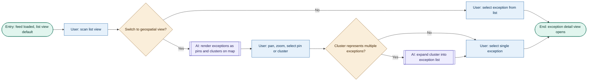

**Steps:** Entry: feed loaded (list view default), User: scans list view, Decision: switch to geospatial view?, User: selects exception from list, End: exception detail view opens

_Alternate path (geospatial):_ if the ZOM switches to the map view, the AI renders exceptions as pins and clusters; the ZOM pans, zooms, and selects a pin or cluster; multi-exception clusters expand into a list before a single exception is selected — converging on the same exit as the list path.

| Step  | Node type     | Action / response                 | State(s) handled                                                                                                                                                   | Linked screen                     | Instrumentation                    | Accessibility note                                                                   |
| ----- | ------------- | --------------------------------- | ------------------------------------------------------------------------------------------------------------------------------------------------------------------ | --------------------------------- | ---------------------------------- | ------------------------------------------------------------------------------------ |
| B     | User action   | Scan list                         | Stale-data flag per card (FR-05); **empty state (zero active exceptions) — not currently specified anywhere in the PRD, carried forward from discarded Flow 4.1a** | Exception Feed                    | `feed_scanned`                     | Card order must be keyboard-navigable top to bottom                                  |
| C     | Decision      | View toggle (list vs. geospatial) | —                                                                                                                                                                  | Exception Feed                    | `view_toggled: {list\|map}`        | Toggle must be a labeled control, not icon-only                                      |
| E–H   | AI + decision | Render map, cluster pins          | **No-geodata fallback — [PROPOSED, unconfirmed]:** if a shipment lacks coordinates, it should degrade to list-only with a note, not silently drop from the map     | Exception Feed (map mode)         | `map_rendered`, `cluster_expanded` | Map view needs a non-visual equivalent always available — never map-only (NFR-16/17) |
| D / I | User action   | Select exception                  | Multi-select is out of scope at MVP                                                                                                                                | Exception Feed → Exception Detail | `exception_opened`                 | Touch target ≥ 44px (secondary mobile support)                                       |

**Open flag:** the "zero active exceptions" empty state has no corresponding FR. Recommend a one-line requirement before wireframing Flow 4.1b's list view — an empty feed should read as "verified clear," not as a loading failure or a blank screen.

**New design input, this flow:**

> **[ASSUMPTION A-09]** Geospatial triage applies to exception types carrying a location or route component — SignalTrack (GPS, geofence, ETA) and FleetCommand TMS (routing, lane) exceptions primarily; Nexus WMS exceptions secondarily, viewable by site pin within the cluster. BorderIQ and OrderPulse exceptions remain list-only unless tied to a shipment with active location data. **Confidence: Medium.**
>
> **[OPEN QUESTION OQ-08]** Does the client's SignalTrack/FleetCommand integration guarantee real-time geocoordinates across all carrier types and modes, or only a subset? This determines whether geospatial triage is P0 or a degraded-by-default P1.

---

## Flow 4.1c — Review exception detail and evaluate AI interpretation

**Actor:** ZOM
**Task:** Read the AI's interpretation of the selected exception and decide whether it's trustworthy enough to act on.
**Entry:** Exception detail view opens (exit state of Flow 4.1b).
**Success end state:** ZOM proceeds to the action surface trusting the read, or exits to correct a disputed interpretation.

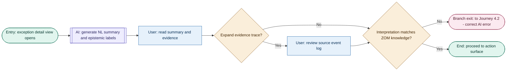

**Steps:** Entry: exception detail view opens, AI: generates natural-language summary and epistemic labels, User: reads summary and evidence, Decision: expand evidence trace?, Decision: does interpretation match ZOM knowledge?, End: proceed to action surface

_Alternate path:_ if the ZOM disputes the interpretation, the flow exits directly to Journey 4.2 (correct AI error) instead of proceeding to the action surface.

| Step | Node type   | Action / response                   | State(s) handled                                         | Linked screen                                           | Instrumentation                             | Accessibility note                                               |
| ---- | ----------- | ----------------------------------- | -------------------------------------------------------- | ------------------------------------------------------- | ------------------------------------------- | ---------------------------------------------------------------- |
| B    | AI action   | Generate summary + epistemic labels | Missing data labeled Unknown, not omitted (FR-12, FR-13) | Exception Detail                                        | `summary_generated`                         | Confirmed/Inferred/Unknown must not rely on color alone (NFR-17) |
| C–E  | User action | Read, optionally expand evidence    | Deep-trace loading state (FR-16)                         | Exception Detail                                        | `evidence_expanded`                         | Trace expansion via keyboard-operable disclosure                 |
| F    | Decision    | Trust check                         | —                                                        | Exception Detail                                        | `interpretation_rated: {trusted\|disputed}` | —                                                                |
| G    | Branch exit | Route to Journey 4.2                | —                                                        | Exception Detail → Correction flow (not yet decomposed) | `correction_initiated`                      | —                                                                |

---

## Flow 4.1d — Decide and act on exception

**Actor:** ZOM
**Task:** Decide on an action for the exception — approve, modify, override, escalate, or delegate — and execute or route it.
**Entry:** Action surface presented, interpretation trusted (exit state of Flow 4.1c).
**Success end state:** Action executed and logged, or cleanly routed to another journey.

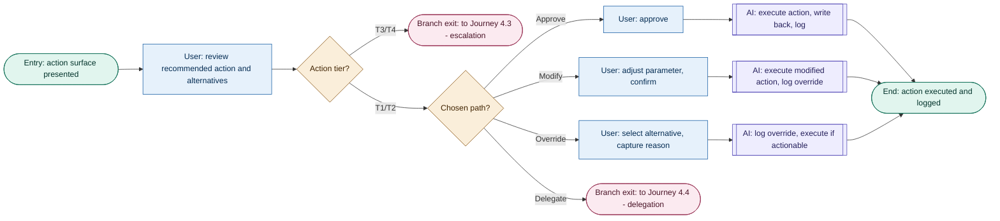

**Steps:** Entry: action surface presented, User: reviews recommended action and alternatives, Decision: action tier?, Decision: chosen path?, User: approves (or modifies, or overrides), AI: executes and logs, End: action executed and logged

_Alternate paths:_ a T3/T4 tier exits to Journey 4.3 (escalation) before any path is chosen; choosing "Delegate" exits to Journey 4.4 (delegation) instead of executing directly.

| Step | Node type   | Action / response           | State(s) handled                                                    | Linked screen                 | Instrumentation                                           | Accessibility note                                           |
| ---- | ----------- | --------------------------- | ------------------------------------------------------------------- | ----------------------------- | --------------------------------------------------------- | ------------------------------------------------------------ |
| C    | Decision    | Tier gate (T1/T2 vs. T3/T4) | —                                                                   | Action Surface                | `tier_evaluated`                                          | Tier badge is text + icon, never color-only (NFR-17)         |
| F–H  | User action | Approve / modify / override | Write-back partial failure must surface, not fail silently (NFR-23) | Action Surface                | `action_approved`, `action_modified`, `action_overridden` | Override reason capture ≤ 30 seconds, dropdown-first (FR-24) |
| J–L  | AI action   | Execute + log               | Non-reversible write flagged (A-06)                                 | Action Surface → confirmation | `action_executed`, `action_logged`                        | Execution confirmation announced, not just visually flashed  |

---

## Flow 4.1e — Monitor queue and close exception

**Actor:** ZOM
**Task:** Track an in-flight action to resolution and confirm closure.
**Entry:** Action taken or routed (exit state of Flow 4.1d, or return from Journeys 4.3/4.4).
**Success end state:** Exception confirmed closed, audit trail complete.

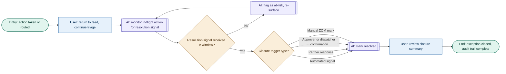

**Steps:** Entry: action taken or routed, User: returns to feed and continues triage, AI: monitors in-flight action for resolution signal, Decision: resolution signal received in window?, Decision: closure trigger type?, AI: marks resolved, User: reviews closure summary, End: exception closed, audit trail complete

_Alternate path:_ if no resolution signal arrives within the expected window, the AI flags the action as at-risk and re-surfaces it, then continues monitoring rather than closing.

| Step | Node type     | Action / response      | State(s) handled                                                                                       | Linked screen                                  | Instrumentation             | Accessibility note                                                   |
| ---- | ------------- | ---------------------- | ------------------------------------------------------------------------------------------------------ | ---------------------------------------------- | --------------------------- | -------------------------------------------------------------------- |
| D–E  | Decision + AI | At-risk re-surfacing   | **[PROPOSED, unconfirmed]** — no corresponding FR exists yet                                           | Exception Feed                                 | `exception_at_risk_flagged` | Re-surfaced item announced, not just re-sorted silently              |
| F    | Decision      | Closure trigger type   | **[PROPOSED, unconfirmed]** — four-way model inferred from Journey 4.1 Step 8 language, not yet locked | Exception Detail / closure modal               | `closure_triggered: {type}` | —                                                                    |
| H    | User action   | Review closure summary | —                                                                                                      | Closure confirmation (screen not yet designed) | `exception_closed`          | Time-to-resolution stated in plain units, not just a timestamp delta |

---

## Journey 4.2 — Trust: Correcting an AI Prioritization Error

**Trigger:** ZOM notices an exception was ranked incorrectly — either surfaced too high (false urgency, Path A) or not surfaced at all (a genuine miss, Path B). Both paths converge at a shared confirmation step, per `prd-v1.4.md`.

Unlike Journey 4.1, this journey's two paths are genuinely different tasks with different interaction modes — Path A works within an already-visible exception card, Path B requires search and manual entry — so they earn separate flows rather than becoming alternate branches inside one.

> **[REVISED, this session]** The shared confirmation step (originally its own Flow 4.2c) has been folded back into the tail of both 4.2a and 4.2b instead of staying a separate flow. That's a small duplication of the acknowledgment sequence across two flows, but it avoids a three-node flow that exists only to avoid repeating a couple of nodes — and it keeps each flow's own diagram self-contained end to end. Also corrected this session: Path A originally only modeled _lowering_ an over-ranked exception's priority. An AI can under-rank just as easily as it can over-rank, so Flow 4.2a now branches on direction — Lower Priority or Raise Priority — rather than assuming the error only ever runs one way.
>
> This also surfaces a real gap worth flagging: **the PRD's FR-32 currently only describes lowering** ("ZOM can lower the priority of an over-ranked exception via a single-step 'Lower Priority' action with structured reason capture"). There is no symmetric FR for raising a priority. Recommend amending FR-32 to cover both directions, or adding a companion FR-32b for Raise Priority, before this flow is wireframed. Journey 4.2's own Path A narrative in `prd-v1.4.md` is also written one-directionally ("does not warrant the urgency it has been given") and would benefit from the same broadening for consistency, though that's a PRD-level edit outside this document's scope to make unilaterally.
>
> **[REVISED, this session]** The acknowledgment step is no longer followed by a user dismiss action. The ZOM simply reads the AI's acknowledgment of its shortcomings — there is nothing to accept or dismiss. The correction step itself is also reframed: rather than "log correction, update priority" followed later by a separate audit-log step, the AI now **receives the override and updates its reasoning for this exception** in one step, then acknowledges. This is worth flagging against a decision locked back in Session 02: **D-10 / FR-33 commit to "no real-time promises about model updates from individual corrections,"** as a deliberate honesty principle (see the governance framework, [2]). "Updates its reasoning for this exception" is written and scoped here at the _case level_ — the AI retains context on this specific exception (and, by extension, this shipment/carrier/customer relationship if it recurs) — which does not contradict D-10. It would contradict D-10 if the acknowledgment copy or the underlying behavior implied the AI's _general_ prioritization model had just been retrained in real time from one correction. Flagged as **OQ-11** below: no FR currently names this case-level reasoning-update mechanism at all, distinct from FR-32 (the priority value change) and FR-34 (the aggregate audit log) — worth a dedicated FR that's explicit about this scope boundary before it's wireframed or the acknowledgment copy is written.

| Flow ID  | Task statement                                                             | Entry                                                                                             | Exit                                                                              |
| -------- | -------------------------------------------------------------------------- | ------------------------------------------------------------------------------------------------- | --------------------------------------------------------------------------------- |
| **4.2a** | Diagnose and correct a mis-ranked exception (Path A — too high or too low) | ZOM disputes an exception's ranking, from the feed or from a disputed interpretation in Flow 4.1c | Correction received, reasoning updated, acknowledged → Branch exit to Journey 4.1 |
| **4.2b** | Diagnose and manually surface a missed exception (Path B)                  | ZOM is aware of an issue absent from the co-pilot feed                                            | Missed exception added, acknowledged → Branch exit to Journey 4.1                 |

### Flow 4.2a — Diagnose and correct a mis-ranked exception

**Actor:** ZOM
**Task:** Investigate why an exception's priority ranking doesn't match its actual urgency — in either direction — and correct it.
**Entry:** ZOM disputes an exception's ranking — either noticed directly while scanning the feed (Flow 4.1b), or because the interpretation review in Flow 4.1c came back disputed.
**Success end state:** The AI receives the override, updates its reasoning for this exception, and acknowledges the correction → ZOM returns to Journey 4.1 to resume triage. No accept or dismiss action is required of the ZOM after the acknowledgment.

```mermaid
flowchart LR
    A(["Entry: exception ranking disputed - too high or too low"]) --> B["User: open exception with disputed ranking"]
    B --> C[["AI: display ranking rationale (Why ranked #N?)"]]
    C --> D["User: read rationale, compare to operational knowledge"]
    D --> E{"Ranking actually wrong?"}
    E -->|"No"| F(["Branch exit: to Journey 4.1 - resume triage"])
    E -->|"Yes"| G{"Direction of correction?"}
    G -->|"Too high"| H["User: select Lower Priority"]
    G -->|"Too low"| I["User: select Raise Priority"]
    H --> J["User: choose reason code, optional note"]
    I --> K["User: choose reason code, optional note"]
    J --> L[["AI: receive override, update reasoning for this exception"]]
    K --> L
    L --> M[["AI: acknowledge correction, honest scope"]]
    M --> N(["Branch exit: to Journey 4.1 - resume triage"])

    classDef entry fill:#E1F5EE,stroke:#0F6E56,color:#04342C
    classDef user fill:#E6F1FB,stroke:#185FA5,color:#042C53
    classDef ai fill:#EEEDFE,stroke:#534AB7,color:#26215C
    classDef decision fill:#FAEEDA,stroke:#854F0B,color:#412402
    classDef branch fill:#FBEAF0,stroke:#993556,color:#4B1528
    class A entry
    class B,D,H,I,J,K user
    class C,L,M ai
    class E,G decision
    class F,N branch
```

**Steps:** Entry: exception ranking disputed (too high or too low), User: opens exception with disputed ranking, AI: displays ranking rationale, User: reads rationale and compares to operational knowledge, Decision: is the ranking actually wrong?, Decision: direction of correction — too high or too low?, User: selects Lower Priority or Raise Priority, User: chooses reason code and optional note, AI: receives override and updates reasoning for this exception, AI: acknowledges correction with honest scope, Branch exit: to Journey 4.1 - resume triage

_Alternate path:_ if the ZOM concludes on review that the ranking was accurate after all, the flow exits directly back to Journey 4.1 (resume triage) without a correction being logged.

| Step | Node type   | Action / response                                                    | State(s) handled                                                                                                                                                                                                                                    | Linked screen                          | Instrumentation                                                      | Accessibility note                                                                                                      |
| ---- | ----------- | -------------------------------------------------------------------- | --------------------------------------------------------------------------------------------------------------------------------------------------------------------------------------------------------------------------------------------------- | -------------------------------------- | -------------------------------------------------------------------- | ----------------------------------------------------------------------------------------------------------------------- |
| C    | AI action   | Display ranking rationale (FR-14)                                    | —                                                                                                                                                                                                                                                   | Exception Feed / Feedback & Correction | `ranking_rationale_viewed`                                           | Rationale must be reachable without leaving the feed view                                                               |
| D    | User action | Read + compare                                                       | —                                                                                                                                                                                                                                                   | Feedback & Correction                  | `rationale_reviewed`                                                 | —                                                                                                                       |
| E    | Decision    | Confirm dispute                                                      | Dismiss-without-correcting is a valid outcome, not just a formality                                                                                                                                                                                 | Feedback & Correction                  | `ranking_dispute_resolved: {confirmed\|dismissed}`                   | —                                                                                                                       |
| G    | Decision    | Direction of correction                                              | **[OPEN — see note above]** FR-32 as written only covers lowering; raising needs the same FR coverage before this branch is wireframed                                                                                                              | Feedback & Correction                  | `correction_direction: {lower\|raise}`                               | —                                                                                                                       |
| H–K  | User action | Select Lower/Raise Priority, capture reason                          | Reason code taxonomy must reflect real operational categories, not generic placeholders, and must cover both directions — flagged as a design pitfall in the Session 05 journey map (P-02 category 4: correctness failures disguised as efficiency) | Feedback & Correction                  | `priority_lowered` / `priority_raised`, `correction_reason_captured` | Reason capture ≤ 30 seconds, dropdown-first (FR-24)                                                                     |
| L    | AI action   | Receive override, update reasoning for this exception (FR-32, FR-34) | **[OPEN QUESTION OQ-11]** no FR currently names a case-level reasoning-update mechanism distinct from the priority value change (FR-32) and the aggregate audit log (FR-34) — see note above on keeping this scoped against D-10/FR-33              | Exception Feed                         | `correction_logged`, `case_reasoning_updated`                        | Feed re-sort announced, not just visually re-ordered                                                                    |
| M    | AI action   | Acknowledge, honest scope (FR-33)                                    | Acknowledgment is passive and persistent — no accept or dismiss action follows it; guards against P-02 category 2 (trust feedback loops that never close)                                                                                           | Feedback & Correction (confirmation)   | `correction_acknowledged`                                            | Acknowledgment announced via screen reader as it appears; must remain legible without requiring an interaction to close |

---

### Flow 4.2b — Diagnose and surface a missed exception

**Actor:** ZOM
**Task:** Bring an operational issue the AI failed to surface into the co-pilot, at the right priority.
**Entry:** ZOM is aware, via direct observation or an outside channel (call, message), of a problem that hasn't appeared in the co-pilot feed.
**Success end state:** The AI receives the manually-added exception as a correction, registers the miss, and acknowledges it → ZOM returns to Journey 4.1 to resume triage. No accept or dismiss action is required of the ZOM after the acknowledgment.

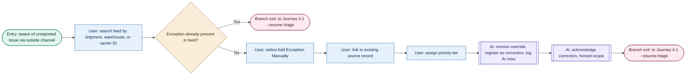

**Steps:** Entry: aware of unreported issue via outside channel, User: searches feed by shipment/warehouse/carrier ID, Decision: is the exception already present in the feed?, User: selects Add Exception Manually, User: links to existing source record, User: assigns priority tier, AI: receives override, registers as correction and logs AI miss, AI: acknowledges correction with honest scope, Branch exit: to Journey 4.1 - resume triage

_Alternate path:_ if the search finds the exception is already present, the ZOM was mistaken rather than the AI having missed it — the flow exits directly back to Journey 4.1 (resume triage) with nothing logged as a miss.

| Step | Node type   | Action / response                                                    | State(s) handled                                                                                                                                                                                     | Linked screen                        | Instrumentation                               | Accessibility note                                                                                                      |
| ---- | ----------- | -------------------------------------------------------------------- | ---------------------------------------------------------------------------------------------------------------------------------------------------------------------------------------------------- | ------------------------------------ | --------------------------------------------- | ----------------------------------------------------------------------------------------------------------------------- |
| B    | User action | Search by identifier                                                 | **[OPEN QUESTION OQ-09]** no FR currently defines this search/lookup capability — see below                                                                                                          | Feedback & Correction (search)       | `missed_exception_search`                     | —                                                                                                                       |
| C    | Decision    | Confirm genuine miss                                                 | False-alarm outcome (already present) is a first-class state, not an error                                                                                                                           | Feedback & Correction                | `search_result: {found\|not_found}`           | —                                                                                                                       |
| E–G  | User action | Manual add, link, assign tier (FR-04)                                | **Linking to an existing source record, not re-keying data from scratch — flagged in the Session 05 journey map as a design pitfall if skipped ("slower than going to the source system directly")** | Feedback & Correction (manual entry) | `manual_exception_added`, `priority_assigned` | Form fields keyboard-navigable in a logical tab order                                                                   |
| H    | AI action   | Receive override, register as correction, log AI miss (FR-31, FR-34) | **[OPEN QUESTION OQ-11]** same case-level reasoning-update gap as Flow 4.2a — see note above                                                                                                         | Exception Feed                       | `ai_miss_logged`, `case_reasoning_updated`    | —                                                                                                                       |
| I    | AI action   | Acknowledge, honest scope (FR-33)                                    | Acknowledgment is passive and persistent — no accept or dismiss action follows it; guards against P-02 category 2                                                                                    | Feedback & Correction (confirmation) | `correction_acknowledged`                     | Acknowledgment announced via screen reader as it appears; must remain legible without requiring an interaction to close |

**Open flag:** the PRD does not currently define a search/lookup FR for finding a shipment, warehouse, or carrier by identifier within the exception feed. FR-04 covers manual entry and FR-31 covers flagging a miss, but neither specifies the search mechanic itself (fields, matching logic, whether it searches resolved exceptions too). Recommend a dedicated FR before wireframing this flow's search step.

---

## Journey 4.3 — Escalation: High-Consequence Exception Requiring Director or Legal Approval

**Entry Point:** Branched from Flow 4.1d when a T3/T4 threshold is reached — or, for BorderIQ customs holds, triggered by the AI's own sub-type classification, which can route to escalation independently of the generic tier gate. **Actors:** ZOM (submits) → Logistics Director or Legal/Compliance Authority (decides) → ZOM (closes), per `prd-v1.4.md`.

This journey decomposes into four flows rather than three, because the customs-hold classification behavior is a genuinely distinct interaction mode from generic brief-and-submit — evaluating an AI classification and reclassifying it is a different task from reading a tier badge and writing a context note — and because the approver's review is a different actor entirely from both.

> **A note on node color convention, clarified this session:** pink branch-exit nodes are reserved for crossing between _journeys_ (4.1 ↔ 4.2/4.3/4.4). A perspective shift to a different _actor within the same journey_ — ZOM to Director/Legal in 4.3, ZOM to Dispatcher in 4.4 — uses a teal End state instead, since the PRD's own journeys already model those shifts as journey-internal ("Steps 4–7 follow the approver"). The one exception: when the _ZOM's own_ path exits toward a different journey while the escalation continues asynchronously for a different actor (e.g., ZOM returns to triage in 4.3b while the brief moves to the approver in 4.3c), that's still pink for the ZOM's own diagram — the approver's flow simply has its own independent Entry node, referencing what triggered it in prose rather than a drawn connector, since the two flows are for different actors and not a continuous screen session.

| Flow ID  | Task statement                              | Entry                                                              | Exit                                                                                                           |
| -------- | ------------------------------------------- | ------------------------------------------------------------------ | -------------------------------------------------------------------------------------------------------------- |
| **4.3a** | Classify and route a customs hold exception | ZOM opens a BorderIQ customs hold exception                        | Self-serve (T1/T2) → Flow 4.1d, or escalation (T3/T4) → Flow 4.3b                                              |
| **4.3b** | Prepare and submit escalation               | Action exceeds ZOM authority (generic tier gate or customs-routed) | Escalation submitted → Branch exit to Journey 4.1 (approver's review is triggered asynchronously in Flow 4.3c) |
| **4.3c** | Approver reviews and decides                | Approver receives escalation notification (triggered by Flow 4.3b) | Decision recorded, ZOM notified                                                                                |
| **4.3d** | ZOM receives decision and closes            | ZOM receives decision notification (triggered by Flow 4.3c)        | Approved/Modified → Branch exit to Journey 4.1; Rejected → Branch exit to Flow 4.1d                            |

### Flow 4.3a — Classify and route a customs hold exception

**Actor:** ZOM
**Task:** Evaluate the AI's classification of a customs hold, correct it if needed, and let that classification determine whether this stays self-serve or escalates.
**Entry:** ZOM opens a BorderIQ customs hold exception (from Flow 4.1b or 4.1c). This routing happens on classification, independent of — and potentially before — the generic tier gate in Flow 4.1d.
**Success end state:** The exception is routed to the correct destination: T1/T2 self-serve for a Documentation Gap, or escalation for Regulatory/Legal-Sanctions.

```mermaid
flowchart LR
    A(["Entry: ZOM opens BorderIQ customs hold exception"]) --> B[["AI: classify hold sub-type, confidence + rationale"]]
    B --> C["User: evaluate classification against reason code and context"]
    C --> D{"Reclassify?"}
    D -->|"Yes"| E["User: reclassify (single step)"]
    E --> F[["AI: log reclassification as override"]]
    F --> G[["AI: route by classification"]]
    D -->|"No"| G
    G --> H{"Routed tier?"}
    H -->|"Documentation Gap - T1/T2"| I(["Branch exit: to Flow 4.1d - self-serve action"])
    H -->|"Regulatory or Legal/Sanctions - T3/T4"| J(["Branch exit: to Flow 4.3b - prepare and submit escalation"])

    classDef entry fill:#E1F5EE,stroke:#0F6E56,color:#04342C
    classDef user fill:#E6F1FB,stroke:#185FA5,color:#042C53
    classDef ai fill:#EEEDFE,stroke:#534AB7,color:#26215C
    classDef decision fill:#FAEEDA,stroke:#854F0B,color:#412402
    classDef branch fill:#FBEAF0,stroke:#993556,color:#4B1528
    class A entry
    class C,E user
    class B,F,G ai
    class D,H decision
    class I,J branch
```

**Steps:** Entry: ZOM opens BorderIQ customs hold exception, AI: classifies hold sub-type with confidence and rationale, User: evaluates classification against reason code and context, Decision: reclassify?, AI: routes by classification, Decision: routed tier?, Branch exit: to Flow 4.3b - prepare and submit escalation

_Alternate paths:_ if the ZOM reclassifies, the AI logs it as an override event before routing proceeds on the corrected sub-type. If the routed tier is Documentation Gap, the flow exits to Flow 4.1d's self-serve, guided-checklist path (T1/T2) instead of escalating.

| Step | Node type            | Action / response                                                  | State(s) handled                                                                                                                                                   | Linked screen                   | Instrumentation           | Accessibility note                                                                                                                                                                    |
| ---- | -------------------- | ------------------------------------------------------------------ | ------------------------------------------------------------------------------------------------------------------------------------------------------------------ | ------------------------------- | ------------------------- | ------------------------------------------------------------------------------------------------------------------------------------------------------------------------------------- |
| B    | AI action            | Classify sub-type, confidence + rationale (FR-CUST-01, FR-CUST-02) | Confidence level must be visible alongside the classification, not just the label                                                                                  | Exception Detail (customs hold) | `hold_classified`         | Confidence indicator must not rely on color alone (NFR-17)                                                                                                                            |
| C    | User action          | Evaluate classification                                            | One explanatory sentence minimum for the classification, per the Session 05 journey map failure point — a label alone gives no basis to evaluate                   | Exception Detail                | `classification_reviewed` | —                                                                                                                                                                                     |
| D–F  | Decision + User      | Reclassify (single step) (FR-CUST-03)                              | Reclassify must complete in one step (tap → select sub-type → optional note) — the journey map flags that anything slower leaves T4 misclassifications uncorrected | Exception Detail                | `hold_reclassified`       | —                                                                                                                                                                                     |
| G–H  | AI action + Decision | Route by classification (FR-CUST-04)                               | —                                                                                                                                                                  | Exception Feed / Action Surface | `hold_routed: {tier}`     | Tier and routing target must be visible on the exception card before the ZOM invests investigation time — per the Session 05 journey map's "threshold discovery timing" failure point |

---

### Flow 4.3b — Prepare and submit escalation

**Actor:** ZOM
**Task:** Get a high-consequence exception in front of the right approver with full context, without needing to contact them directly.
**Entry:** The required action exceeds the ZOM's configured authority — either a generic T3/T4 tier hit at the action surface (Flow 4.1d), or a customs hold routed to Director/Legal (Flow 4.3a).
**Success end state:** Escalation submitted with a complete, approver-ready brief. The ZOM returns to Journey 4.1 immediately — Flow 4.3c begins asynchronously for the approver, triggered by this submission.

```mermaid
flowchart LR
    A(["Entry: action exceeds ZOM authority - T3/T4 tier or customs hold routed to escalation"]) --> B["User: read tier badge and escalation trigger explanation"]
    B --> C["User: review AI-assembled escalation brief for accuracy"]
    C --> D["User: preview brief in approver-view format"]
    D --> E["User: add ZOM context note"]
    E --> F["User: confirm routing destination, submit"]
    F --> G[["AI: route escalation, confirm receipt, log submission"]]
    G --> H(["Branch exit: to Journey 4.1 - resume triage"])

    classDef entry fill:#E1F5EE,stroke:#0F6E56,color:#04342C
    classDef user fill:#E6F1FB,stroke:#185FA5,color:#042C53
    classDef ai fill:#EEEDFE,stroke:#534AB7,color:#26215C
    classDef branch fill:#FBEAF0,stroke:#993556,color:#4B1528
    class A entry
    class B,C,D,E,F user
    class G ai
    class H branch
```

**Steps:** Entry: action exceeds ZOM authority, User: reads tier badge and escalation trigger explanation, User: reviews AI-assembled escalation brief for accuracy, User: previews brief in approver-view format, User: adds ZOM context note, User: confirms routing destination and submits, AI: routes escalation, confirms receipt, and logs submission, Branch exit: to Journey 4.1 - resume triage

| Step | Node type        | Action / response                             | State(s) handled                                                                                                                                                                                                    | Linked screen          | Instrumentation                             | Accessibility note                                           |
| ---- | ---------------- | --------------------------------------------- | ------------------------------------------------------------------------------------------------------------------------------------------------------------------------------------------------------------------- | ---------------------- | ------------------------------------------- | ------------------------------------------------------------ |
| C–D  | User action      | Review + preview brief                        | **[OPEN QUESTION OQ-12]** no FR currently grants a preview-as-approver-will-see-it capability — recommended by the Session 05 journey map ("preview mode is a quality gate, not a nicety"), not yet backed by an FR | Escalation / Tier flow | `brief_reviewed`, `brief_previewed`         | —                                                            |
| E    | User action      | Add context note (FR-25)                      | Structured prompt fields, not a blank free-text box — the journey map warns that critical operational context won't travel otherwise                                                                                | Escalation / Tier flow | `context_note_added`                        | —                                                            |
| F–G  | User action + AI | Submit, route, confirm receipt (FR-25, FR-40) | Receipt confirmation is mandatory — without it, per the journey map, ZOMs follow up out-of-band, recreating the coordination overhead the product exists to remove                                                  | Exception Feed         | `escalation_submitted`, `escalation_routed` | Submission confirmation announced, not just visually flashed |

---

### Flow 4.3c — Approver reviews and decides

**Actor:** Logistics Director (T3) or Legal/Compliance Authority (T4)
**Task:** Decide on an escalated exception using only the assembled brief, without opening any source system or contacting the ZOM.
**Entry:** Approver receives an escalation notification with the full context brief, triggered by Flow 4.3b's submission.
**Success end state:** Decision recorded with rationale, and the ZOM notified. This is a different actor's task, not the ZOM's — its exit is a plain End state, not a branch back into Journey 4.1.

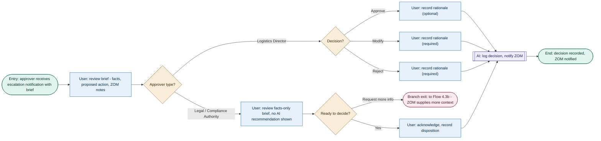

**Steps:** Entry: approver receives escalation notification with brief, User: reviews brief, Decision: approver type?, User: records rationale (Director) or reviews facts-only brief and acknowledges (Legal), AI: logs decision and notifies ZOM, End: decision recorded, ZOM notified

_Alternate path:_ the Legal/Compliance Authority can request more information instead of deciding immediately, which routes back to Flow 4.3b for the ZOM to supply additional context — **[OPEN QUESTION OQ-13]** the PRD names "Request More Info" as an interface option (Section 3.4) but doesn't specify what happens next: whether this pauses an SLA clock, how it's represented in the ZOM's queue, or how many times it can recur.

| Step | Node type       | Action / response                                   | State(s) handled                                                                                                                                            | Linked screen                                    | Instrumentation                                                       | Accessibility note                                                                                             |
| ---- | --------------- | --------------------------------------------------- | ----------------------------------------------------------------------------------------------------------------------------------------------------------- | ------------------------------------------------ | --------------------------------------------------------------------- | -------------------------------------------------------------------------------------------------------------- |
| C    | Decision        | Approver type                                       | Interfaces genuinely differ by type — Director sees a full decision surface, Legal sees facts-only (FR-CUST-05)                                             | Escalation / Tier flow                           | `approver_type: {director\|legal}`                                    | —                                                                                                              |
| D–G  | Decision + User | Director's decision + rationale                     | Rationale required for Modify/Reject, optional for Approve, per the PRD's own journey text and the journey map's failure point on uncontextualized verdicts | Escalation / Tier flow                           | `escalation_decided: {approve\|modify\|reject}`, `rationale_recorded` | —                                                                                                              |
| H–K  | User action     | Legal reviews + acknowledges                        | No AI action recommendation shown on T4 cards (FR-CUST-05) — facts, reason codes, and shipment details only                                                 | Escalation / Tier flow (Legal minimal interface) | `disposition_recorded`                                                | —                                                                                                              |
| L    | AI action       | Log decision, notify ZOM (FR-26, FR-40, FR-CUST-06) | —                                                                                                                                                           | — (backend + ZOM queue)                          | `decision_logged`, `zom_notified`                                     | Notification must carry rationale, not just the verdict — per the journey map's "notify & close" failure point |

---

### Flow 4.3d — ZOM receives decision and closes

**Actor:** ZOM
**Task:** Act on the approver's decision and confirm the escalation is fully closed out.
**Entry:** ZOM receives the decision notification in their queue, triggered by Flow 4.3c.
**Success end state:** Approved or modified actions are confirmed and the escalation chain is verified in the audit trail; a rejected action routes the ZOM back to choose an alternate path in Flow 4.1d.

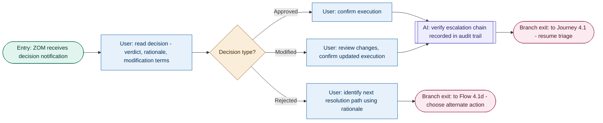

**Steps:** Entry: ZOM receives decision notification, User: reads decision, Decision: decision type?, User: confirms execution (approved) or reviews changes and confirms (modified), AI: verifies escalation chain recorded in audit trail, Branch exit: to Journey 4.1 - resume triage

_Alternate path:_ if the decision is a rejection, the flow exits directly to Flow 4.1d so the ZOM can choose a different action — it does not go through audit-trail verification the same way, since no action was executed.

| Step | Node type       | Action / response                 | State(s) handled                                                                                                                                                                          | Linked screen              | Instrumentation                                     | Accessibility note |
| ---- | --------------- | --------------------------------- | ----------------------------------------------------------------------------------------------------------------------------------------------------------------------------------------- | -------------------------- | --------------------------------------------------- | ------------------ |
| C–F  | Decision + User | React to verdict                  | Notification must carry rationale and modification terms, not just the verdict — per the journey map's failure point on the ZOM executing the wrong action or re-escalating unnecessarily | Exception Detail / closure | `decision_actioned: {approved\|modified\|rejected}` | —                  |
| G    | AI action       | Verify audit trail (FR-40, AC-09) | Especially critical for T4 holds, where the record is a regulatory requirement, not just an operational one, per the journey map                                                          | — (backend, audit log)     | `audit_trail_verified`                              | —                  |

---

## Journey 4.4 — Delegation: Assigning an Exception to a Dispatcher

**Entry Point:** Branched from Flow 4.1d when the ZOM selects "Delegate." **Actors:** ZOM (packages and sends) → Transportation Planner/Dispatcher (executes) → ZOM (confirms and closes), per `prd-v1.4.md`.

This journey decomposes into three flows along the same actor-shift lines as Journey 4.3.

> **MVP scoping flag, worth reading before Flow 4.4b:** per locked Decision E-03, the Dispatcher is not a primary co-pilot user at MVP — delegated tasks are delivered via existing operational systems and/or email/SMS, and a dispatcher-native interface is Extension V-05 (post-MVP). That means Flow 4.4b's middle steps happen largely _outside_ this product's own UI. It's still modeled as a user flow — the Dispatcher is a real person taking real actions, satisfying P-04 — but it's worth being honest that this flow documents a behavior the co-pilot can shape the _content_ of (the notification, the brief) without controlling the _interface_ it happens in. That's also why Flow 4.4b has no AI-action nodes at all: there's no co-pilot AI in the loop at MVP once the handoff leaves the ZOM's screen.

| Flow ID  | Task statement                        | Entry                                                                                     | Exit                                                                                                        |
| -------- | ------------------------------------- | ----------------------------------------------------------------------------------------- | ----------------------------------------------------------------------------------------------------------- |
| **4.4a** | Select dispatcher and prepare handoff | ZOM has selected Delegate at the action surface (Flow 4.1d)                               | Handoff sent → Branch exit to Journey 4.1 (Dispatcher's execution is triggered asynchronously in Flow 4.4b) |
| **4.4b** | Dispatcher executes delegated task    | Dispatcher receives task notification (triggered by Flow 4.4a) — MVP: outside co-pilot UI | Completion status sent                                                                                      |
| **4.4c** | ZOM confirms resolution and closes    | ZOM receives completion status (triggered by Flow 4.4b)                                   | Resolved → Branch exit to Journey 4.1; not resolved → Branch exit to Journey 4.1 to re-engage               |

### Flow 4.4a — Select dispatcher and prepare handoff

**Actor:** ZOM
**Task:** Get a self-contained handoff to the right dispatcher without the dispatcher needing to come back with questions.
**Entry:** ZOM has already selected "Delegate" at the action surface (Flow 4.1d's Decide-and-act decision).
**Success end state:** Delegated task sent with a complete package. The ZOM returns to Journey 4.1 immediately — per the PRD's own journey text, they don't wait or monitor the delegation actively.

```mermaid
flowchart LR
    A(["Entry: ZOM has selected Delegate at the action surface"]) --> B["User: identify and select dispatcher"]
    B --> C[["AI: generate handoff package - brief, recommendation, context, deadline"]]
    C --> D["User: review handoff package for accuracy"]
    D --> E["User: add ZOM context note"]
    E --> F["User: confirm and send delegated task"]
    F --> G[["AI: log delegation event"]]
    G --> H(["Branch exit: to Journey 4.1 - resume triage"])

    classDef entry fill:#E1F5EE,stroke:#0F6E56,color:#04342C
    classDef user fill:#E6F1FB,stroke:#185FA5,color:#042C53
    classDef ai fill:#EEEDFE,stroke:#534AB7,color:#26215C
    classDef branch fill:#FBEAF0,stroke:#993556,color:#4B1528
    class A entry
    class B,D,E,F user
    class C,G ai
    class H branch
```

**Steps:** Entry: ZOM has selected Delegate at the action surface, User: identifies and selects dispatcher, AI: generates handoff package, User: reviews handoff package for accuracy, User: adds ZOM context note, User: confirms and sends delegated task, AI: logs delegation event, Branch exit: to Journey 4.1 - resume triage

| Step | Node type        | Action / response                 | State(s) handled                                                                                                                                                        | Linked screen             | Instrumentation                         | Accessibility note                                     |
| ---- | ---------------- | --------------------------------- | ----------------------------------------------------------------------------------------------------------------------------------------------------------------------- | ------------------------- | --------------------------------------- | ------------------------------------------------------ |
| B    | User action      | Identify dispatcher               | No dispatcher availability/workload signal specified — the journey map flags that without one, ZOMs may delegate to someone already overwhelmed                         | Action Surface (delegate) | `dispatcher_selected`                   | —                                                      |
| C–D  | AI action + User | Generate + review package (FR-21) | —                                                                                                                                                                       | Action Surface (delegate) | `handoff_generated`, `handoff_reviewed` | —                                                      |
| E    | User action      | Add context note                  | Must be encourage-but-skippable with a contextual prompt, not required or silently optional — the journey map notes both extremes fail (abandonment vs. empty handoffs) | Action Surface (delegate) | `context_note_added`                    | —                                                      |
| F–G  | User action + AI | Confirm, send, log (FR-21, FR-40) | —                                                                                                                                                                       | Exception Feed            | `delegation_sent`, `delegation_logged`  | Send confirmation announced, not just visually flashed |

---

### Flow 4.4b — Dispatcher executes delegated task

**Actor:** Transportation Planner / Dispatcher
**Task:** Execute the carrier-side response the ZOM delegated, and report back.
**Entry:** Dispatcher receives the delegated task notification, triggered by Flow 4.4a. **At MVP, this arrives via existing operational systems and/or email/SMS (Decision E-03), not a co-pilot interface.**
**Success end state:** Status update or completion confirmation sent back to the ZOM's queue.

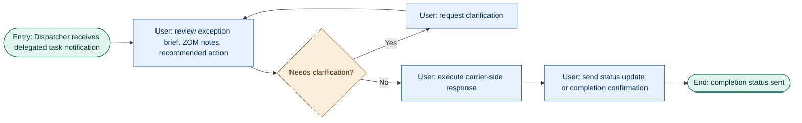

**Steps:** Entry: Dispatcher receives delegated task notification, User: reviews exception brief, ZOM notes, and recommended action, Decision: needs clarification?, User: executes carrier-side response, User: sends status update or completion confirmation, End: completion status sent

_Alternate path:_ if the Dispatcher needs clarification, they request it and loop back to review — **[PROPOSED, unconfirmed — PB-03]** the journey map calls a structured "request clarification" reply path "essential at MVP," but no FR currently backs it. Without it, per the journey map, "every brief gap breaks the delegation chain."

| Step | Node type       | Action / response  | State(s) handled                                                                                                                                                                           | Linked screen                                   | Instrumentation                                       | Accessibility note |
| ---- | --------------- | ------------------ | ------------------------------------------------------------------------------------------------------------------------------------------------------------------------------------------ | ----------------------------------------------- | ----------------------------------------------------- | ------------------ |
| B    | User action     | Review brief       | Handoff format must match how dispatchers actually receive/act on work in email/SMS/existing channels — the journey map warns the coordination benefit "stops at the ZOM's desk" otherwise | Outside co-pilot (email/SMS/existing systems)   | `dispatcher_brief_opened`                             | —                  |
| C–D  | Decision + User | Clarification loop | **[PROPOSED, unconfirmed — PB-03]** no FR backs this reply path yet                                                                                                                        | Outside co-pilot                                | `clarification_requested`                             | —                  |
| E–F  | User action     | Execute + report   | Executed via existing carrier tools, not the co-pilot's own action surface, at MVP                                                                                                         | Outside co-pilot → Exception Feed (status only) | `carrier_response_executed`, `completion_status_sent` | —                  |

---

### Flow 4.4c — ZOM confirms resolution and closes

**Actor:** ZOM
**Task:** Verify the delegated work actually resolved the exception before closing it out.
**Entry:** ZOM receives the Dispatcher's completion status in their queue, triggered by Flow 4.4b.
**Success end state:** Resolution confirmed and the full delegation chain verified in the audit trail.

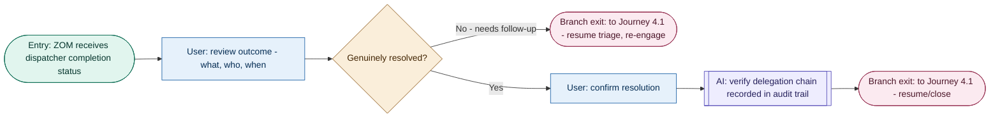

**Steps:** Entry: ZOM receives dispatcher completion status, User: reviews outcome, Decision: genuinely resolved?, User: confirms resolution, AI: verifies delegation chain recorded in audit trail, Branch exit: to Journey 4.1 - resume/close

_Alternate path:_ if the outcome is only partial, the ZOM re-engages rather than closing — the journey map warns that marking an exception resolved at the moment of delegation, rather than at dispatcher confirmation, gives the ZOM false confidence, so this check is treated as a first-class branch, not an edge case.

| Step | Node type | Action / response                 | State(s) handled                                                                                                                                                                                                  | Linked screen          | Instrumentation                           | Accessibility note |
| ---- | --------- | --------------------------------- | ----------------------------------------------------------------------------------------------------------------------------------------------------------------------------------------------------------------- | ---------------------- | ----------------------------------------- | ------------------ |
| C    | Decision  | Genuinely resolved?               | Stalled delegations must eventually re-surface as an active re-engagement prompt after a threshold — per the journey map, not yet backed by an FR (relates to PB-01, the at-risk re-surfacing gap from Flow 4.1e) | Exception Feed         | `delegation_outcome: {resolved\|partial}` | —                  |
| F    | AI action | Verify audit trail (FR-40, AC-13) | Delegation chain must show delegator, dispatcher, and outcome                                                                                                                                                     | — (backend, audit log) | `delegation_chain_verified`               | —                  |

---

## Journey 4.5 — Adoption Tracking: Director AI Performance Dashboard

**Actor:** Logistics Director / Network Operations Lead. **Entry Point:** Director navigates to the Adoption & Performance module from the main nav — independent of any ZOM journey. **Visibility-only:** no workflow execution, no policy config, no in-app alerting from this surface — the only action affordance is export [LOCKED — D-87, D-89].

> **Naming note:** the PRD's own FigJam reference names these flows `5.1a`–`5.1f` (mismatched against the journey number "4.5"). This document uses `4.5a`–`4.5f` instead, for consistency with this document's established Flow ID convention (D-29) — both point to the same four MVP flows. Flows `5.1d` (superuser analysis) and `5.1e` (source pattern analysis) are explicitly deferred to post-MVP (Extension, FR-ADOPT-04/08) and are not decomposed here.
>
> **State coverage worth flagging:** per Assumption A-10, this dashboard needs 30 days of production audit data to populate. Flow 4.5a's entry should account for a "Building baseline" state before that window closes — not currently detailed in the PRD beyond the assumption itself.

| Flow ID  | Task statement                                  | Entry                                                     | Exit                                   |
| -------- | ----------------------------------------------- | --------------------------------------------------------- | -------------------------------------- |
| **4.5a** | Review network health snapshot                  | Director navigates to the module                          | Proceeds to drill-down, or exits       |
| **4.5b** | Drill into AI performance and override patterns | Director reviews the performance tile                     | Proceeds to adoption heatmap, or exits |
| **4.5c** | Review ZOM adoption heatmap                     | Director reviews the heatmap                              | Proceeds to export, or exits           |
| **4.5f** | Export performance summary                      | Director selects Export (available from any of the above) | Export downloaded                      |

### Flow 4.5a — Review network health snapshot

**Task:** Get an honest, pre-assembled read on whether the co-pilot is working, without a raw data dump.
**Entry:** Director navigates to the Adoption & Performance module from the main nav.
**Success end state:** Director has a headline read and decides whether to drill deeper.

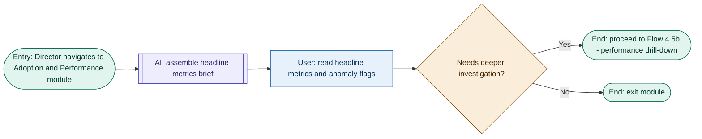

**Steps:** Entry: Director navigates to Adoption and Performance module, AI: assembles headline metrics brief, User: reads headline metrics and anomaly flags, Decision: needs deeper investigation?, End: proceed to Flow 4.5b or exit module

| Step | Node type   | Action / response                    | State(s) handled                                                                                                                | Linked screen      | Instrumentation             | Accessibility note                           |
| ---- | ----------- | ------------------------------------ | ------------------------------------------------------------------------------------------------------------------------------- | ------------------ | --------------------------- | -------------------------------------------- |
| B    | AI action   | Assemble metrics brief (FR-ADOPT-01) | **Pre-30-day "Building baseline" state (A-10)** not detailed beyond the assumption — needs a design decision before wireframing | Adoption Dashboard | `adoption_dashboard_loaded` | Load target ≤ 3s for 400+ warehouses (AC-14) |
| C    | User action | Read brief                           | —                                                                                                                               | Adoption Dashboard | `snapshot_reviewed`         | —                                            |

---

### Flow 4.5b — Drill into AI performance and override patterns

**Task:** Distinguish an isolated data-quality blip from a systemic model gap or policy misconfiguration.
**Entry:** Director reviews the AI performance tile (from Flow 4.5a, or directly).
**Success end state:** Director has an interpretation of the override pattern and decides whether to cross-check it against cluster adoption.

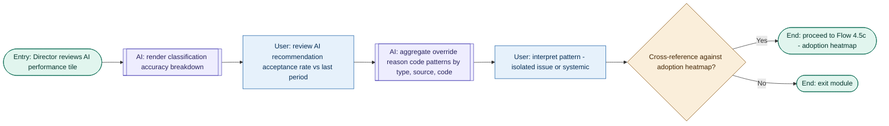

**Steps:** Entry: Director reviews AI performance tile, AI: renders classification accuracy breakdown, User: reviews acceptance rate vs last period, AI: aggregates override reason code patterns, User: interprets pattern as isolated or systemic, Decision: cross-reference against adoption heatmap?, End: proceed to Flow 4.5c or exit module

| Step | Node type   | Action / response                                                 | State(s) handled                                                                             | Linked screen      | Instrumentation                                       | Accessibility note |
| ---- | ----------- | ----------------------------------------------------------------- | -------------------------------------------------------------------------------------------- | ------------------ | ----------------------------------------------------- | ------------------ |
| B, D | AI action   | Accuracy breakdown + override patterns (FR-ADOPT-02, FR-ADOPT-05) | Vocabulary must match the reason codes ZOMs actually used, not model-internal labels (AC-16) | Adoption Dashboard | `performance_tile_viewed`, `override_patterns_viewed` | —                  |
| E    | User action | Interpret pattern                                                 | Never attributed to an individual ZOM — cluster/network level only, per FR-ADOPT-05 and D-87 | Adoption Dashboard | `pattern_interpreted`                                 | —                  |

---

### Flow 4.5c — Review ZOM adoption heatmap

**Task:** Identify clusters bypassing AI-assisted triage and judge whether that's a training gap, a trust problem, or a tooling issue.
**Entry:** Director reviews the adoption heatmap (from Flow 4.5b, or directly).
**Success end state:** Low-adoption clusters identified and checked against override patterns for co-location.

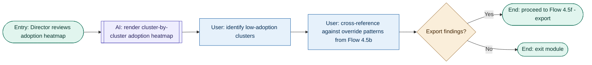

**Steps:** Entry: Director reviews adoption heatmap, AI: renders cluster-by-cluster heatmap, User: identifies low-adoption clusters, User: cross-references against override patterns, Decision: export findings?, End: proceed to Flow 4.5f or exit module

| Step | Node type   | Action / response            | State(s) handled                                                                                                                                     | Linked screen      | Instrumentation                                    | Accessibility note                                             |
| ---- | ----------- | ---------------------------- | ---------------------------------------------------------------------------------------------------------------------------------------------------- | ------------------ | -------------------------------------------------- | -------------------------------------------------------------- |
| B    | AI action   | Render heatmap (FR-ADOPT-03) | Gradient session-depth signal, not binary active/inactive; drill-down stops at cluster level — never individual ZOM (FR-ADOPT-03, FR-ADOPT-06, D-87) | Adoption Dashboard | `heatmap_viewed`                                   | Heatmap must have a non-color-dependent equivalent (NFR-17/18) |
| C–D  | User action | Identify + cross-reference   | Cluster drill-down in ≤ 2 taps, no individual exception detail ever exposed here (AC-15)                                                             | Adoption Dashboard | `clusters_identified`, `patterns_cross_referenced` | —                                                              |

---

### Flow 4.5f — Export performance summary

**Task:** Get a portable, presentation-ready account of co-pilot performance without reconstructing the narrative manually.
**Entry:** Director selects Export from any point in the module.
**Success end state:** File downloaded, matching the dashboard's own section hierarchy.

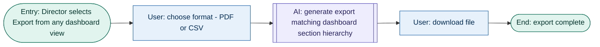

**Steps:** Entry: Director selects Export, User: chooses format (PDF or CSV), AI: generates export matching dashboard hierarchy, User: downloads file, End: export complete

| Step | Node type | Action / response             | State(s) handled                                                                          | Linked screen      | Instrumentation                | Accessibility note            |
| ---- | --------- | ----------------------------- | ----------------------------------------------------------------------------------------- | ------------------ | ------------------------------ | ----------------------------- |
| C    | AI action | Generate export (FR-ADOPT-07) | No individual ZOM names or per-ZOM scores in any export format, ever (FR-ADOPT-07, AC-17) | Adoption Dashboard | `export_generated: {pdf\|csv}` | Export completes ≤ 5s (AC-17) |

---

## Journey 4.6 — Conversational Intelligence: AI Chat as an Execution Surface

**Actor:** ZOM (primary, full capability); Logistics Director (Tier A read-only only, within cluster roll-up scope). **Entry Point:** Persistent chat icon in the nav rail, available from any screen. **Modality note:** chat is a parallel path, not a replacement — every action available through chat is also available through the structured UI, and the same T0–T4 tier framework applies regardless of input modality [LOCKED — D-92, D-93].

> **Capability taxonomy [LOCKED — D-93]:** Tier A = show only; Tier B = execute with confirmation card (T1/T2); Tier C = prepare and route (escalation/delegation, same routing as structured flow); Tier D = hard boundary, never available via chat.
>
> The PRD's FigJam reference names five _stages_ (OPEN CHAT · QUERY & CLARIFY · INTERPRET AI REASONING · EXECUTE ACTION · HANDLE LIMITS) rather than naming flows directly, unlike Journey 4.5. Applying P-03: OPEN CHAT, QUERY & CLARIFY, and INTERPRET AI REASONING collapse into one flow (4.6a) — asking a question and asking for an interpretation are the same interaction mode, just different content. EXECUTE ACTION splits into two (4.6b single action, 4.6c multi-step workflow) because the multi-step case has meaningfully more state (progress tracking, multiple gates) than a single confirmation. HANDLE LIMITS becomes its own flow (4.6d) — but note it only clears P-04 because declining is followed by a real user action (following the offered link, or continuing to chat), not because declining itself is a user action.

| Flow ID  | Task statement                                     | Entry                                 | Exit                                                   |
| -------- | -------------------------------------------------- | ------------------------------------- | ------------------------------------------------------ |
| **4.6a** | Ask a question via chat (Tier A)                   | Chat panel opened                     | Answer received, loops for follow-ups, or exits        |
| **4.6b** | Execute a single action via chat (Tier B/C)        | ZOM instructs an execute/route action | Action executed, or routed into Flow 4.3b/4.4a         |
| **4.6c** | Execute a multi-step workflow via chat             | ZOM instructs a multi-step workflow   | Workflow complete with summary                         |
| **4.6d** | Handle a request beyond chat's capability (Tier D) | ZOM requests something out of bounds  | Redirected to structured screen, or continues chatting |

### Flow 4.6a — Ask a question via chat (Tier A)

**Task:** Get an answer — data retrieval or interpretation — without leaving the current screen.
**Entry:** ZOM or Director opens the persistent chat panel.
**Success end state:** Question answered with epistemic labels; ZOM continues in their current view.

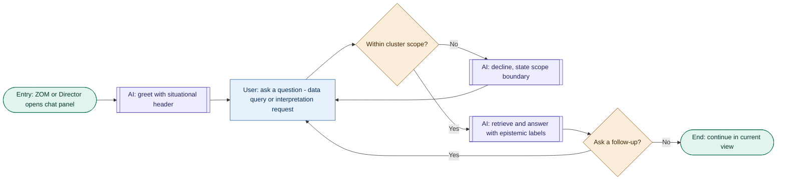

**Steps:** Entry: chat panel opened, AI: greets with situational header, User: asks a question, Decision: within cluster scope?, AI: retrieves and answers with epistemic labels, Decision: ask a follow-up?, End: continue in current view

_Alternate path:_ an out-of-scope request loops back to re-ask rather than dead-ending the session.

| Step | Node type | Action / response                                 | State(s) handled                                                                             | Linked screen        | Instrumentation            | Accessibility note                                                |
| ---- | --------- | ------------------------------------------------- | -------------------------------------------------------------------------------------------- | -------------------- | -------------------------- | ----------------------------------------------------------------- |
| B    | AI action | Greet with situational header (FR-CONV-01)        | —                                                                                            | Chat panel (overlay) | `chat_opened`              | Panel must be keyboard-reachable from any screen                  |
| D    | Decision  | Cluster scope enforcement (FR-CONV-08)            | Director's Tier A queries additionally scoped to their cluster roll-up                       | Chat panel           | `scope_checked: {in\|out}` | —                                                                 |
| F    | AI action | Answer within ≤ 3s, epistemic labels (FR-CONV-02) | Same Confirmed/Inferred/Unknown labels as structured detail view — not a separate vocabulary | Chat panel           | `query_answered`           | Response time and epistemic label both announced, not visual-only |

---

### Flow 4.6b — Execute a single action via chat (Tier B/C)

**Task:** Get the chat to actually do something, with the same confirmation discipline as the structured UI.
**Entry:** ZOM instructs the chat to execute a Tier B action or prepare a Tier C routing package.
**Success end state:** Action executed and logged with conversational attribution, or routed exactly as the structured flow would.

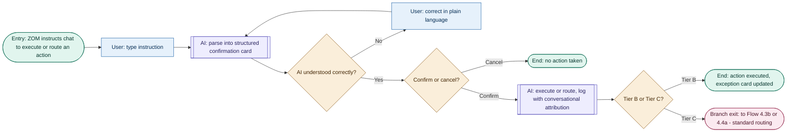

**Steps:** Entry: ZOM instructs chat to execute or route an action, User: types instruction, AI: parses into confirmation card, Decision: understood correctly?, User: confirms or cancels, AI: executes or routes with conversational attribution, Decision: Tier B or Tier C?, End: action executed or Branch exit: to standard routing

_Alternate path:_ a misunderstood instruction loops through natural-language correction (FR-CONV-04) without a session restart, any number of times.

| Step | Node type | Action / response                                                                                                                                                                                                                                                                                                           | State(s) handled                                                                                                                    | Linked screen               | Instrumentation            | Accessibility note                                      |
| ---- | --------- | --------------------------------------------------------------------------------------------------------------------------------------------------------------------------------------------------------------------------------------------------------------------------------------------------------------------------- | ----------------------------------------------------------------------------------------------------------------------------------- | --------------------------- | -------------------------- | ------------------------------------------------------- |
| C    | AI action | Confirmation card (FR-CONV-03)                                                                                                                                                                                                                                                                                              | Card shows action type, exception ID, tier badge, projected consequence — same fields as structured confirmation                    | Chat panel                  | `confirmation_card_shown`  | —                                                       |
| H    | AI action | Execute/route + log (FR-CONV-05, FR-CONV-06)                                                                                                                                                                                                                                                                                | `channel: conversational` attribution flag distinct from structured-UI actions, required for EU AI Act traceability (NFR-24, AC-18) | Chat panel + Exception Feed | `action_executed_via_chat` | Exception card update announced live, not just visually |
| —    | —         | **[OPEN — flagged in the PRD sync note above]** FR-CONV-03 describes Tier B as "execute with ZOM confirmation card" — whether this still holds given FR-18's Session 17 change (T1/T2 execution always routes via Delegate, no separate confirm step) is unresolved. Not fixed here; carried as part of the same open item. | 4.6b                                                                                                                                | —                           | —                          | —                                                       |

---

### Flow 4.6c — Execute a multi-step workflow via chat

**Task:** Complete a sequence that would normally take several screens, with the right confirmation gates and none of the wrong ones.
**Entry:** ZOM instructs the chat to complete a multi-step workflow.
**Success end state:** All steps complete, with a summary of what was done.

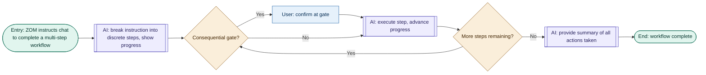

**Steps:** Entry: chat instructed to complete a multi-step workflow, AI: breaks into discrete steps with progress, Decision: consequential gate?, User: confirms at gate, AI: executes step and advances, Decision: more steps remaining?, AI: provides summary, End: workflow complete

| Step | Node type | Action / response            | State(s) handled                                                                                                            | Linked screen | Instrumentation                              | Accessibility note                                          |
| ---- | --------- | ---------------------------- | --------------------------------------------------------------------------------------------------------------------------- | ------------- | -------------------------------------------- | ----------------------------------------------------------- |
| C    | Decision  | Gate discipline (FR-CONV-09) | Confirms at every consequential (Tier B/C) step, not trivial ones — over-gating is itself a failure mode worth watching for | Chat panel    | `gate_evaluated: {consequential\|automatic}` | —                                                           |
| G    | AI action | Final summary (FR-CONV-09)   | —                                                                                                                           | Chat panel    | `workflow_summary_shown`                     | Summary announced in full, not truncated for screen readers |

---

### Flow 4.6d — Handle a request beyond chat's capability (Tier D)

**Task:** Decline clearly and get the ZOM to where they actually need to go.
**Entry:** ZOM requests something outside the chat's defined boundaries (T4 action, approver-side decision, batch action, policy config, adoption analytics, or an out-of-catalog action).
**Success end state:** ZOM understands why and has a concrete next step — not just a dead end.

```mermaid
flowchart LR
    A(["Entry: ZOM requests something beyond chat capability"]) --> B[["AI: identify boundary type"]]
    B --> C[["AI: decline in plain language, state specific reason"]]
    C --> D[["AI: offer nearest alternative and direct link"]]
    D --> E{"Follow the link?"}
    E -->|"Yes"| F["User: navigate to structured screen"]
    F --> G(["Branch exit: to structured screen / relevant journey"])
    E -->|"No"| H["User: continue chatting with a different request"]
    H --> I(["End: return to Flow 4.6a"])

    classDef entry fill:#E1F5EE,stroke:#0F6E56,color:#04342C
    classDef user fill:#E6F1FB,stroke:#185FA5,color:#042C53
    classDef ai fill:#EEEDFE,stroke:#534AB7,color:#26215C
    classDef decision fill:#FAEEDA,stroke:#854F0B,color:#412402
    classDef branch fill:#FBEAF0,stroke:#993556,color:#4B1528
    class A,I entry
    class F,H user
    class B,C,D ai
    class E decision
    class G branch
```

**Steps:** Entry: ZOM requests something beyond chat capability, AI: identifies boundary type, AI: declines with specific reason, AI: offers alternative and direct link, Decision: follow the link?, User: navigates to structured screen, Branch exit: to structured screen / relevant journey

| Step | Node type | Action / response                                             | State(s) handled                                                                                                                              | Linked screen | Instrumentation                                     | Accessibility note                                                                   |
| ---- | --------- | ------------------------------------------------------------- | --------------------------------------------------------------------------------------------------------------------------------------------- | ------------- | --------------------------------------------------- | ------------------------------------------------------------------------------------ |
| B–D  | AI action | Identify, decline, offer alternative (FR-CONV-07, FR-CONV-11) | Never partially executes without explicit notification of what it did and didn't do (FR-CONV-07); T4 declined in 100% of tested cases (AC-19) | Chat panel    | `request_declined: {reason}`, `alternative_offered` | Decline reason and alternative both must be screen-reader legible, not just the link |

---

## Cross-flow assumptions and open questions introduced in this document

| #         | Item                                                                                                                                                                                                                                                                                                                                                                         | Flow       | Confidence / Priority                                         | Validation path                                                                                                                                                                                                    |
| --------- | ---------------------------------------------------------------------------------------------------------------------------------------------------------------------------------------------------------------------------------------------------------------------------------------------------------------------------------------------------------------------------- | ---------- | ------------------------------------------------------------- | ------------------------------------------------------------------------------------------------------------------------------------------------------------------------------------------------------------------ |
| A-09      | Geospatial triage scoped to SignalTrack, FleetCommand TMS, Nexus WMS exceptions                                                                                                                                                                                                                                                                                              | 4.1b       | Medium                                                        | Engineering discovery on geocoordinate consistency; ZOM contextual interviews                                                                                                                                      |
| OQ-08     | Geocoordinate reliability across carrier types/modes                                                                                                                                                                                                                                                                                                                         | 4.1b       | High                                                          | Engineering discovery                                                                                                                                                                                              |
| PB-01     | At-risk re-surfacing for stalled in-flight actions                                                                                                                                                                                                                                                                                                                           | 4.1e       | Proposed, needs FR + threshold                                | Product/design sign-off                                                                                                                                                                                            |
| PB-02     | Four-way closure trigger model                                                                                                                                                                                                                                                                                                                                               | 4.1e       | Proposed, resolves prior close-trigger gap                    | Product/design sign-off                                                                                                                                                                                            |
| —         | Zero-active-exceptions empty state undefined (carried forward from discarded Flow 4.1a)                                                                                                                                                                                                                                                                                      | 4.1b       | Needs an FR                                                   | Product/design sign-off                                                                                                                                                                                            |
| —         | No-geodata fallback behavior on map view                                                                                                                                                                                                                                                                                                                                     | 4.1b       | Proposed                                                      | Product/design sign-off                                                                                                                                                                                            |
| OQ-09     | No FR defines the search/lookup mechanic for finding a shipment, warehouse, or carrier by identifier                                                                                                                                                                                                                                                                         | 4.2b       | High                                                          | Product/design sign-off — needs a dedicated FR before wireframing                                                                                                                                                  |
| —         | Reason code taxonomy must reflect real operational error categories, not generic placeholders, and cover both directions                                                                                                                                                                                                                                                     | 4.2a       | Design constraint on FR-24/FR-32 implementation, not a gap    | UX content design pass ahead of wireframing                                                                                                                                                                        |
| OQ-10     | FR-32 only describes lowering an over-ranked exception's priority; there is no symmetric FR for raising an under-ranked one                                                                                                                                                                                                                                                  | 4.2a       | High                                                          | Recommend amending FR-32 or adding FR-32b before wireframing; consider broadening Journey 4.2 Path A's narrative in `prd-v1.4.md` for consistency                                                                  |
| OQ-11     | No FR names a case-level "reasoning update" mechanism — the AI retaining/adjusting context on a specific exception in response to a ZOM correction — distinct from the priority value change (FR-32) and the aggregate audit log (FR-34)                                                                                                                                     | 4.2a, 4.2b | High                                                          | Needs a dedicated FR, scoped explicitly against D-10/FR-33's "no real-time promises about model updates" principle so the acknowledgment copy and underlying behavior don't overstate what the AI actually retains |
| OQ-12     | No FR grants the ZOM a "preview brief as approver will see it" capability                                                                                                                                                                                                                                                                                                    | 4.3b       | Medium                                                        | Recommended by the Session 05 journey map's failure-point note; needs a dedicated FR before wireframing                                                                                                            |
| OQ-13     | PRD names "Request More Info" as a Legal/Compliance Authority interface option (Section 3.4) but doesn't specify what happens next                                                                                                                                                                                                                                           | 4.3c       | Medium                                                        | Needs product decision: routing target, SLA/timer implications, recurrence limit                                                                                                                                   |
| PB-03     | "Request clarification" reply path for the Dispatcher, routing a structured message back to the ZOM's queue                                                                                                                                                                                                                                                                  | 4.4b       | Proposed — journey map calls it "essential at MVP," no FR yet | Product/design sign-off                                                                                                                                                                                            |
| **DX-06** | **[HIGH PRIORITY]** PRD's Session 17 update to Journey 4.1/FR-18/19/23/24 removes Approve and Override as discrete action paths in favor of a unified route-via-Delegate-or-Escalate model. Not reflected in Journey 4.4's own narrative text, not given a decision number, not reflected in the PRD's version header. **Flows 4.1d and 4.4a are stale pending resolution.** | 4.1d, 4.4a | High — blocks further Decide-and-Act / Delegation wireframing | See PRD sync flag at top of this document                                                                                                                                                                          |
| —         | 30-day "Building baseline" pre-population state (A-10) not detailed for the adoption dashboard's first-load experience                                                                                                                                                                                                                                                       | 4.5a       | Needs design decision                                         | Product/design sign-off                                                                                                                                                                                            |
| —         | FR-CONV-03's "execute with ZOM confirmation card" (Tier B) not reconciled against the Session 17 unified routing model (FR-18)                                                                                                                                                                                                                                               | 4.6b       | Open — part of DX-06                                          | Resolve alongside DX-06                                                                                                                                                                                            |

---

## Flow Log

| Flow ID | Task statement                                                        | Parent journey | Status                                                                                                      |
| ------- | --------------------------------------------------------------------- | -------------- | ----------------------------------------------------------------------------------------------------------- |
| 4.1b    | Triage exception feed (list + geospatial)                             | J4.1           | Drafted, Session 06 — pending A-09 / OQ-08 validation                                                       |
| 4.1c    | Review exception detail, evaluate AI interpretation                   | J4.1           | Drafted, Session 06                                                                                         |
| 4.1d    | Decide and act on exception                                           | J4.1           | Drafted, Session 06                                                                                         |
| 4.1e    | Monitor queue and close exception                                     | J4.1           | Drafted, Session 06 — pending PB-01 / PB-02 sign-off                                                        |
| 4.2a    | Diagnose and correct a mis-ranked exception (Path A — raise or lower) | J4.2           | Corrected, Session 10 — pending OQ-10 (FR-32 raise gap), OQ-11 (reasoning-update FR)                        |
| 4.2b    | Diagnose and surface a missed exception (Path B)                      | J4.2           | Corrected, Session 10 — pending OQ-09 (search FR), OQ-11 (reasoning-update FR)                              |
| 4.3a    | Classify and route a customs hold exception                           | J4.3           | Drafted, Session 11                                                                                         |
| 4.3b    | Prepare and submit escalation                                         | J4.3           | Drafted, Session 11 — pending OQ-12 (preview FR)                                                            |
| 4.3c    | Approver reviews and decides                                          | J4.3           | Drafted, Session 11 — pending OQ-13 (Request More Info)                                                     |
| 4.3d    | ZOM receives decision and closes                                      | J4.3           | Drafted, Session 11                                                                                         |
| 4.4a    | Select dispatcher and prepare handoff                                 | J4.4           | Drafted, Session 11                                                                                         |
| 4.4b    | Dispatcher executes delegated task                                    | J4.4           | Drafted, Session 11 — pending PB-03 (clarification reply path); largely outside co-pilot UI at MVP per E-03 |
| 4.4c    | ZOM confirms resolution and closes                                    | J4.4           | Drafted, Session 11                                                                                         |
| 4.5a    | Review network health snapshot                                        | J4.5           | Drafted, Session 12                                                                                         |
| 4.5b    | Drill into AI performance and override patterns                       | J4.5           | Drafted, Session 12                                                                                         |
| 4.5c    | Review ZOM adoption heatmap                                           | J4.5           | Drafted, Session 12                                                                                         |
| 4.5f    | Export performance summary                                            | J4.5           | Drafted, Session 12                                                                                         |
| 4.6a    | Ask a question via chat (Tier A)                                      | J4.6           | Drafted, Session 12                                                                                         |
| 4.6b    | Execute a single action via chat (Tier B/C)                           | J4.6           | Drafted, Session 12 — pending DX-06                                                                         |
| 4.6c    | Execute a multi-step workflow via chat                                | J4.6           | Drafted, Session 12                                                                                         |
| 4.6d    | Handle a request beyond chat's capability (Tier D)                    | J4.6           | Drafted, Session 12                                                                                         |

**Discarded:** Flow 4.1a (backend-only, fails P-04). Flow 4.2c (folded into 4.2a/4.2b tails).
**Deferred (named in PRD, not decomposed):** Flows 5.1d (superuser analysis) and 5.1e (source pattern analysis) — post-MVP extension, per the PRD's own Journey 4.5 note.
**Stale, pending DX-06:** Flow 4.1d (Decide and act) and Flow 4.4a (Select dispatcher and prepare handoff) — built against an action model the PRD has since revised. See the PRD sync flag at the top of this document.

**Next:** Resolve DX-06 before any further wireframing on the Decide-and-Act or Delegation screens — this affects two already-built flows, not just future work. Once resolved, this document will have 21 flows across all six journeys, ready in full for feature ideation and prioritization.
